# Flyleaf — Product Requirements Document

**Version:** 1.0
**Status:** Ready for design and engineering planning
**Last updated:** 1 September 2026
**Owner:** Gaurav

---

## Document conventions

- **[ASSUMPTION]** marks a product decision made in the absence of user research or stakeholder input. Each is stated so it can be challenged and replaced with evidence.
- **[LOCKED]** marks a decision already made and agreed. Changing it invalidates dependent sections.
- **P0 / P1 / P2** indicate MVP priority throughout: P0 is required to launch, P1 is the first fast-follow, P2 is later.
- Effort estimates assume **one full-stack developer working steadily**, and are calibrated to a zero-cash-budget build.

---

## Table of contents

| # | Section | # | Section |
|---|---------|---|---------|
| 1 | [Product Overview](#1-product-overview) | 27 | [Content Moderation](#27-content-moderation) |
| 2 | [Product Positioning](#2-product-positioning) | 28 | [Analytics](#28-analytics) |
| 3 | [Target Users & Personas](#3-target-users--personas) | 29 | [Growth Loops](#29-growth-loops) |
| 4 | [Core Product Experience](#4-core-product-experience) | 30 | [Monetization](#30-monetization) |
| 5 | [Information Architecture](#5-information-architecture) | 31 | [MVP Definition](#31-mvp-definition) |
| 6 | [Complete Screen Inventory](#6-complete-screen-inventory) | 32 | [Roadmap](#32-roadmap) |
| 7 | [Book Data Model](#7-book-data-model) | 33 | [Non-Functional Requirements](#33-technical-non-functional-requirements) |
| 8 | [Reading Tracking System](#8-reading-tracking-system) | 34 | [Edge Cases](#34-edge-cases) |
| 9 | [Rating System](#9-rating-system) | 35 | [Offline & Mobile](#35-offline--mobile-considerations) |
| 10 | [Review System](#10-review-system) | 36 | [Design System](#36-design-system) |
| 11 | [Social Graph](#11-social-graph) | 37 | [UX Principles](#37-ux-principles) |
| 12 | [Home Feed](#12-home-feed) | 38 | [Accessibility](#38-accessibility) |
| 13 | [Discovery](#13-discovery) | 39 | [Internationalization](#39-internationalization) |
| 14 | [Search](#14-search) | 40 | [Book Data Providers](#40-book-data-providers) |
| 15 | [Lists & Collections](#15-lists--collections) | 41 | [Data Ownership & Licensing](#41-data-ownership--licensing) |
| 16 | [User Profiles](#16-user-profiles) | 42 | [Security Threat Model](#42-security-threat-model) |
| 17 | [Reading Statistics](#17-reading-statistics) | 43 | [Performance Targets](#43-performance-targets) |
| 18 | [Gamification](#18-gamification) | 44 | [Success Metrics](#44-success-metrics) |
| 19 | [Notifications](#19-notifications) | 45 | [Product Risks](#45-product-risks) |
| 20 | [AI Features](#20-ai-features) | 46 | [Open Questions](#46-open-questions) |
| 21 | [Recommendation Engine](#21-recommendation-engine) | 47 | [Product Decisions](#47-product-decisions) |
| 22 | [Backend Architecture](#22-backend-architecture) | 48 | [User Stories](#48-user-stories) |
| 23 | [Database Design](#23-database-design) | 49 | [Acceptance Criteria](#49-acceptance-criteria) |
| 24 | [API Design](#24-api-design) | 50 | [MVP Feature Matrix](#50-mvp-feature-matrix) |
| 25 | [Authentication & Authorization](#25-authentication--authorization) | 51 | [Final MVP Blueprint](#51-final-mvp-blueprint) |
| 26 | [Privacy & Safety](#26-privacy--safety) | | |

---

# 1. Product Overview

## 1.1 Product name

**Flyleaf** — the blank page at the front of a book, the one you write your name on. **[LOCKED]**

The name was chosen because it describes a place where a reader's identity lives *inside* a book, which is precisely what a profile is in this product. It avoids the crowded "Dogear" naming space (at least five existing book-tracking products use that stem) and avoids generic `book-`, `read-` and `shelf-` prefixes.

**Outstanding brand tasks:** trademark search in the software class, `flyleaf.app` and `flyleaf.com` acquisition, and handle registration on Instagram and X. Handles exhaust before domains, so register them ahead of launch.

## 1.2 One-line description

> Flyleaf is a mobile-first social network for readers — track what you're reading, rate and review it, and build a public identity out of your taste in books.

## 1.3 Product vision

A reader's library should be as expressive as a musician's record collection. Flyleaf exists so that ten years of someone's reading life — the books, the abandonments, the re-reads, the half-star arguments — becomes a place they are proud to send someone, and a place other readers actually want to visit.

## 1.4 Product mission

Make tracking a book effortless enough to do daily, make reviewing it expressive enough to be worth doing well, and make the resulting profile good enough to share.

## 1.5 Problem statement

Readers currently choose between three unsatisfying options:

| Problem | Where it shows up today |
|---|---|
| **The dominant product is stagnant.** Goodreads' interface has changed little in a decade, its API closed to new developers in 2020, and its catalog is polluted with duplicates. | Goodreads |
| **The good alternative is not social.** StoryGraph has excellent statistics but a thin social layer; people use it alone. | StoryGraph |
| **The social model that works is for film.** Letterboxd proved that taste-based identity plus short expressive reviews is addictive — but no equivalent exists for books, and a naive port breaks because books are not two-hour events. | Letterboxd |
| **Tracking is high-friction.** Most trackers require 4–6 taps to record progress, so people stop and the data rots. | All of the above |
| **Nothing represents abandonment honestly.** "Did not finish" is a real, socially meaningful reading event that most products treat as a deletion. | All of the above |

## 1.6 Product thesis

Letterboxd works because a film is a **two-hour event** you finish and have an opinion about. A book is a **three-week process** with a start, a middle you might abandon, and an ending you reach on a Tuesday morning.

That single difference generates the entire product:

1. **The core object is not a log entry, it is a reading session** with a lifecycle — which means an interval, not a timestamp.
2. **Progress is a first-class feature and the daily retention hook.** Letterboxd has no analogue. "I'm on page 210 of 480" is why someone opens the app on a Wednesday.
3. **The social payload is the finish.** Completing a book is a genuine event worth posting, and it happens rarely enough to keep the feed from becoming noise.

Flyleaf therefore has two jobs, in strict order:

1. Be a **genuinely good solo reading tracker** that a user with zero friends will keep using.
2. Make **finishing a book a social event** worth sharing.

If job 1 fails, job 2 cannot rescue it — a social app with no users is a solo tracker with a broken tab.

## 1.7 Target users

| Segment | Description | Priority |
|---|---|---|
| **Primary** | Readers aged 18–35 who read 12+ books a year, already use Goodreads or StoryGraph, and post about books on Instagram, TikTok or X | P0 |
| **Primary** | Letterboxd users who read — a high-intent group who already understand the interaction model and complain publicly that no book equivalent exists | P0 |
| **Secondary** | Readers who track privately and want statistics without a social layer | P1 |
| **Secondary** | Book club organisers and members | P2 |
| **Tertiary** | Authors maintaining a reader-facing presence | P2 |

**[ASSUMPTION]** The initial launch market is English-language readers, with India and the US as the first two geographies. Localization is designed for but not shipped in v1 (§39).

## 1.8 Primary use cases

1. **Log a book I just finished** and give it a rating and a short review — under 20 seconds.
2. **Update where I am in a book** — under 5 seconds, one screen, no navigation.
3. **Decide what to read next** from what people whose taste I trust have rated highly.
4. **Look up a book** someone recommended and see whether my friends liked it.
5. **Show someone who I am as a reader** by sending them a link to my profile.
6. **Look back at my reading year** and share it.
7. **Bring ten years of Goodreads history with me** without retyping it.

## 1.9 Value proposition

**For readers who want their reading life to mean something socially,** Flyleaf is a book tracker that turns a reading history into an identity — **unlike Goodreads**, which is a database with a social layer bolted on, and **unlike StoryGraph**, which is a private analytics tool. Flyleaf treats reading the way Letterboxd treats film: as taste worth publishing.

## 1.10 Product principles

1. **Tracking must be effortless or the data rots.** Every friction point in logging is paid for in abandoned accounts. Corollary: **every field beyond status is optional**, progress included (§8.3).
2. **The solo experience must stand alone.** Assume the user has no friends here for their first three months.
3. **The finish is the story.** Optimise the feed, the share cards and the notifications around completion, not around starting.
4. **Honesty over vanity.** DNFs, low ratings and abandoned books are first-class. A tracker that only records success is a tracker people stop trusting.
5. **Five tabs. A sixth means removing one.** If a feature needs its own tab to exist, it is not in v1. **[LOCKED]**
6. **No guilt mechanics.** No "you're 3 books behind" notifications. No streak that breaks at midnight and punishes a busy week.
7. **Own the catalog.** The dataset is the moat. Never build the core on an API that can revoke access.
8. **AI only where it removes real work.** No AI feature ships for marketing reasons.
9. **Export is a feature, not a concession.** Users who can leave easily are the ones who trust you enough to stay.

## 1.11 What the product is NOT

- **Not an ebook reader.** Flyleaf never displays book content. No DRM, no reader engine, no licensing negotiations.
- **Not a bookstore.** Commerce, if it appears, is affiliate links out — never a cart.
- **Not a Goodreads clone.** No exhaustive shelving taxonomy, no forums, no giveaways, no author Q&A.
- **Not a general social network.** No arbitrary posting. Every post is anchored to a book.
- **Not a productivity app.** Reading goals exist but are deliberately confined; the product does not treat reading as a task to optimise.
- **Not a book club platform in v1.** Clubs are a Phase 4 consideration, not an MVP feature.
- **Not web-first.** Public book, list and profile pages ship as read-only SEO surfaces (§29); the full web app is Phase 6.

---

# 2. Product Positioning

## 2.1 Competitive landscape

| Product | What it is | Core strength | Core weakness | Users |
|---|---|---|---|---|
| **Goodreads** | Amazon-owned catalog + social | Unmatched catalog and review volume; default network effect | Dated UX, closed API, duplicate-ridden data, no meaningful product investment | ~150M registered (est.) |
| **StoryGraph** | Independent tracker | Best-in-class statistics, mood tagging, quarter-star ratings | Thin social layer; review flow criticised as multi-step and hard to find | ~3M (est.) |
| **Fable** | Social book clubs | Strong community and club mechanics | Club-centric; weaker as a personal tracker |  |
| **Hardcover** | Indie tracker with a public API | Developer-friendly, open GraphQL API, values-aligned audience | Smaller catalog, small userbase |  |
| **Bookmory / Basmo / Bookly** | Private trackers | Clean, offline, no social pressure | Deliberately not social; no discovery |  |
| **Letterboxd** | Social film tracker | The behavioural model this product adapts | Films only |  |

## 2.2 Differentiation from Goodreads

| Dimension | Goodreads | Flyleaf |
|---|---|---|
| Core object | A shelf assignment | A **reading session** with progress, dates and an outcome |
| Rating | 1–5 whole stars, no halves — a decade-old top community complaint | **Half-stars, 0.5–5.0** |
| Abandonment | Effectively unsupported; contested community norm | **DNF is a first-class state** with the page you quit on |
| Progress | Buried, optional | **A primary tab and the daily hook** |
| Identity | A list of books | **A profile built to be shared** — four favourites, taste stats, rating distribution |
| Data portability | CSV export only, closed API | **Import from six sources + full export from day one** |
| Design | Web-era, dense | Mobile-native, expressive, dark-mode-first |

## 2.3 Differentiation from StoryGraph

StoryGraph is the closest product in quality and the one to learn most from. The differentiation is **not statistics** — StoryGraph wins there and Flyleaf should reach parity, not try to exceed it in v1.

The difference is **social architecture**:

- StoryGraph's stats are private-facing; Flyleaf's are **designed to be published**. Every statistic answers "what does this say about me as a reader?"
- StoryGraph's reviews are functional; Flyleaf's are **expressive, short-form and rankable**, in the Letterboxd tradition — the review is content, not metadata.
- StoryGraph's discovery is recommendation-driven; Flyleaf's is **taste-graph-driven** — you find books through people, not through an algorithm's opinion of you.
- StoryGraph's review flow is criticised for step count; Flyleaf's log flow has a **hard budget of two taps** to a shelf and under 20 seconds to a full finish-with-review.

## 2.4 Differentiation from Letterboxd

Flyleaf borrows Letterboxd's **behavioural loops**, not its features:

| Letterboxd loop | Flyleaf adaptation |
|---|---|
| Four favourite films on your profile | Four favourite books — same emotional function, same prominence |
| The one-line review as a genre of writing | Same, plus spoiler gating past a page number, which film doesn't need |
| Rating as personality | Same, plus "you rate 0.4 below average" — a screenshottable personality result |
| Lists as curation and social currency | Same, with ranked lists and per-entry notes |
| Year in Review as an annual growth event | Same, timed to late November |

Where Letterboxd's model **does not transfer**, and Flyleaf must invent:

- **Progress.** No analogue. This is the daily-open mechanic and Letterboxd has nothing like it.
- **Works vs editions.** One film is one object; one book is a work with dozens of editions (§7).
- **DNF.** Walking out of a film is rare; abandoning a book is common and socially meaningful.
- **Duration.** A film log is instant; a book log spans weeks and needs a lifecycle.
- **Series.** Franchises are loose; book series have strict reading order.

## 2.5 Why users would switch

Switching costs in this category are dominated by **history**. A user with 800 logged books will not retype them. Therefore:

1. **Import is the single most important acquisition feature**, not a convenience. It ships in the MVP (§10, §31).
2. **Half-stars alone move a measurable segment** — it is among the longest-running Goodreads complaints.
3. **Progress tracking gives a daily reason to open**, which no competitor's core loop provides.
4. **A shareable profile creates external pull** — the growth loop is other people seeing a Flyleaf link.

## 2.6 Competitive advantages

| Advantage | Durability |
|---|---|
| **An owned catalog** ingested from CC0 data, not a licensed API feed | High — cannot be revoked |
| **The taste graph** — who follows whom and how their ratings correlate | Very high — accumulates and cannot be copied |
| **Progress event history** — the finest-grained reading data in the category | High — powers stats and recommendations no competitor can match |
| **Import breadth** — six sources | Low individually, but decisive at acquisition |
| **Design quality and mobile-native feel** | Medium — copyable, but rarely copied well |

## 2.7 Potential moat

The moat is **not** the catalog — Open Library is public and anyone can ingest it. The moat is, in order of strength:

1. **The social graph.** Standard network effects. Each user makes the product better for the people who follow them.
2. **Accumulated user-generated content.** Reviews and ranked lists are unique, non-transferable, and become the discovery surface.
3. **Longitudinal reading data.** A user with three years of progress events cannot replicate that history elsewhere. This is the real switching cost, and it is why export must be offered freely — it signals confidence and costs nothing, because the graph is what holds people.

**Strategic implication:** invest disproportionately in the follow graph and review quality in Phase 2. Catalog quality is a hygiene factor; the graph is the asset.

## 2.8 Positioning statement

> For readers who want their reading life to be visible and expressive, Flyleaf is a mobile social network built around books. Unlike Goodreads, which is a catalog with a neglected social layer, and unlike StoryGraph, which is private analytics, Flyleaf turns a reading history into a shareable identity — with effortless daily tracking, half-star ratings, honest DNFs, and reviews worth reading.

## 2.9 Taglines

| Tagline | Angle |
|---|---|
| **Your reading, in public.** | Identity — recommended primary |
| **Write your name in it.** | Ties directly to the Flyleaf metaphor |
| **Every book you've ever loved.** | Archive and nostalgia |
| **Taste, in books.** | Letterboxd-adjacent, taste-forward |

**Recommendation:** *Your reading, in public.* It states the differentiator (social, expressive) in four words and works as an App Store subtitle.

---

# 3. Target Users & Personas

Seven personas. The first three are the MVP targets; the rest inform roadmap.

---

## 3.1 Persona 1 — Aisha, the Social Reader *(PRIMARY — design for her first)*

**26, marketing associate, Bengaluru. Reads ~30 books/year. Heavy Letterboxd and Instagram user.**

| | |
|---|---|
| **Goals** | Have her taste be visible; find her next book from people she trusts; be known as someone with good recommendations |
| **Pain points** | Goodreads looks embarrassing to share; her book posts on Instagram get lost; no half-stars means her ratings feel dishonest |
| **Behaviors** | Logs the moment she finishes; screenshots and shares; writes short, funny, opinionated reviews; follows ~150 people |
| **Motivations** | Social identity, taste signalling, community |
| **Frustrations** | Feeds full of "started reading"; recommendation algorithms that don't know her; no good way to show a year of reading |
| **Desired features** | Shareable profile, half-stars, short reviews, four favourites, Year in Review, friends' ratings surfaced first |
| **Journey** | Sees a friend's Flyleaf link → installs → imports Goodreads → picks four favourites → follows 10 people → logs a finish that evening → shares the card |

**Design implication:** she is the reason the profile and share cards are P0, not P1.

---

## 3.2 Persona 2 — Rahul, the Serious Reader *(PRIMARY)*

**34, software engineer, Pune. Reads 50–70 books/year across print and audio. StoryGraph user.**

| | |
|---|---|
| **Goals** | Accurate records; understand his own reading patterns; never lose his history |
| **Pain points** | Audiobooks and print measured differently; no honest DNF handling; distrusts products that could shut down |
| **Behaviors** | Updates progress most days; sets an annual goal; rereads; reads series in order; exports his data periodically |
| **Motivations** | Self-knowledge, completeness, control |
| **Frustrations** | Lossy imports; stats that misrepresent audiobooks; guilt-inducing goal reminders |
| **Desired features** | Progress events, format-aware stats, DNF with page, re-read support, series tracking, full export |
| **Journey** | Finds it via a subreddit → checks export exists before signing up → imports StoryGraph → sets a goal → uses progress tab daily |

**Design implication:** he is why export ships day one and why progress is an append-only event stream.

---

## 3.3 Persona 3 — Meera, the Casual Reader *(PRIMARY for retention)*

**22, student, Delhi. Reads 8–12 books/year, mostly on her phone.**

| | |
|---|---|
| **Goals** | Remember what she's read; find something she'll actually finish; not feel behind |
| **Pain points** | Trackers feel like homework; empty feeds; guilt about abandoned books |
| **Behaviors** | Logs in bursts, forgets for weeks, returns; discovers via BookTok; abandons ~30% of what she starts |
| **Motivations** | Memory, light social connection, low-effort enjoyment |
| **Frustrations** | Being nagged; complicated forms; stats that make her feel inadequate |
| **Desired features** | Two-tap logging, no required fields, guilt-free DNF, warm empty states |
| **Journey** | Downloads after seeing a TikTok → skips import → picks genres → adds 3 books → returns 3 weeks later → app must feel welcoming, not accusatory |

**Design implication:** she is why ratings are optional, why goals have no push notifications, and why every empty state must offer content rather than a shrug.

---

## 3.4 Persona 4 — Tanvi, the Book Reviewer

**29, writes long reviews, ~4k followers on Goodreads.**

- **Goals:** an audience, credit for her writing, reviews that look good
- **Pain points:** reviews buried by algorithms; no spoiler control granularity; formatting is ugly
- **Behaviors:** writes 800+ word reviews; responds to comments; maintains themed lists
- **Desired features:** rich text, spoiler-after-page markers, review likes and comments, follower counts, review permalinks
- **Journey:** imports → cross-posts her best reviews → gains followers → becomes a discovery node for others
- **Value to product:** high — reviewers create the content that makes discovery work. Prioritise their tools in Phase 2.

---

## 3.5 Persona 5 — Dev, the Book Collector

**41, collects editions; 2,000+ physical books.**

- **Goals:** catalog what he owns, distinct from what he's read; track specific editions
- **Pain points:** products conflate "owned" with "read"; edition data is wrong or missing
- **Desired features:** an **Owned** flag independent of read status, edition-precise records, ISBN barcode scanning, shelf/collection organisation
- **Product decision:** **[ASSUMPTION]** ownership is a **P1 boolean on the read/edition record**, not a separate module. Full collection management (condition, purchase price, location) is out of scope — that is a different product.

---

## 3.6 Persona 6 — Priya, the Book Club Member

**37, runs a 12-person club.**

- **Goals:** coordinate a shared book, discuss without spoilers, track who's where
- **Pain points:** discussion scattered across WhatsApp; spoilers from faster readers
- **Desired features:** shared lists, spoiler-gated discussion by progress, group progress view
- **Product decision:** **P2 / Phase 4.** Collaborative lists (P1) partially serve this. Full clubs are a distinct product surface and would violate the five-tab rule.

---

## 3.7 Persona 7 — Arjun, the Author

**Debut novelist.**

- **Goals:** see reception, connect with readers, correct wrong metadata about his own book
- **Pain points:** no way to claim a profile; can't respond to reviews appropriately
- **Desired features:** verified author profile, claim-your-book flow, read-only review analytics
- **Product decision:** **P2 / Phase 5.** Authors are a monetization surface later. **Critical guardrail:** authors must never be able to reply publicly to reviews — this is the single largest source of toxicity in book communities. Reception data yes; a reply button no.

---

## 3.8 Persona priority matrix

| Persona | MVP priority | Drives which metric | Key feature dependency |
|---|---|---|---|
| Aisha — Social Reader | **P0** | Viral growth, K-factor | Profile, share cards, half-stars |
| Rahul — Serious Reader | **P0** | Retention, DAU | Progress events, export, stats |
| Meera — Casual Reader | **P0** | Activation, resurrection | Two-tap log, optional rating, DNF |
| Tanvi — Reviewer | P1 | Content supply | Review tools, spoiler control |
| Dev — Collector | P1 | Niche retention | Owned flag, barcode scan |
| Priya — Club Member | P2 | Group acquisition | Collaborative lists |
| Arjun — Author | P2 | Monetization | Claim flow, analytics |

---

# 4. Core Product Experience

## 4.1 First-run experience

**Design goal: from install to first logged book in under 90 seconds, with no dead ends.**

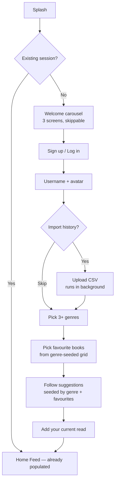

### Step-by-step requirements

| Step | Requirement | Rationale |
|---|---|---|
| **Welcome** | 3 screens max, skippable, no account required to view | Reduce bounce before value is shown |
| **Sign up** | Email + password only in v1 **[LOCKED]** | Adding Google sign-in on iOS obliges Sign in with Apple, which forces the Apple Developer cost forward. Deferred to Phase 3 |
| **Username** | Claimed at signup; drives the public profile URL | Identity is the product; claim it immediately |
| **Import** | Offered *before* manual setup, runs as a background job | A user with 800 books imported has a populated app instantly — the strongest possible activation event |
| **Genres** | Minimum 3, from ~24 visual tiles | Seeds cold-start recommendations and the follow suggestions |
| **Favourite books** | Grid seeded by chosen genres; 4 slots, skippable | The four-favourites row is the single most-copied Letterboxd element and the strongest identity signal |
| **Follow suggestions** | 12–15 users matched on genre and favourite overlap | A feed with zero people in it is the top cause of day-1 churn |
| **Current read** | "What are you reading right now?" — search, one tap | Immediately populates the Reading tab, the daily hook |

**Anti-pattern to avoid:** a mandatory multi-screen questionnaire. Every step above except sign-up and username must be skippable, and the home feed must be non-empty even for a user who skipped everything (falls back to Popular This Week).

## 4.2 Guest mode — browse before you sign up **[LOCKED]**

The share loops in §29 all end the same way: someone sees a quote card or a profile link, taps it, installs the app — and hits a signup wall before seeing a single book. **The loop the whole growth strategy depends on dead-ends at the front door.**

Public web pages (Phase 2) solve this for people who never install. They do nothing for the person who *did* install because the content looked good, and is now being asked for an email before being shown anything.

### What a guest can do

| Allowed without an account | Requires signup |
|---|---|
| Search books, authors, series | Logging anything |
| Read book pages, including ratings and the distribution | Rating, reviewing, hearting |
| Read public reviews and comment threads | Commenting, liking |
| Browse public profiles, Walls, Diaries and lists | Following |
| Browse Discover, genres and curated lists | The Reading tab |
| Scan a barcode and see the book | Notifications, settings |

The endpoints are already public — §24.2 marks search, works, editions, reviews and profiles as optional-auth — so this is a client change plus a gate, not new backend surface.

### How the gate behaves

| Rule | Detail |
|---|---|
| **Gate at the action, never at the door** | No wall on launch. The prompt appears the moment a guest taps Log, Rate, Follow or Like, and it says what they were trying to do: *"Sign up to log Piranesi"* — not a generic wall |
| **One tap to dismiss** | A guest who declines returns exactly where they were, with nothing lost |
| **The Reading tab is the upsell** | It is the only tab a guest cannot use. Tapping it shows what it would contain for them, with a single signup action |
| **Guests are shown the app, not a demo** | Real data, real reviews, real profiles. A fake preview would be worse than a wall |

### The local shelf — turning browsing into investment

A guest can add books to a **local Want to Read list**, stored on device with no account. On signup it migrates into their real library and the confirmation says so: *"We've kept the 4 books you saved."*

This is the highest-leverage part of the feature. It converts a passive browse into accumulated value **before** the ask, so the signup prompt arrives when the user already has something to lose. **[ASSUMPTION]** Cap the local shelf at 20 books; beyond that, prompt to sign up to keep them.

### Constraints

| Constraint | Reason |
|---|---|
| Private accounts and follower-only content are invisible to guests | §26.1 — a guest is a stranger, and the least-privileged viewer |
| **Maturity filter is on and cannot be disabled** | §7.8 — a guest has no verified age, so the 18+ setting is unavailable to them |
| No analytics identity beyond an anonymous session ID | §26.5 — do not build a profile of someone who has not signed up |
| Guest state is device-local and never synced | No account, no server-side record |
| Rate-limited more tightly than authenticated users | §24.4 anonymous tiers already cover this |

**Priority: P0.** It is a client-side gate over endpoints that already exist, and without it the primary growth loop leaks at its most important moment.

## 4.3 The complete lifecycle of a book

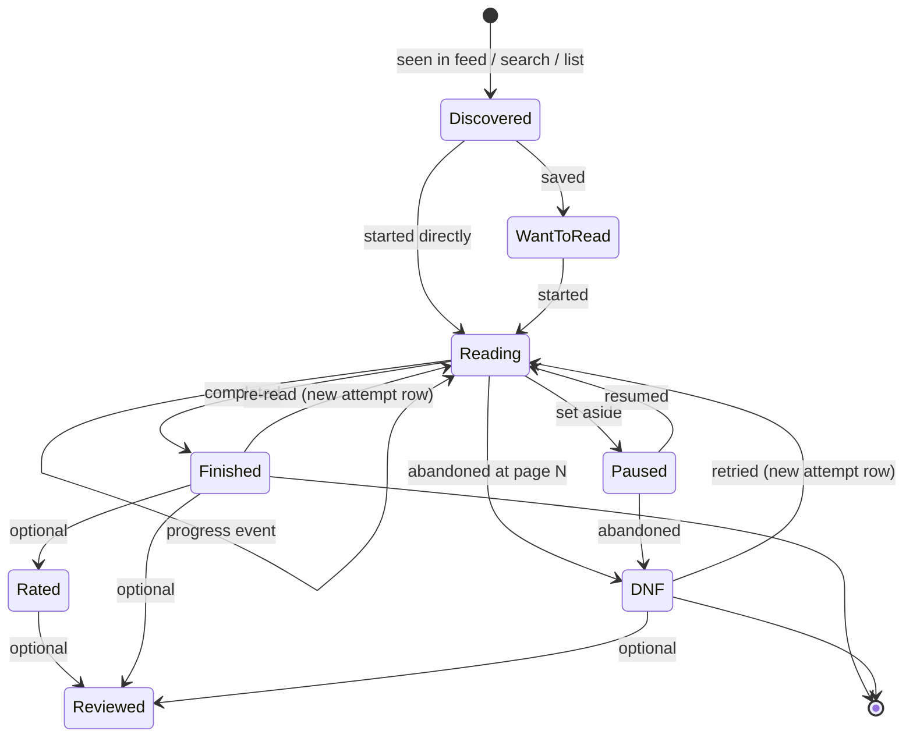

**Critical modelling rule [LOCKED]:** each pass through this machine is a **separate `reads` row** with its own `attempt_no`, dates and rating. A re-read never overwrites the original. A DNF followed by a successful read later is two rows telling a true story.

### Lifecycle stage detail

| Stage | Trigger | Data written | Social effect |
|---|---|---|---|
| **Discovered** | Impression in feed, search, list or book page | Analytics only | None |
| **Want to Read** | Tap bookmark | `reads` row, `status=want` | Low-priority activity; aggregated |
| **Reading** | Tap "Start" or set progress | `status=reading`, `started_at` | Low-priority activity item |
| **Progress** | Slider, page entry, or quick-add | `progress_events` row | Never in the feed — too frequent |
| **Paused** | Explicit user action | `status=paused` | Silent |
| **Finished** | Tap "Finish" | `status=finished`, `finished_at` | **High-priority feed event** |
| **DNF** | Tap "Stop reading" → page + optional reason | `status=dnf`, `abandoned_page` | Medium-priority; shown, never shamed |
| **Rated** | Star tap | `reads.rating` | Bundled with the finish event |
| **Reviewed** | Review composed | `reviews` row | **Highest-priority feed event** |
| **Shared** | Share card generated | Analytics | External growth loop |

## 4.4 The three critical interaction budgets

These are hard requirements, not aspirations. Every one is a retention lever.

| Interaction | Budget | Path |
|---|---|---|
| **Update progress** | ≤ 5 seconds, 1 tap from app open | Reading tab → drag slider → auto-save |
| **Shelve a book** | ≤ 2 taps from anywhere it appears | Long-press cover → "Want to read" |
| **Finish + rate + review** | ≤ 20 seconds | Reading tab → Finish → stars appear inline → optional text → Post |

If a design fails these budgets, the design is wrong — not the budget.

**And they are measured in production, not just asserted here.** A design budget nobody instruments is an aspiration that quietly erodes — a field added here, a confirmation dialog there, and six months later logging takes twelve seconds and nobody noticed the day it stopped being fast.

| Instrumented metric | Budget | Event |
|---|---|---|
| Time from Reading tab open → progress saved | p75 < 5s | `progress_updated{duration_ms}` |
| Taps from book impression → shelved | p75 ≤ 2 | `book_logged{tap_count}` |
| Time from Finish tapped → log saved | **p75 < 20s** | `finish_completed{duration_seconds}` |
| Time from `+` tapped → anything saved | p75 < 15s | `log_sheet_completed{duration_ms}` |
| Abandonment rate in the finish flow | < 8% | `finish_flow_abandoned` |

These sit alongside the §44 metrics and are reviewed with them. A regression in any of them is treated as a bug, not a trade-off.

## 4.5 The habit loop

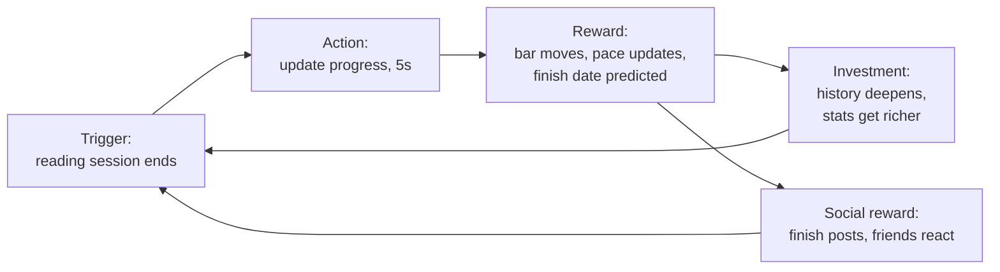

**Design note:** the *primary* reward must be intrinsic (progress, prediction, self-knowledge) because most users will have few friends early. The social reward is the amplifier, never the foundation.

---

# 5. Information Architecture

## 5.1 Navigation evaluation

The brief proposed Home / Discover / Search / Activity / Profile. That is five tabs, but it is **not the right five**.

| Proposed tab | Verdict | Reasoning |
|---|---|---|
| Home | Keep | The social feed is the social product |
| Discover | **Merge into Search** | Discovery and search are the same intent — "find me something". Two tabs for one intent wastes a slot and splits the user's mental model. Discover becomes the *empty state* of Search, which is how Instagram, Spotify and Letterboxd all solve it |
| Search | Keep, renamed **Discover** | The tab is discovery; search is the input method |
| Activity | **Demote to a header icon** | Notifications belong in a bell icon on Home. A dedicated tab over-weights a surface visited a few times a week and creates badge anxiety |
| Profile | Keep | Identity is the product |
| **Reading** | **Add — this is the missing tab** | The single highest-frequency screen in the product. It is the daily hook and the only genuinely novel thing versus Letterboxd. It cannot be buried |
| **Shelves** | **Add** | Lists are core social currency and the pre-social sharing surface |

## 5.2 Final navigation **[LOCKED]**

| # | Tab | Icon | Purpose | Expected frequency |
|---|---|---|---|---|
| 1 | **Home** | House | Social feed + notifications bell | Daily |
| 2 | **Reading** | Bookmark | Current reads, progress, the daily hook | **Multiple times daily** |
| 3 | **Discover** | Magnifier | Search + browse + recommendations | Weekly |
| 4 | **Shelves** | Stack | Lists and collections, own and others' | Weekly |
| 5 | **Profile** | Avatar | Identity, stats, diary | Weekly |

Plus one **central floating action button (+)** overlaying the tab bar: *Log a book*. It is the most important action in the product and does not belong buried inside a tab.

> **Rule [LOCKED]:** Five tabs. A sixth means removing one.

## 5.3 Screen hierarchy

```
Flyleaf
│
├── Splash
├── Auth
│   ├── Welcome carousel
│   ├── Sign up
│   ├── Log in
│   ├── Forgot password
│   ├── Reset password
│   └── Email verification
│
├── Onboarding
│   ├── Username & avatar
│   ├── Import from another app
│   ├── Genre selection
│   ├── Favourite books
│   ├── Follow suggestions
│   └── Current read
│
├── 1. HOME
│   ├── Feed (Friends | Popular toggle)
│   ├── Notifications  ← bell icon
│   ├── Review detail  ← from feed card
│   └── Comment thread
│
├── 2. READING
│   ├── Currently reading (default)
│   ├── Progress update sheet
│   ├── Finish flow  → Rate → Review
│   ├── DNF flow
│   ├── Want to read queue
│   └── Diary
│
├── 3. DISCOVER
│   ├── Browse (default / search empty state)
│   │   ├── Popular this week
│   │   ├── New releases
│   │   ├── Highly rated
│   │   ├── Hidden gems
│   │   ├── Browse by genre
│   │   ├── Curated lists
│   │   └── Readers to follow
│   ├── Search results (Books | Authors | Users | Lists)
│   ├── Genre detail
│   ├── Barcode scanner
│   └── Filters & sort
│
├── 4. SHELVES
│   ├── My shelves
│   ├── Shelf detail
│   ├── Create / edit shelf
│   ├── Reorder shelf items
│   └── Browse public shelves
│
├── 5. PROFILE
│   ├── Profile (own / other)
│   ├── Edit profile
│   ├── Favourites picker
│   ├── Stats
│   │   ├── Overview
│   │   ├── By year
│   │   └── Year in Review
│   ├── Followers
│   ├── Following
│   ├── All reviews
│   ├── Diary (full) — list · grid · calendar
│   ├── The Wall (poster grid)
│   └── Settings
│       ├── Account
│       ├── Privacy
│       ├── Notifications
│       ├── Blocked users
│       ├── Import
│       ├── Export
│       ├── Appearance
│       ├── About / Legal
│       └── Delete account
│
└── SHARED (reachable from anywhere)
    ├── Book detail
    │   ├── Overview
    │   ├── Reviews
    │   ├── Editions
    │   └── Your history with this book
    ├── Author detail
    ├── Series detail
    ├── Log book sheet  ← the (+) FAB
    ├── Edition picker
    ├── Report content
    ├── Share card preview
    └── Suggest a correction
```

## 5.4 Navigation principles

1. **The tab bar never disappears** except in full-screen modals (log sheet, share preview, scanner).
2. **Book detail is reachable from everywhere** and always returns to where it was opened from.
3. **Modals for creation, pushes for navigation.** Logging, reviewing and shelf-creating are bottom sheets or modals; browsing pushes onto a stack.
4. **Maximum stack depth of 4** before offering a shortcut back to the tab root.
5. **Every deep link resolves to a real screen** with a synthesised back stack (§35).

---

# 6. Complete Screen Inventory

Fifty-three screens. Core screens (marked ★) are specified in full; secondary screens are specified in compact form. All analytics event names correspond to §28.

---

## 6.1 Splash

| Field | Detail |
|---|---|
| **Purpose** | Restore session, warm caches, route to Auth or Home |
| **Entry** | Cold app launch |
| **Components** | Wordmark, subtle mark animation |
| **Primary CTA** | None — automatic |
| **Empty/Loading** | Is a loading state; max 1.5s before routing regardless of network |
| **Error** | Network failure → route to Home in cached/offline mode, never block |
| **Edge cases** | Expired refresh token → silent re-auth, then Auth if it fails; app updated → run migrations before routing |
| **Destinations** | Auth · Onboarding · Home. **A guest with no session routes to Home in browse mode (§4.2), not to Auth** |
| **Analytics** | `app_opened`, `session_restored` |

---

## 6.2 Welcome carousel

| Field | Detail |
|---|---|
| **Purpose** | Communicate value before asking for anything |
| **Entry** | Splash, no session |
| **Components** | 3 paged cards, dot indicator, Skip, "Get started", "I have an account", **"Look around first"** (§4.2) |
| **Content** | 1) Track what you read, effortlessly · 2) Rate and review, half-stars included · 3) Follow readers whose taste you trust |
| **Edge cases** | Deep link into the app while logged out → preserve the destination and resume after auth |
| **Destinations** | Sign up · Log in |
| **Analytics** | `welcome_viewed`, `welcome_skipped` |

---

## 6.3 Sign up ★

| Field | Detail |
|---|---|
| **Purpose** | Create an account with minimum friction |
| **Entry** | Welcome, Log in screen |
| **Components** | Email field, password field with strength meter and reveal toggle, terms/privacy links, submit |
| **Primary CTA** | Create account |
| **Secondary** | Log in instead; terms; privacy |
| **Validation** | Email format inline on blur; password minimum 10 characters, checked against a common-password list; no composition rules (they reduce real entropy) |
| **Loading** | Button spinner, form disabled, no full-screen blocker |
| **Errors** | Email already registered → offer log in and password reset · Weak password → specific guidance · Network → retry with the form preserved · Rate limited → "Too many attempts, try again in N minutes" |
| **Edge cases** | Email exists but unverified → resend verification rather than error · Password manager autofill must work · Paste into password field must be allowed |
| **Destinations** | Email verification → Onboarding |
| **Analytics** | `signup_started`, `account_created`, `signup_failed{reason}` |

---

## 6.4 Log in

| Field | Detail |
|---|---|
| **Purpose** | Authenticate a returning user |
| **Components** | Email, password, "Forgot password", submit |
| **Errors** | Generic "Email or password is incorrect" — **never** reveal whether the email exists (account enumeration) · Locked after repeated failures with a clear unlock time |
| **Edge cases** | Unverified email → allow log in but show a persistent verification banner; do not block the product |
| **Analytics** | `login_succeeded`, `login_failed{reason}` |

---

## 6.5 Forgot / reset password

| Field | Detail |
|---|---|
| **Purpose** | Recover access |
| **Components** | Email field → confirmation screen; deep-linked reset screen with new password + confirm |
| **Security** | Always show the same confirmation regardless of whether the email exists · Token single-use, expires in 60 minutes · All refresh token families revoked on successful reset |
| **Errors** | Expired or used token → clear explanation and a "send a new link" action |
| **Analytics** | `password_reset_requested`, `password_reset_completed` |

---

## 6.6 Email verification

| Field | Detail |
|---|---|
| **Purpose** | Confirm email ownership |
| **Components** | Instruction, resend button with 60s cooldown, change-email link |
| **Product decision** | **[ASSUMPTION]** Verification is **not blocking**. Unverified users can read and track but cannot post reviews, comment, or follow — this prevents throwaway-account spam without harming activation |
| **Analytics** | `email_verification_sent`, `email_verified` |

---

## 6.7 Onboarding: username & avatar

| Field | Detail |
|---|---|
| **Components** | Username field with live availability check, display name, avatar picker (camera / library / generated default) |
| **Validation** | 3–20 chars, `a-z 0-9 _`, case-insensitive uniqueness, reserved-word blocklist (`admin`, `flyleaf`, `support`…) |
| **Loading** | Debounced 400ms availability check with inline tick/cross |
| **Errors** | Taken → suggest three alternatives · Upload too large → client-side resize before upload, never error |
| **Edge cases** | Emoji and confusable Unicode rejected with an explanation; avatar upload failure must not block progression |
| **Analytics** | `username_set`, `avatar_set` |

---

## 6.8 Onboarding: import ★

| Field | Detail |
|---|---|
| **Purpose** | The highest-leverage activation step — a populated app on day one |
| **Components** | Source picker (Goodreads, StoryGraph, LibraryThing, Calibre, Open Library, OpenReads, Skip), per-source instructions with a screenshot, file picker, progress indicator |
| **Primary CTA** | Choose file |
| **Secondary** | "I'll do this later" — always visible, never a dark pattern |
| **Behaviour** | Upload returns a job ID immediately; **onboarding continues while the import runs in the background** |
| **Loading** | Non-blocking. Progress appears as a dismissible banner on Home |
| **Errors** | Unrecognised format → show detected columns and let the user map them manually · File too large (>10MB) → explain and offer to split · Malformed rows → import what parses, report the rest |
| **Edge cases** | 5,000-book library → chunked processing, ETA shown · Duplicate import → detect and offer merge or replace · Import abandoned mid-way → resumable |
| **Destinations** | Genre selection (immediately) |
| **Analytics** | `import_started{source}`, `import_completed{source, matched, unmatched}`, `import_failed{reason}` |

---

## 6.9 Onboarding: genres

| Field | Detail |
|---|---|
| **Components** | ~24 genre tiles with representative cover art, multi-select, sticky Continue |
| **Validation** | Minimum 3 to continue; Continue disabled with a count hint until then |
| **Edge cases** | If the user imported, pre-select genres inferred from their history and show "we picked these from your library — adjust if you like" |
| **Analytics** | `genres_selected{count, genres}` |

---

## 6.10 Onboarding: favourite books ★

| Field | Detail |
|---|---|
| **Purpose** | Establish identity immediately; the four-favourites row is the profile's centrepiece |
| **Components** | 4 empty slots, searchable grid seeded from selected genres, search field |
| **Primary CTA** | Continue (enabled at 0 — skippable) |
| **Empty state** | Four dashed slots reading "Your four favourites" |
| **Edge cases** | Imported users see their highest-rated books as suggestions · Order matters and is user-controlled by drag |
| **Analytics** | `favourites_set{count}` |

---

## 6.11 Onboarding: follow suggestions

| Field | Detail |
|---|---|
| **Purpose** | Prevent a dead feed on day one — the top cause of day-1 churn |
| **Components** | 12–15 user cards (avatar, username, favourite covers, follow button), "Follow all", Continue |
| **Ranking** | Genre overlap → favourite-book overlap → active reviewers → seeded editorial accounts |
| **Empty state** | Pre-launch there are no users to suggest: fall back to **curated editorial lists** to follow instead **[ASSUMPTION]** |
| **Analytics** | `follow_suggestions_shown`, `user_followed{source:onboarding}` |

---

## 6.12 Onboarding: current read

| Field | Detail |
|---|---|
| **Components** | Search field, "I'm not reading anything right now" |
| **Purpose** | Populates the Reading tab so the daily hook exists from minute one |
| **Analytics** | `onboarding_completed`, `book_started{source:onboarding}` |

---

## 6.13 Home — Feed ★

| Field | Detail |
|---|---|
| **Purpose** | The social surface: what people you follow are reading and thinking |
| **Entry** | Tab 1, app default after onboarding |
| **Components** | Header (wordmark, notification bell with badge), segmented control **Friends / Popular**, activity cards, pull-to-refresh, infinite scroll |
| **Card types** | Finished+rated · Reviewed (largest) · DNF · Shelf addition (aggregated) · Started (low priority) · Goal reached · Followed someone (aggregated) |
| **Card anatomy** | Avatar, username, verb, book cover, title/author, rating stars, review excerpt (3 lines), like/comment counts, relative time |
| **Primary CTA** | Tap card → Review detail or Book detail |
| **Secondary** | Like (double-tap and explicit), comment, long-press cover → quick shelve, share. Likes and comments target the underlying read, so a finish with no review is fully interactive (§10.3) |
| **Empty state** | **Never truly empty.** Zero follows → auto-switch to Popular with a banner "Follow readers to see them here" and an inline suggestion carousel |
| **Loading** | Skeleton cards on first load; inline spinner on pagination; optimistic like updates |
| **Errors** | Network → cached feed with an offline banner; failed page → inline retry row, never a full-screen error |
| **Edge cases** | Blocked user's content filtered server-side · Deleted review → card removed on refresh, tombstone if already visible · Very long review → truncate at 3 lines with "more" · New user with 800 imported books → imports excluded from feed entirely |
| **Destinations** | Review detail · Book detail · Profile · Notifications · Comment thread |
| **Analytics** | `feed_viewed{tab}`, `feed_card_impression{type}`, `feed_card_tapped{type}`, `review_liked`, `feed_refreshed` |

---

## 6.14 Notifications

| Field | Detail |
|---|---|
| **Purpose** | Social reactions to your activity |
| **Entry** | Bell icon on Home |
| **Components** | Grouped list (Today / This week / Earlier), unread indicator, per-row avatar and action, mark-all-read |
| **Types** | New follower · Follow request (private accounts) · Review liked · Review commented · Comment replied · Mention · Import complete · Year in Review ready |
| **Empty** | "Nothing yet — when people react to your reviews, you'll see it here" |
| **Edge cases** | Aggregate high-volume events ("Aisha and 12 others liked your review") · Notification for deleted content → row removed |
| **Analytics** | `notifications_viewed`, `notification_tapped{type}` |

---

## 6.15 Reading — Currently reading ★★

**The single most important screen in the product.** This is the daily hook and the primary differentiator from Letterboxd.

| Field | Detail |
|---|---|
| **Purpose** | See and update what you're reading in under five seconds |
| **Entry** | Tab 2; push notification; deep link |
| **Components** | Segmented **Reading / Want to read / Diary** · Book cards with cover, title, author, progress bar, "page X of Y", predicted finish date, drag-to-update slider, quick +10 pages button, overflow menu |
| **Primary CTA** | Drag the progress slider — **auto-saves on release, no confirm button** |
| **Secondary** | +10 pages · Finish · Pause · Stop reading (DNF) · Add a note · Change edition |
| **Interactions** | Drag slider → haptic tick at each 5% → optimistic save · Tap page number → numeric keypad sheet · Long-press card → quick actions |
| **Empty** | "Nothing on the go. What are you reading?" + prominent search field + 3 suggestions from Want to Read |
| **Loading** | Skeleton cards; progress writes are optimistic and never show a spinner |
| **Errors** | Offline → local write queued, card shows a subtle "will sync" dot; **never block a progress update on the network** |
| **Edge cases** | Audiobook → slider is time-based, shows "4h 12m of 9h 30m" · Ebook or unknown page count → percentage slider · Progress set to 100% → prompt "Finished?" but do not auto-finish · Progress set backwards → allow silently (re-reading a section) · More than 8 concurrent reads → still list all, no artificial limit · Book with no page count → percentage mode with a prompt to supply the count |
| **Destinations** | Finish flow · DNF flow · Book detail · Edition picker |
| **Analytics** | `reading_viewed`, `progress_updated{method, delta}`, `book_finished`, `book_dnf`, `book_paused` |

---

## 6.16 Progress update sheet

| Field | Detail |
|---|---|
| **Purpose** | Precise progress entry when the slider is not enough |
| **Components** | Numeric page / percent / time input, quick chips (+10, +25, +50), **optional "how long?" field** (§8.4), optional note field, **"Save a quote"** (§10.8), "Finished it" shortcut |
| **Edge cases** | Entered page exceeds page count → offer "Did you finish?" or "Fix the page count" · Note over 280 chars → counter and hard stop |
| **Analytics** | `progress_sheet_opened`, `progress_note_added` |

---

## 6.17 Finish flow ★

| Field | Detail |
|---|---|
| **Purpose** | Capture the moment of completion with maximum expression and minimum friction |
| **Entry** | Finish button on a reading card; progress reaching 100% |
| **Components** | Cover, "You finished!", **half-star row already visible and interactive**, **heart** (§9.4), finish-date picker (defaults today), **format chips (Print · Ebook · Audio)** pre-selected from the edition, review field (collapsed, one tap to expand), spoiler toggle, visibility selector, Post |
| **Primary CTA** | Done |
| **Secondary** | Skip rating (explicit and visible) · Add review · Mark as a re-read · Share |
| **Budget** | The whole flow must be completable in **under 20 seconds** |
| **Empty/error** | Rating is optional and never blocks **[LOCKED]** · Review draft autosaved locally every 3 seconds |
| **Edge cases** | Finish date before start date → validation with a clear message · Finishing a book already finished → creates a new attempt row, labelled "Re-read #2" · Offline → queued, appears in feed on sync |
| **Destinations** | Share card preview · Home |
| **Analytics** | `finish_flow_opened`, `rating_created{value}`, `rating_skipped`, `review_created{length, has_spoilers}`, `finish_completed{duration_seconds}`, `finish_flow_abandoned{step}` |

---

## 6.18 DNF flow

| Field | Detail |
|---|---|
| **Purpose** | Record abandonment honestly and without shame |
| **Components** | "Stopped reading" heading (never "Failed" or "Gave up"), page/percent reached (pre-filled from last progress), optional reason chips (Pacing · Writing style · Not the right time · Content · Lost interest · Other), optional note, optional rating, visibility |
| **Tone requirement** | Copy must be neutral-to-warm. "Not every book is for every reader." |
| **Edge cases** | DNF at 95% → still a DNF if the user says so; never argue · DNF then later finish → separate attempt rows, both visible in history |
| **Analytics** | `book_dnf{page_percent, reason}` |

---

## 6.19 Want to read queue

| Field | Detail |
|---|---|
| **Purpose** | The to-read pile, ordered by intent |
| **Components** | Grid/list toggle, sort (Recently added · Title · Author · Highest rated · Shortest), filter by genre/format/length, multi-select for bulk actions |
| **Primary CTA** | Start reading |
| **Empty** | "Nothing saved yet" + Discover shortcut |
| **Edge cases** | 500+ items → virtualised list, search within queue |
| **Analytics** | `want_to_read_viewed`, `book_started{source:want_to_read}` |

---

## 6.20 Diary ★

**Naming decision [LOCKED]:** this screen is called the **Diary**, not "reading history". The diary is Letterboxd's central organising metaphor — a dated, chronological record of what you consumed — and it is the correct frame here for the same reason it works there: a history is a database view, a diary is something a person keeps. The word appears in the UI, in the profile, and in the product's own vocabulary.

| Field | Detail |
|---|---|
| **Purpose** | The dated chronological record of everything you have read — the archive that makes a long-running account valuable |
| **Entry** | Reading tab segmented control; profile "View diary"; deep link |
| **Components** | **Three views of the same rows — List · Grid · Calendar** (see below) · year jump-bar · filter by status (Finished / DNF / All) · search within the diary |
| **Primary CTA** | Tap an entry → that read's detail, including its review and progress history |
| **Secondary** | Filter · search · change year · share a year as a card |
| **Empty** | "Your diary starts with the first book you finish." plus a shortcut to Reading |
| **Edge cases** | Imported rows without dates → grouped under "Undated" at the end, with an inline prompt to add them · Re-reads appear as separate dated entries, each labelled with its attempt number · A single day with several finishes groups under one date header |
| **Analytics** | `diary_viewed{view}`, `diary_filtered`, `diary_year_changed`, `diary_shared{year}` |

### Three views, because they answer different questions

| View | Shows | The question it answers |
|---|---|---|
| **List** (default) | Chronological rows: cover, title, rating, dates, DNF marker | *"What did I read, and when?"* |
| **Grid** | Covers only, dense | *"What does my year look like?"* — the same data as the Wall (§6.37a), scoped to a period |
| **Calendar** | A month grid with a marked dot per day of activity, tap a day to expand | ***"What is my reading rhythm?"*** |

The calendar earns its place because **it is the only view that shows absence.** A list of forty finished books hides the six-week gap in March; a calendar makes the gaps, the binges and the dry months immediately visible, which is the most self-revealing thing in the whole statistics story. It is also the natural home for the streak (§8.7) — seeing the chain is more motivating than reading a number, and more honest, because the breaks are visible too.

| Calendar detail | Decision |
|---|---|
| A day is marked when it has any progress event, finish or DNF | Same definition as the streak, so the two can never disagree |
| Dot weight scales with pages read that day | Denser days read darker — a heatmap without calling itself one |
| Tap a day | Expands to the entries and progress for that date |
| Finishes are marked distinctly from progress | A finish is the memorable event; a progress day is texture |
| Never shows a guilt state | Empty days are simply empty — no red, no "missed", no strike-through |

---

## 6.21 Discover — Browse ★

| Field | Detail |
|---|---|
| **Purpose** | The default state of the Discover tab; search's empty state is browsing |
| **Components** | Sticky search field, then horizontally scrolling shelves: Popular this week · Because you liked *X* · New releases · Highly rated in [your genre] · Hidden gems · Curated lists · Readers to follow · Browse all genres |
| **Primary CTA** | Tap the search field |
| **Secondary** | Barcode scan icon in the search field · Tap any shelf row |
| **Empty** | Cold-start user → Popular and editorial lists only, no personalised rows shown rather than bad ones |
| **Loading** | Shelf-level skeletons; rows appear as they resolve |
| **Errors** | A failed row is omitted entirely rather than showing an error, so the screen still works |
| **Edge cases** | Personalised rows require ≥5 rated books; below that they are hidden, not empty |
| **Analytics** | `discover_viewed`, `discover_row_impression{row}`, `discover_book_tapped{row, position}` |

---

## 6.22 Search results ★

| Field | Detail |
|---|---|
| **Purpose** | Find any entity in the product |
| **Components** | Search field, tabs **Books / Authors / Users / Lists**, result rows, filters, recent searches |
| **Behaviour** | Debounced 250ms; results update as you type; typo-tolerant |
| **Book row** | Cover, title, author, year, average rating, your status badge if any |
| **Filters** | Genre · Format · Language · Page count range · Publication year · Minimum rating |
| **Empty (no query)** | Recent searches, then Browse content |
| **Empty (no results)** | "No results for *X*" + Search all editions · Scan a barcode · Suggest we add this book |
| **Loading** | Inline skeleton rows; a slow catalog-miss lookup shows "Checking Open Library…" |
| **Errors** | Search backend down → cached recents + clear message |
| **Edge cases** | ISBN pasted → exact edition match first · Single-character query → no search fired · Query matching a user handle → Users tab badged · Non-Latin script → must work (§39) |
| **Analytics** | `search_performed{query_length, tab}`, `search_result_tapped{tab, position}`, `search_zero_results{query}` |

---

## 6.23 Barcode scanner

| Field | Detail |
|---|---|
| **Purpose** | Log a physical book in one action |
| **Components** | Camera view, ISBN framing guide, torch toggle, manual-entry fallback |
| **Permissions** | Rationale shown before the OS prompt; graceful denial path to manual entry |
| **Errors** | Unreadable code → guidance ("try more light, hold steady") · ISBN not in catalog → offer live lookup, then "suggest this book" |
| **Edge cases** | Non-ISBN barcode → clear message · Multiple editions for one ISBN → edition picker |
| **Analytics** | `scanner_opened`, `isbn_scanned{found}` |

---

## 6.24 Book detail ★★

The most-visited non-tab screen and the product's SEO surface later.

| Field | Detail |
|---|---|
| **Purpose** | Everything about a book, and everything you can do with it |
| **Entry** | Feed, search, shelves, profile, deep link, scanner |
| **Components** | Cover (hero, parallax), title, author (tappable), series with position, publication year · **Your status control** (Want to read / Reading / Finished / DNF) · **Your half-star rating** · Average rating with distribution histogram and count · **Friends' ratings, above strangers'** · Description (collapsible) · Metadata (pages, format, language, publisher) · Genre chips · Tabbed: Reviews / Editions / Your history |
| **Primary CTA** | Status control — the largest, most obvious element after the cover |
| **Secondary** | Rate · Write a review · Add to shelf · Share · **Where to read** (library first, §30.3) · Suggest a correction · View editions |
| **Empty** | No reviews → "Be the first to review" · No friends' ratings → section hidden, not empty |
| **Loading** | Cover and title from the navigation payload render immediately; the rest fills in |
| **Errors** | Book not found (deleted or merged) → redirect to the merge target, or a friendly "this book was merged into X" |
| **Edge cases** | Book with 12 editions → default to the most-held edition, with an obvious switcher · Missing cover → generated placeholder using title typography, never a broken image · Missing page count → prompt the user to contribute it · Book you've read 3 times → history tab shows all attempts with individual ratings · Very long title → 3-line clamp |
| **Destinations** | Author · Series · Editions · Reviews · Review composer · Shelf picker |
| **Analytics** | `book_viewed{source}`, `book_status_changed{from, to}`, `rating_created`, `book_shared` |

---

## 6.25 Reviews list (book)

| Field | Detail |
|---|---|
| **Components** | Sort control (Friends · Most liked · Newest · Highest rated · Lowest rated), spoiler-collapsed cards, filter by rating |
| **Ranking** | Friends first, then the ranking formula in §10.7 |
| **Empty** | "No reviews yet" + write CTA |
| **Edge cases** | Reviews containing spoilers are collapsed behind a tap · Reviews from blocked users never appear |
| **Analytics** | `reviews_list_viewed{sort}`, `spoiler_revealed` |

---

## 6.26 Review detail ★

| Field | Detail |
|---|---|
| **Purpose** | The review as a first-class piece of content |
| **Components** | Author header (avatar, username, follow button), book context strip, rating, full review body, spoiler gate, like/comment counts, comment thread, share |
| **Primary CTA** | Like |
| **Secondary** | Comment · Follow author · Share · Report · Copy link |
| **Edge cases** | Deleted review → tombstone ("This review was removed") rather than a crash · Review by a blocked user → not reachable · Extremely long review → progressive rendering |
| **Analytics** | `review_viewed`, `review_liked`, `review_shared`, `comment_created` |

---

## 6.27 Review composer ★

| Field | Detail |
|---|---|
| **Purpose** | Make writing a review feel good enough to do often |
| **Components** | Book context strip, half-star row, body field (auto-growing), **spoiler toggle + optional "spoilers after page N"**, visibility selector (Public / Followers / Private), character count (soft, no hard limit), Post |
| **Primary CTA** | Post |
| **Secondary** | Save draft · Discard · Preview |
| **Behaviour** | Draft autosaved locally every 3 seconds and restored on relaunch |
| **Errors** | Post failure → draft preserved, inline retry, never lose text |
| **Edge cases** | Editing an existing review → shows "edited" on the review afterwards · Review on a DNF → allowed, labelled · Offline → queued and posted on reconnect |
| **Analytics** | `review_composer_opened`, `review_created{length, has_spoilers, visibility}`, `review_edited`, `review_draft_saved` |

---

## 6.28 Comment thread

| Field | Detail |
|---|---|
| **Components** | Parent review summary, flat comment list (single-level replies only), composer, per-comment overflow (report, delete own, block author) |
| **Product decision** | **[ASSUMPTION]** Single-level replies only. Deep nesting produces argument threads; flat lists produce conversation |
| **Edge cases** | Comment on a deleted review → thread becomes read-only with a tombstone · Rate limit: 5 comments/minute |
| **Analytics** | `comment_created`, `comment_deleted`, `comment_reported` |

---

## 6.29 Author detail

| Field | Detail |
|---|---|
| **Components** | Photo, name, bio, "books you've read by them" count, bibliography sorted by popularity or date, series grouping, follow author (P1) |
| **Empty** | No bio → hide the section rather than showing an empty block |
| **Edge cases** | Author name collision (two people named John Smith) → disambiguation by works; a merge/report affordance · Author with 400 works → paginated, sorted by holdings |
| **Analytics** | `author_viewed`, `author_book_tapped` |

---

## 6.30 Series detail

| Field | Detail |
|---|---|
| **Components** | Series name, ordered book list with position numbers, **your progress through the series** ("3 of 7 read"), read-next suggestion |
| **Edge cases** | Novellas at position 2.5 → shown in order, visually distinguished · Unordered or disputed series → fall back to publication order with a note |
| **Analytics** | `series_viewed`, `series_next_tapped` |

---

## 6.31 Edition picker

| Field | Detail |
|---|---|
| **Purpose** | Choose which physical or digital object you actually read |
| **Components** | **Cover-forward grid** (the cover is the choice, so it dominates the row), format icon, publisher, year, pages, language, ISBN · filter by format and language · "most common" badge · "this is the copy I own" affordance |
| **Why it matters** | Page counts and covers come from the edition; ratings belong to the work (§7) |
| **It also chooses your cover art** | The selected edition's cover is what appears in **your** Diary, your Wall (§6.37a) and your share cards — so this is not only a page-count control, it is how a reader makes the poster grid show the copies they actually own. Surface it as "choose your cover", not just "choose your edition", and show the covers large enough to pick by sight |
| **Edge cases** | 60+ editions → search within, default to most-held · No editions with page counts → allow the user to enter one |
| **Analytics** | `edition_changed{format}` |

---

## 6.32 Log book sheet (the + FAB) ★

| Field | Detail |
|---|---|
| **Purpose** | The fastest path from "I read this" to a saved record, from anywhere |
| **Components** | Search field (auto-focused), recent and suggested books, scan shortcut, then a compact status selector |
| **Budget** | Two taps to Want to Read; four to a fully logged finish |
| **Edge cases** | Book not found → "Add it manually" (title, author, pages) creating a provisional record flagged for catalog review |
| **Analytics** | `log_sheet_opened{entry_point}`, `book_logged{status}` |

---

## 6.33 Shelves — My shelves

| Field | Detail |
|---|---|
| **Components** | Grid of shelf cards (4-cover mosaic, name, count, privacy icon), create button, sort, tabs **Mine / Saved / Discover** |
| **Empty** | Three suggested starter shelves ("Favourites of 2026", "Comfort reads", "Recommended to me") that create on tap |
| **Analytics** | `shelves_viewed`, `shelf_created` |

---

## 6.34 Shelf detail

| Field | Detail |
|---|---|
| **Components** | Header (name, description, owner, count, privacy), ranked numbering if ranked, book rows with per-entry notes, follow/save shelf, share, edit if owner |
| **Edge cases** | Collaborative shelf → contributor avatars and per-entry attribution · Book removed from the catalog → row shows a tombstone rather than vanishing silently |
| **Analytics** | `shelf_viewed`, `shelf_saved`, `shelf_shared` |

---

## 6.35 Create / edit shelf

| Field | Detail |
|---|---|
| **Components** | Name, description, privacy (Public / Followers / Private), **ranked toggle**, collaborative toggle (P1), cover selection |
| **Edge cases** | Turning a ranked list unranked → warn that the order will be lost · Name collision within a user's own shelves → allowed but warned |
| **Analytics** | `shelf_created{is_ranked, privacy}`, `shelf_edited` |

---

## 6.36 Reorder shelf items

| Field | Detail |
|---|---|
| **Components** | Drag-handle list, haptic feedback on reorder, autosave |
| **Edge cases** | 200-item list → drag-to-edge auto-scroll; "move to position" sheet as an accessible alternative to dragging |
| **Analytics** | `shelf_reordered` |

---

## 6.37 Profile ★★

| Field | Detail |
|---|---|
| **Purpose** | "This is who I am as a reader." The product's identity artefact and its primary growth surface |
| **Entry** | Tab 5, feed cards, search, deep link, external share |
| **Components (top to bottom)** | Avatar, display name, @username, bio · Follower/following counts · Follow or Edit button · **Four favourites row** · Stats strip (books this year, pages, average rating, current streak, goal ring) · **Currently reading** carousel · **The Wall** — a poster grid of everything read (§6.37a) · **Diary** — the most recent dated entries, with "View full diary" · Recent reviews · Shelves · "View all" affordances throughout |
| **Primary CTA** | Follow (other) / Edit profile (own) |
| **Secondary** | Share profile · View stats · View all reviews · Block or report (other) · Message (out of scope) |
| **Empty (own, new)** | Prompts in place of each empty section: "Pick your four favourites", "Log your first book" |
| **Empty (other, sparse)** | Sections with no content are hidden entirely — never show someone an empty profile |
| **Loading** | Header renders from cached summary; sections stream in |
| **Errors** | Deleted user → "This account no longer exists" · Private account, not following → header only, plus a Request to follow button |
| **Edge cases** | Blocked-by → indistinguishable from "account not found" (do not leak block state) · 10,000 books → all sections paginate · Very long bio → 4-line clamp with expand |
| **Destinations** | Stats · Diary · The Wall · Followers · Following · Reviews · Shelves · Book detail · Settings |
| **Analytics** | `profile_viewed{is_own}`, `profile_shared`, `user_followed{source:profile}` |

---

## 6.37a The Wall — poster grid ★

| Field | Detail |
|---|---|
| **Purpose** | Everything you have read, as cover art. After the four favourites, this is the most visually arresting thing on a profile and the most screenshotted surface in products of this kind — a wall of covers says more about a reader in three seconds than any statistic |
| **Entry** | Profile section header "View all"; profile stats strip; deep link |
| **Components** | 3-column poster grid at 2:3 · sticky filter bar (Year · Rating · **Hearted** · Genre · Format) · sort control (Recently read · Rating · Title · Publication date) · count header ("312 books") · long-press for quick actions · share-as-image |
| **Primary CTA** | Tap a cover → book detail |
| **Secondary** | Filter · sort · share the grid · switch to Diary for the dated view |
| **Relationship to the Diary** | Same rows, two presentations, and both are needed. **The Diary is chronological and narrative** — when you read it, in what order, what you said. **The Wall is spatial and aggregate** — the shape of a reading life at a glance. Letterboxd ships both for exactly this reason |
| **Empty** | Fewer than 4 books → the section is hidden on the profile entirely rather than showing a sparse grid, which looks worse than nothing |
| **Loading** | Blurhash placeholders in grid position; covers stream in |
| **Edge cases** | Books with no cover → generated typographic poster, so the grid never has holes · 3,000 books → virtualised, filters applied server-side · Filtered to zero → "No books match" with a clear-filters action · `explicit` titles blurred for filtered viewers (§7.8) · Private reads visible to the owner, excluded for everyone else (§17.5) |
| **Share** | Renders a 4×4 or 3×5 poster collage as an image — the single most shareable artefact the profile produces |
| **Analytics** | `wall_viewed{is_own}`, `wall_filtered{filter}`, `wall_shared{layout}` |

---

## 6.38 Edit profile

| Field | Detail |
|---|---|
| **Components** | Avatar, display name, bio (160 chars), pronouns (optional), location (optional), favourite genres, link (P1) |
| **Edge cases** | Username change → allowed once every 30 days, old handle reserved for 30 days to prevent impersonation |
| **Analytics** | `profile_edited{fields}` |

---

## 6.39 Favourites picker

| Field | Detail |
|---|---|
| **Components** | Four ordered slots, search, drag to reorder, remove |
| **Analytics** | `favourites_changed` |

---

## 6.40 Stats ★

| Field | Detail |
|---|---|
| **Purpose** | Self-knowledge, and the raw material for sharing |
| **Components** | Year selector · Headline numbers (books, pages, hours) · Reading pace chart · Genre donut · Format split · Rating distribution histogram · You-vs-average delta · Most-read author · Longest and shortest · DNF rate · Streak · Goal ring · Share button on every card |
| **Empty** | Fewer than 3 finished books → "Finish a few books and your stats will appear" with a preview illustration |
| **Edge cases** | Imported data without dates → excluded from time-based charts, with a note explaining why · Audiobooks normalised to page-equivalents with the method disclosed on tap |
| **Analytics** | `stats_viewed{year}`, `stat_card_shared{card}` |

---

## 6.41 Year in Review

| Field | Detail |
|---|---|
| **Purpose** | The annual growth event |
| **Components** | Vertically paged story cards, each server-rendered as a shareable image; final summary card with the user's handle |
| **Availability** | Unlocks 1 December; re-viewable any time afterwards |
| **Edge cases** | Fewer than 5 books read → a gentler variant that celebrates rather than measures |
| **Analytics** | `yir_viewed{year}`, `yir_card_shared{card}` |

---

## 6.42 Followers / Following

| Field | Detail |
|---|---|
| **Components** | Searchable user list, follow/unfollow inline, mutual indicator |
| **Edge cases** | Private account → list hidden from non-followers · Pending requests shown to the owner only |
| **Analytics** | `followers_viewed`, `following_viewed` |

---

## 6.43 Settings screens (compact)

| Screen | Key contents | Notable requirements |
|---|---|---|
| **Settings root** | Grouped list, version, sign out | — |
| **Account** | Email, change password, connected devices/sessions, username | Show active sessions with device and last-used; allow revoking one or all |
| **Privacy** | Private account toggle, default read visibility, default review visibility, activity visibility, searchable-by-email toggle | Changing to private must retroactively hide existing public activity |
| **Libraries** | Add your library systems; used for the "Where to read" section (§30.3) | Set once; nothing is shared with the library |
| **Content** | Show explicit titles in search (off by default, 18+ only), blur covers, muted words | Requires date-of-birth re-entry to enable; hidden entirely for under-18 accounts (§7.8) |
| **Notifications** | Per-category toggles, quiet hours, push/email split, **reading reminder time picker** (off by default) | Every category individually disableable (§19) |
| **Blocked users** | List, unblock | — |
| **Import** | Same as onboarding import, plus import history with results | Re-runnable |
| **Export** | Request export → emailed link | Must include all reads, reviews, shelves, ratings |
| **Appearance** | Theme (System / Light / Dark), text size | Dark mode is a first-class design, not an inversion |
| **About / Legal** | Terms, privacy policy, licences, data attribution | Open Library attribution lives here (§41) |
| **Delete account** | Two-step confirmation, consequences explained, 30-day grace | **Store requirement.** Must be completable in-app; deactivation alone is insufficient |

---

## 6.44 Report content

| Field | Detail |
|---|---|
| **Components** | Reason picker (Spam · Harassment · Hate speech · Spoilers unmarked · NSFW · Copyright · Fake review · Other), optional detail, submit |
| **Feedback** | Confirmation with an expected response window; do not promise outcomes |
| **Analytics** | `content_reported{type, reason}` |

---

## 6.45 Share card preview

| Field | Detail |
|---|---|
| **Components** | Rendered card preview, template switcher (2–3 options), share sheet |
| **Templates** | Finished a book · Review quote · Stat card · Year in Review · Profile |
| **Requirements** | Portrait, story dimensions, handle watermark, generated server-side so it is identical everywhere |
| **Analytics** | `share_card_generated{template}`, `share_completed{destination}` |

---

## 6.46 Suggest a correction

| Field | Detail |
|---|---|
| **Components** | Field picker (cover, title, author, page count, "these are the same book"), proposed value, submit |
| **Purpose** | Crowd-sourced catalog quality — cheaper than perfect ingest and builds community investment |
| **Behaviour** | An accepted correction writes a `field_provenance` row with `provider='user'` and `is_locked=true`, so the next monthly ingest **cannot** overwrite it (§7.8). Without that lock, every human fix silently reverts within thirty days |
| **Edge cases** | Correction to a field a user has already locked → shown to a moderator rather than auto-applied · High-reputation users auto-apply; everyone else queues |
| **Analytics** | `correction_submitted{field}`, `correction_applied{field, auto}` |

---

## 6.47 Additional screens identified (not in the original brief)

These were missing from the brief and are required:

| Screen | Why it is necessary |
|---|---|
| **Edition picker** | Without it, works-vs-editions modelling is invisible to users and page counts will be wrong |
| **Series detail** | Series reading order is a genuine book-specific need with no film analogue |
| **DNF flow** | Abandonment needs its own designed experience, not a status dropdown |
| **Share card preview** | The growth loop requires a designed artefact, not an OS screenshot |
| **Suggest a correction** | The only economically viable path to catalog quality |
| **Import results / unmatched rows** | Silent partial imports destroy trust with the highest-value users |
| **Barcode scanner** | Physical-book logging is a step-change in convenience |
| **Sessions / device management** | Self-hosted auth makes this the user's only visibility into account security |
| **Progress update sheet** | The slider covers the common case; precise entry needs its own surface |
| **Comment thread** | Reviews without conversation are a broadcast, not a social product |

---

# 7. Book Data Model

## 7.1 The central modelling problem

A film is one object. A book is not. This is the single largest structural difference between Flyleaf and Letterboxd, and getting it wrong fragments every rating, review and statistic in the product.

| Concept | Definition | Example |
|---|---|---|
| **Work** | The abstract creative work, independent of any printing | *Dune* by Frank Herbert — the novel itself |
| **Edition** | A specific published manifestation of a work | The 2021 Ace paperback, 704 pages, ISBN 9780441013593 |
| **ISBN** | An identifier for a specific edition-format-region combination | The hardcover and paperback of the same edition have different ISBNs |

Additional real-world complications:

- Pre-1970 books have **no ISBN at all**.
- Audiobooks may have an ISBN, an ASIN, both, or neither.
- The same edition sold in different countries can carry different ISBNs.
- Box sets have their own ISBN but contain multiple works.
- Translations are separate works in some catalogues and separate editions in others.

## 7.2 The Flyleaf model **[LOCKED]**

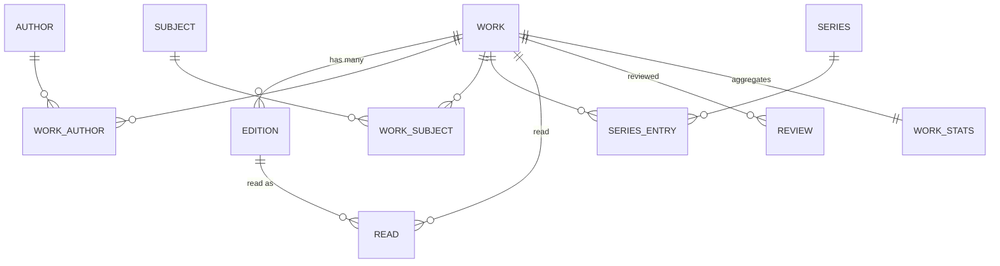

### The rule that resolves everything

> **Opinions attach to the WORK. Physical facts attach to the EDITION.**

| Attaches to the **Work** | Attaches to the **Edition** |
|---|---|
| Ratings | Page count |
| Reviews | Cover image |
| Average rating and distribution | ISBN-10 / ISBN-13 |
| Shelf and list membership | Publisher |
| Genre and subject tags | Publication date |
| Series position | Language |
| Read counts, DNF rate | Format (hardcover / paperback / ebook / audiobook) |
| Author relationships | Audio duration |
| Favourites | Translator |

**Why:** a reader who loved *Dune* loved *Dune*, not the 2021 Ace paperback. Attaching ratings to editions would split one book's 40,000 ratings across 60 editions and destroy every average in the product. Conversely, "how many pages did I read?" is only answerable from the edition.

### The user-facing consequence

The user never sees the word "work". They see **a book** (the work) and, when it matters, **which copy they read** (the edition). The edition picker (§6.31) is the only place the distinction surfaces, and it appears only when the user cares — setting a page count, or logging a specific audiobook.

## 7.3 Entity definitions

### Work

| Field | Type | Notes |
|---|---|---|
| `id` | uuid | Internal primary key |
| `ol_work_key` | text unique | Open Library identifier, e.g. `/works/OL45883W` |
| `title` | text | Canonical title |
| `subtitle` | text null | |
| `description` | text null | |
| `first_publish_year` | int null | Original publication, not this edition |
| `default_edition_id` | uuid null | The edition shown by default — most-held, with a cover |
| `original_language` | text null | |
| `search_vector` | tsvector | Generated from title, subtitle, author names |
| `merged_into_id` | uuid null | Set when this work is merged into another (§34) |
| `created_at`, `updated_at` | timestamptz | |

### Edition

| Field | Type | Notes |
|---|---|---|
| `id` | uuid | |
| `work_id` | uuid FK | |
| `ol_edition_key` | text unique | |
| `isbn_13`, `isbn_10` | text null, indexed | Nullable — pre-ISBN books exist |
| `title` | text | May differ from the work (translated titles) |
| `publisher` | text null | |
| `publish_date` | date null | Often partial; store as text plus a parsed year **[ASSUMPTION]** |
| `page_count` | int null | |
| `format` | enum | `hardcover` · `paperback` · `ebook` · `audiobook` · `unknown` |
| `language` | text | ISO 639-1 |
| `audio_seconds` | int null | Audiobook duration |
| `ol_cover_id` | int null | **An integer, not a URL** — covers are served from Open Library's CDN (§40) |
| `is_box_set` | bool | Suppressed from default results |

### Author

| Field | Type | Notes |
|---|---|---|
| `id`, `ol_author_key`, `name`, `bio`, `ol_photo_id`, `birth_date`, `death_date` | | |
| `disambiguation` | text null | For name collisions, e.g. "John Smith (historian)" |

`work_authors(work_id, author_id, role)` where role ∈ `author` · `co_author` · `translator` · `illustrator` · `narrator` · `editor`.

### Series

`series(id, name, ol_key)` and `series_entries(series_id, work_id, position numeric)`.

`position` is **numeric, not integer**, so novellas at 2.5 sort correctly — a real and common case in fantasy and science fiction.

### Subject / genre

`subjects(id, name, kind)` where `kind` ∈ `genre` · `theme` · `place` · `time_period` · `character` · `noise`.

Open Library subjects are extremely noisy — they mix "Science fiction" with "New York Times bestseller" and "Fiction, general". Normalisation to a **curated set of ~40 genres** is required; everything else is retained but not surfaced. **[ASSUMPTION]** The genre taxonomy is hand-built and maintained by the team, mapping many OL subjects to one Flyleaf genre.

## 7.4 Format handling

| Format | Progress unit | Stats normalisation | Notes |
|---|---|---|---|
| Hardcover / Paperback | Pages | Direct | Page count from the edition |
| Ebook | Percent (Kindle has no stable pages) | Percent × work's median page count | Falls back to percent-only stats if unknown |
| Audiobook | Time | Hours × 40 pages/hour **[ASSUMPTION]** | Disclosed to the user on tap; based on ~9,000 words/hour narration and ~250 words/page |

**Requirement:** statistics screens must show both the raw unit and the normalised figure, and never silently mix them. "412 pages + 9h 30m" is more honest than a single fabricated number, so headline figures show both.

### The friction problem, and `format_override` **[LOCKED]**

Format lives on the edition, which is correct — but taken alone it produces a statistic the product will be confidently wrong about.

A user listens to a book on Audible. To have that recorded as audio, the strict model requires them to locate and select the specific audiobook edition. They do not know which edition that is, they do not care, and they will not go looking. So they log the paperback, and every format statistic in §17 quietly becomes false — the audiobook listener appears in their own year-in-review as someone who reads only print.

**The fix is not to move format onto the read.** That would break page counts, the edition model and cross-user aggregation. Instead:

| Field | Behaviour |
|---|---|
| `reads.format_override` | Nullable enum, same values as `editions.format`. Null means "use the edition's format" |
| Where it is set | A one-tap format chip in the log sheet and the finish flow — **Print · Ebook · Audio** — visible without opening the edition picker |
| Effect on statistics | The override wins. Format split, listening hours and the print/audio ratio all read it first |
| Effect on progress | Setting Audio switches the progress control to time-based even on a print edition, and prompts once for the duration if unknown |
| Effect on page counts | The edition still supplies page count. An audio override with no duration falls back to page-equivalents, disclosed on tap |
| Effect on aggregates | **None.** `work_stats` and community averages are unaffected — this is a personal record, not a claim about the book |

**Why this is the right trade.** The edition remains the source of truth for anything shared or aggregated; the override only governs how one person's own read is described. It costs one nullable column and one row of chips, and it is the difference between format statistics that are right and format statistics that quietly aren't.

## 7.5 Handling multi-language editions and translations

**[ASSUMPTION]** A translation is modelled as an **edition of the original work**, with `language` set and a `translator` role in `work_authors`.

Rationale: a reader of the Hindi translation of *Dune* has read *Dune*, and their rating belongs in the same pool. The alternative — separate works per language — fragments ratings and makes "have my friends read this?" unanswerable across languages.

**Exception:** where a translation is itself a significant literary work (a famous verse translation, for example), it may warrant its own work record. This is rare and handled by manual curation, not by rule.

## 7.6 Box sets and omnibuses

- A box set is an **edition flagged `is_box_set`** and linked to multiple works via `edition_works`.
- Logging a box set logs each contained work as a separate read.
- Box sets are excluded from default search results (they pollute results badly) and reachable via the edition picker.

## 7.7 Provisional records

When a user logs a book absent from the catalog (via "add manually" or a failed scan):

1. A `works` row is created with `is_provisional = true` and `created_by_user_id`.
2. It is visible only to that user and excluded from search, aggregates and the feed.
3. A background job attempts to match it against Open Library daily for 30 days.
4. On match, the provisional record is merged into the canonical work and the user's read is repointed.

This prevents a long tail of user-created duplicates from polluting the catalog while never blocking a user from logging what they actually read.

## 7.8 Catalog maturity classification **[LOCKED]**

Open Library is a complete library catalogue, which means it contains a substantial quantity of explicit erotica and adult material — fully catalogued, with cover art, indistinguishable in structure from anything else. Ingest it unfiltered and that material is returned by search, appears in genre browsing and shows up in recommendations, to every user including the thirteen-year-olds §26.6 explicitly admits.

This is not a hypothetical. It is an unfiltered search away, it is a **§1.2 App Store problem** — objectionable content with no filtering mechanism — and it is the kind of finding that surfaces during review rather than before it. The product has no answer today; this section is the answer.

### Classification

Every work carries a `maturity` rating, assigned at ingest and correctable:

| Value | Meaning | Default visibility |
|---|---|---|
| `general` | Everything ordinary | Always visible |
| `mature` | Adult themes handled seriously — literary fiction with explicit content, some memoir, some non-fiction | Visible; no filtering |
| `explicit` | Material whose primary purpose is sexual content | **Hidden by default** |
| `unclassified` | Not yet assessed | Treated as `general`, queued for classification |

**How it is assigned.** Open Library subjects carry reliable signals (`Erotic fiction`, `Erotica`, and similar), and publisher and imprint are a second strong signal — a handful of imprints account for most of this material. Classification runs as an ingest-time rule set, not a per-title human review, with a queue for corrections. **[ASSUMPTION]** A rules-based pass over subjects and imprints catches the large majority; the correction flow (§6.46) handles the tail.

### Behaviour

| Surface | Rule |
|---|---|
| Search | `explicit` works excluded unless the user has enabled the setting **and** is 18+ |
| Genre browse, Discover rows, recommendations | `explicit` never appears, regardless of the setting — these are push surfaces, and the user did not ask |
| Direct link or ISBN scan | Resolves and is loggable, with a one-time interstitial. **A user is never blocked from recording a book they actually read** |
| A user's own Diary, shelves and stats | Always visible to them. Filtering governs discovery, never their own record |
| Feed and public profiles | Reviews of `explicit` works are visible to followers but suppressed from Popular and from logged-out public pages |
| Covers | `explicit` covers render blurred in any list a filtered user can reach, tappable to reveal |

### The setting

Settings → Content, with one control: **"Show explicit titles in search"**, off by default, and settable only by accounts registered as 18+. Changing it requires re-entering the date of birth. Accounts under 18 do not see the control at all.

**Design principle:** this filters *discovery*, not *the user's own life*. Someone who reads erotica can log it, shelve it, rate it and see it in their statistics with no friction whatsoever. What the filter governs is whether that material is pushed at people who did not ask for it — which is both the ethical line and the one the app stores actually care about.

## 7.9 Metadata provenance **[LOCKED]**

Catalog fields arrive from several places — the monthly dumps, the live Open Library API, a user correction, and eventually a paid provider. Without a record of **where each field came from**, three things break, and all three break silently.

| Problem | What goes wrong without provenance |
|---|---|
| **Licensing** | §41 forbids persisting Google Books content. That rule currently exists only as a sentence in a document. The first time someone writes a gap-fill job that merges a missing description, the rule is violated and nothing detects it |
| **User corrections** | A user fixes a wrong page count. The next monthly re-ingest upserts on the Open Library key and overwrites the human with the machine — exactly backwards, and invisible until someone complains twice |
| **Multi-source merging** | Adding ISBNdb later means deciding, field by field, which source wins. Without provenance that is a migration; with it, it is a policy change |

### The model

Two additions to the catalog schema.

**`external_ids`** — maps every provider identifier to your canonical record, so one work or edition can be recognised from any source.

| Field | Type | Notes |
|---|---|---|
| `entity_type` | enum | `work` · `edition` · `author` · `series` |
| `entity_id` | uuid | Your canonical ID |
| `provider` | enum | `open_library` · `google_books` · `isbndb` · `user` |
| `external_id` | text | The provider's identifier |
| `first_seen_at`, `last_seen_at` | timestamptz | |

Unique on `(provider, external_id, entity_type)`; indexed on `(entity_type, entity_id)`.

**`field_provenance`** — records the origin of each individually-sourced field.

| Field | Type | Notes |
|---|---|---|
| `entity_type`, `entity_id` | | As above |
| `field_name` | text | e.g. `page_count`, `description`, `cover` |
| `provider` | enum | Where this specific value came from |
| `fetched_at` | timestamptz | Freshness |
| `confidence` | smallint | 0–100 |
| `is_locked` | bool | **True for user corrections — the ingest may not overwrite it** |

Provenance is recorded only for fields that can come from more than one source, or that a user can correct. It is not a change log for every column.

### Keep the raw payload

Provenance records *where* a field came from. Keeping the raw response records *what the source actually said*, and the two answer different questions.

**Rule: every Open Library response — dump line or live API call — is stored verbatim in `raw_payloads` alongside the normalised record.**

| Field | Notes |
|---|---|
| `provider`, `external_id` | What was fetched |
| `fetched_at` | When |
| `payload` | `jsonb`, the response exactly as received |
| `payload_hash` | Skip the write when nothing changed since last fetch |

**Why this earns its storage.** The normaliser will have bugs — a date format missed, a subtitle rule that eats real titles, a subject mapping that turns out wrong. Without the raw payload, fixing one means **re-fetching**, and the live API is capped at roughly one identified request per second. Reprocessing 200,000 gap-filled records would take over two days of continuous requests and would risk the IP block §45 warns about. With the raw payload it is a `SELECT` and a loop, and it runs in minutes.

It also makes the classification rules in §7.8 and the dedupe pipeline in §40.3 **re-runnable against improved rules** rather than frozen at whatever the first pass decided.

| Constraint | Detail |
|---|---|
| **Open Library only** | CC0, so storage is unrestricted. **Google Books payloads are never stored**, for the same reason its fields are never persisted — the `CHECK` constraint below covers both |
| Storage cost | Raw JSON for a filtered catalog is single-digit gigabytes, compressed by Postgres TOAST. Cheap against the cost of a two-day re-fetch |
| Retention | Superseded payloads pruned after 90 days; the current one kept indefinitely |
| Not a change log | This is a reprocessing cache, not an audit trail of catalog history |

### The rules that fall out of it

| # | Rule |
|---|---|
| 1 | **No field may be persisted with `provider = 'google_books'`.** Enforce with a database `CHECK` constraint, not a code review. This converts the §41 licensing constraint from a promise into something the database refuses to violate |
| 2 | **A user correction sets `is_locked = true`.** The monthly ingest skips locked fields. A human who fixed something stays fixed |
| 3 | **Precedence when sources disagree:** user correction → paid provider (if adopted) → Open Library dump → Open Library live API. Higher confidence wins within a tier |
| 4 | **Staleness is visible.** A field not refreshed in over a year is eligible for re-fetch; the ingest prioritises these |
| 5 | **Provisional records (§7.7) carry `provider = 'user'`** on every field, so a later match knows exactly what a human supplied versus what was guessed |

**Cost of adding this later:** a schema migration plus a backfill you cannot actually perform, because the origin of existing rows is unrecoverable. It is cheap now and impossible retroactively, which is why it belongs in Phase 0.

---

# 8. Reading Tracking System

## 8.1 The core insight

**The unit of tracking is a reading attempt, not a book.** Each attempt is one row in `reads`, with its own status, dates, rating and progress history.

Consequences:

- A re-read is a **new row** with `attempt_no = 2`, carrying its own rating. Ratings can differ between reads, which is realistic and interesting data.
- A DNF followed by a successful read later is **two rows**, both preserved.
- "Books read" counts finished attempts; "distinct books read" counts distinct works. Both are shown in stats.

## 8.2 Status model **[LOCKED]**

| Status | Meaning | Terminal? | Feed weight |
|---|---|---|---|
| `want` | On the to-read pile | No | Low, aggregated |
| `reading` | Actively reading | No | Low |
| `paused` | Set aside, intending to return | No | Silent |
| `finished` | Completed | Yes | **Highest** |
| `dnf` | Abandoned | Yes | Medium |

`paused` exists because without it, users either lie (leaving books "reading" forever, corrupting pace statistics) or destroy data (deleting the read). **[ASSUMPTION]** Books with no progress for 60 days prompt — once, gently, in-app only — "Still reading this?" with Continue / Pause / Stop options.

## 8.3 Progress: the design decision

> **Recommendation: store all three units natively; display the one that matches the format; normalise only for cross-format statistics.** **[LOCKED]**

| Option | Verdict |
|---|---|
| Page-only | Fails for ebooks and audiobooks — roughly 40% of modern reading |
| Percent-only | Loses the satisfying specificity of "page 210 of 480", which is the emotional core of progress |
| **Both, format-aware** | **Chosen.** Print shows pages, ebooks show percent, audiobooks show time. All convert to percent internally for progress bars |

### Progress is optional **[LOCKED]**

The product bets on progress as the daily hook (§1.6), and that bet invites a fair objection: **for a meaningful share of readers, progress tracking is friction rather than fun.** Someone who reads a book over three weeks and simply wants to record that they read it should not be nagged into logging pages.

So the bet is on progress being *available and rewarding*, never on it being *required*:

| Rule | Detail |
|---|---|
| A read can go `want` → `reading` → `finished` with **zero** progress events | This path is fully supported and produces a complete, correct record |
| Nothing prompts for progress | No push notification, no badge, no "you haven't updated in a while" nudge. The one exception is the single gentle 60-day "still reading this?" prompt (§34.2), which asks about *status*, not pages |
| The reading card degrades gracefully | With no progress data it shows cover, title, days elapsed and a Finish button — no empty progress bar, no zero-percent shame |
| Statistics adapt rather than break | Pages-per-week, pace and predicted finish date are **hidden**, not shown as zero. Volume, taste and extremes statistics all work fine without a single progress event |
| Streaks are opt-in by behaviour | A user who never logs progress simply never has a streak, and is never told they are missing one |

**Who this protects.** Meera, the casual-reader persona (§3.3), is P0 for retention precisely because she logs in bursts and forgets for weeks. A product that only works for people who update daily would lose her, and she is the largest resurrection cohort. The serious reader gets pace and prediction; the casual reader gets a clean record. Neither is second-class.

**[ASSUMPTION]** Roughly half of active users will never use the progress slider regularly. If instrumentation shows progress users retain dramatically better, the correct response is to make progress *more rewarding* — better prediction, better pace visuals — never to make it more mandatory.

### The `reads` table

```
reads(
  id, user_id, work_id, edition_id,
  status,                        -- want | reading | paused | finished | dnf
  attempt_no,                    -- 1 for a first read, 2+ for re-reads
  started_at, finished_at, abandoned_at, abandoned_page,
  rating numeric(2,1) NULL,      -- optional by design (§9.3)
  format_override NULL,          -- overrides the edition's format for this user's stats (§7.4)
  hearted bool,                  -- affection, independent of rating (§9.4)
  source,                        -- app | import
  visibility                     -- public | followers | private
)
```

Unique on `(user_id, work_id, attempt_no)`. One row per reading attempt, never overwritten.

### The `progress_events` table

```
progress_events(
  id, read_id, at timestamptz,
  page int null, percent numeric null, audio_seconds int null,
  note text null,
  minutes int null,             -- optional session duration, never required (§8.4)
  client_event_id uuid unique   -- idempotency for offline retry
)
```

**Append-only. Never updated, never deleted** (except by cascade when the read is deleted).

Why an event stream rather than a mutable `current_page` field:

1. **Pace and velocity statistics** require the history — they are impossible to compute from a single current value.
2. **Reading streaks** are derived from distinct dates in this table, needing no separate tracking.
3. **Offline sync** becomes trivial: events are idempotent on `client_event_id`, so replaying a queue is safe.
4. **Finish-date prediction** needs the recent slope.
5. It cannot be corrupted by a bad write — the current position is always the latest row.

This is the single most important schema decision in the tracking system.

## 8.4 Reading sessions

### The one field a timer would have bought

`progress_events.minutes` is nullable and optional: when a user updates progress, they may also say *"that took about 40 minutes."* Retrospective, one extra tap, no behaviour change at the moment reading starts.

That single field unlocks the statistics a timer exists for — **pages per hour, reading speed over time, speed by format and by genre** — without any of the timer's cost. It is the Completionist persona's most-wanted number, and it is free.

| Rule | Detail |
|---|---|
| Always optional | A progress event with no minutes is complete and normal. Most will have none |
| Never prompted | It sits in the progress sheet as an optional field, never as a question that must be dismissed |
| Statistics degrade honestly | Reading-speed statistics compute from events that have minutes, and state their sample: *"based on 34 of your 210 sessions"* (§17.4) |
| No inference | Never estimate duration from the gap between two events. Someone who read on Monday and updated on Friday did not read for four days |

**[ASSUMPTION]** Flyleaf does **not** ship a timer-based session tracker in v1 (the Bookly model — start timer, stop timer). Reasons:

- It demands behaviour change at the exact moment a user wants to start reading, which is the worst possible time to add friction.
- It is a different product's core loop, appealing to a narrower segment.
- Every statistic it enables can be approximated from progress events plus timestamps.

A *derived* session — "you read 34 pages on Tuesday evening" — is inferred from consecutive progress events and is sufficient for all v1 statistics. An explicit timer is a **P2** feature for the serious-reader segment.

## 8.5 Dates

| Field | Behaviour |
|---|---|
| `started_at` | Set when status → `reading`; user-editable; defaults to today |
| `finished_at` | Set when status → `finished`; user-editable; defaults to today |
| `abandoned_at` | Set when status → `dnf` |
| Imported reads | May have none of these. Excluded from time-based statistics with a visible explanation, and a prompt offering to add them |

**Validation:** `finished_at >= started_at`. Violations produce a clear inline message, not a silent correction.

## 8.6 Reading goals **[LOCKED]**

The Goodreads annual challenge is that product's most-used feature and costs roughly two days on top of existing statistics. It ships — under a strict containment rule.

**Goals appear in exactly two places:**

1. A progress ring in the profile stats strip.
2. A card in Year in Review.

**Goals never appear as:** a tab, a home-screen banner, a push notification, or a "you are N books behind" message anywhere in the product.

| Field | Detail |
|---|---|
| Model | `goals(user_id, year, target_books, target_pages)` |
| Types | Book count (primary), page count (optional) |
| Editable | Any time, including downward, with no friction or judgement |
| On completion | A single celebratory in-app moment and a share card. Nothing more |

**Rationale:** the challenge is popular precisely because it is *ambient*. Goodreads' "you are 3 books behind schedule" is the most-complained-about copy in the category, and it converts a hobby into a chore. Flyleaf shows the ring and says nothing.

## 8.7 Reading streaks

| Rule | Value | Reason |
|---|---|---|
| Definition | A day with at least one progress event | Simple and honest |
| Grace period | **2 days** | A streak that dies on a busy Tuesday is a churn mechanic |
| Display | Profile stats strip and Stats screen | Never a push notification |
| On break | Shown as "Longest streak: 47 days" — reframed as an achievement, never a loss | Loss framing produces anxiety, not retention |

## 8.8 What the tracker computes

| Derived value | Source | Surfaced where |
|---|---|---|
| Current position | Latest `progress_events` row | Reading card |
| Percent complete | Position ÷ edition total | Progress bar |
| Recent pace | Pages per day over the last 7 active days | Reading card |
| **Predicted finish date** | Remaining ÷ recent pace | Reading card — the single most-loved small feature |
| Days elapsed | `now - started_at` | Book history |
| Reading streak | Distinct dates in progress events | Profile |

---

# 9. Rating System

## 9.1 Options evaluated

| System | Pros | Cons | Verdict |
|---|---|---|---|
| 1–5 whole stars | Universally understood; matches Goodreads imports exactly | Too coarse; the "3 vs 4" gap is enormous; the longest-running complaint in the book community | Rejected |
| **1–5 with half-stars** | Letterboxd's system; culturally load-bearing; enough granularity for real distinction; imports cleanly from both Goodreads and StoryGraph | Slightly harder to tap accurately on mobile — solvable with a wide hit area | **CHOSEN** |
| Quarter-stars (StoryGraph) | Maximum granularity | False precision; users report agonising over 3.75 vs 4.0; harder to render legibly | Rejected |
| 10-point | Precise, no rendering ambiguity | Cold and numeric; loses the emotional shorthand of stars; alienates the Letterboxd audience | Rejected |
| Like / dislike | Zero friction | Destroys all ranking nuance and every statistic that makes the product interesting | Rejected |

## 9.2 Decision **[LOCKED]**

> **Half-stars, 0.5 to 5.0, stored as `numeric(2,1)`, nullable.**

- Stored as a decimal rather than an integer of half-steps, so the scale can widen later with no migration.
- StoryGraph's quarter-stars round to the nearest half on import, disclosed in the import summary.
- Goodreads' whole stars import directly.

## 9.3 Is a rating required to finish a book? **[LOCKED — optional]**

This was researched rather than assumed. The evidence:

| Finding | Implication |
|---|---|
| **Rating regret is a named, common experience.** Readers describe rating high in the post-finish glow, then doubting the number weeks later | Forcing a rating at peak emotion produces data readers themselves distrust |
| **The same number means different things to different readers** — "three stars is good" versus "three stars is an insult" is the most repeated complaint in the community | Compulsory ratings add volume to a noisy signal, not clarity |
| **DNF ratings are contested on principle.** Long-running community threads debate whether rating an unfinished book is fair; many refuse | A required rating makes the DNF feature unusable for a real segment |
| **A whole cohort will not rate at all.** Authors routinely decline to rate peers rather than post something low | Requiring it loses them rather than converting them |
| **Friction in the log flow is a documented churn point.** StoryGraph is praised for granular ratings in the same reviews that criticise its step count | Every required field taxes the 20-second budget |
| **Decisive: the importer breaks.** Goodreads exports encode unrated books as `My Rating = 0`, and a large share of any real library is unrated | A required rating would force fabricating ratings or dropping rows — in the feature built to win those exact users |

**Implementation:** `reads.rating` is nullable. On finish, the star row is already visible and interactive with a clear Skip. Nothing blocks. A gentle "rate the ones you skipped" prompt may appear later on the Stats screen — opt-in, never a toll gate.

## 9.4 The heart — affection, separate from judgement **[LOCKED]**

Two of the reference documents surfaced this independently, and it is real Letterboxd behaviour rather than a nice-to-have: **a rating and a heart are different statements.**

- You can give a book **3.5 stars and still heart it** — the guilty pleasure, the comfort reread, the flawed book that got you through a bad month.
- You can give a book **4.5 stars and not heart it** — objectively excellent, admired rather than loved.

A rating is a judgement. A heart is an affection. Collapsing them into one number loses the more useful of the two.

| Field | Behaviour |
|---|---|
| `reads.hearted` | Boolean, default false, independent of `rating` and independent of `rating` being null |
| Where it is set | A heart outline beside the star row in the finish flow and on the book page — one tap, no confirmation |
| Where it appears | Book page (your state) · Diary entries · a **Hearted** filter on the Wall (§6.37a) and in search |
| Where it does **not** appear | **No sixth profile tab.** It is a filter on surfaces that already exist |
| Social | Hearts are visible on your own activity but are **not** a separate feed event — hearting is not a broadcast |
| Aggregate | A public `heart_count` per work, shown next to the rating count. "4.1 · 2,847 ratings · 1,203 hearts" says something the average alone cannot |

### Why it earns its column

**It is a materially better recommendation signal than rating alone** (§21.4). A 3.5-star heart is a far stronger "find me more like this" than a 4.5-star non-heart, because it captures affinity rather than quality assessment — and affinity is what a recommender should be modelling. It also costs one boolean and produces a second, cleaner axis for the taste-correlation work in V2.

### Relationship to the four favourites

| | Four favourites | Heart | Shelves |
|---|---|---|---|
| How many | Exactly 4 | Unlimited | Unlimited, grouped |
| Effort | Deliberate curation | One tap | Organising |
| Meaning | "This is who I am" | "I loved this" | "These belong together" |

Three different weights of the same underlying feeling, and readers use all three. The failure mode to avoid is making any of them feel like the others — so the heart is never called a favourite, and never auto-populates the favourites row.

## 9.5 Average rating calculation

A raw arithmetic mean is unusable: a book with one 5-star rating would outrank a beloved classic with 40,000 ratings averaging 4.3.

**Bayesian weighted average [LOCKED]:**

```
weighted_rating = (v / (v + m)) * R  +  (m / (v + m)) * C

R = this work's mean rating
v = this work's rating count
m = minimum ratings for full confidence  (start at 25)
C = the global mean rating across the catalog (recomputed nightly)
```

| Parameter | Initial value | Notes |
|---|---|---|
| `m` | 25 | **[ASSUMPTION]** Tune once real distributions exist. Too high suppresses genuine hidden gems; too low lets manipulation through |
| `C` | Computed nightly | Expect ~3.9 — book ratings skew high because people mostly finish books they like |

**Display rules:**

- Show the **raw mean** as the headline number (users expect it and find weighted numbers confusing).
- Use the **weighted rating** for all ranking, sorting and recommendation.
- Below 5 ratings, show the count instead of an average: "3 ratings" rather than "5.0".
- Always show the rating count next to the average.

## 9.6 Rating distribution

A histogram of the ten half-star buckets, displayed on every book detail page.

This matters more for books than film: a **polarising** book (many 5s and many 1s) is a genuinely different proposition from a **consensus** book (everything clustered at 4), and the average hides that completely. Surfacing the shape lets a reader judge whether they'll be on the loving side.

**[ASSUMPTION]** Compute a `polarisation` score (standard deviation of ratings) and use it for a "Divisive" badge and as a recommendation feature.

## 9.7 Manipulation prevention

| Vector | Mitigation |
|---|---|
| Sock-puppet rating farms | Ratings from accounts under 7 days old or with fewer than 5 total ratings are **excluded from aggregates** (still visible on the user's own profile) |
| Review-bombing a book | Velocity anomaly detection: a sudden spike in ratings for one work triggers a review queue and temporarily freezes the displayed average |
| Author self-rating | Verified authors cannot rate their own works |
| Coordinated brigading | Cluster detection on the follow graph — a group of accounts created together, rating together, is flagged |
| Rating without reading | **[ASSUMPTION]** Ratings from accounts with no progress events on any book carry reduced weight. Not blocked — some people log retrospectively — but down-weighted |

All of the above are **P1**, not P0. At MVP scale manipulation is not yet economically interesting; the schema must simply support these checks being added without migration.

## 9.8 How ratings drive recommendations

1. **Rating vectors** across users are the primary collaborative-filtering signal.
2. **Rating delta from the mean** is more informative than the absolute rating — a user who rates a widely-loved book 2.5 tells you far more than one who rates it 4.5.
3. **Taste correlation between users** (Pearson correlation over co-rated works) powers "readers like you" and the friends-first review ranking.
4. **Half-star granularity materially improves this**, which is a second, quieter argument for the chosen scale.

---

# 10. Review System

## 10.1 Design intent

Reviews on Letterboxd are a **genre of writing** — short, funny, opinionated, quotable. Reviews on Goodreads are essays. Flyleaf should support both while optimising the composer for the short form, because short reviews are what make a feed readable and what get shared.

## 10.2 Capabilities

| Capability | Priority | Notes |
|---|---|---|
| Write a review | P0 | Attached to a `read`, so re-reads can be reviewed separately |
| Edit | P0 | Shows an "edited" marker afterwards |
| Delete | P0 | Soft delete; comments become read-only with a tombstone |
| Like | P0 | The primary engagement signal. Attaches to the **read**, so a finish with no review is still likeable (§10.3) |
| Comment | P0 | Single-level replies only. Also attaches to the read (§10.3) |
| Share | P0 | Renders a quote card |
| Spoiler warning | P0 | Whole-review flag **and** "spoilers after page N" |
| Visibility control | P0 | Public / Followers / Private |
| Rich text | P1 | Bold, italic, block quote only — no headings, no colours |
| Mentions | P1 | `@username` with autocomplete and a notification |
| Tags | P2 | User-defined, feeding discovery |
| Mark as helpful | **Rejected** | A second engagement axis alongside likes adds complexity without changing behaviour. Likes are sufficient |

## 10.3 What likes and comments attach to **[LOCKED]**

An inconsistency worth naming, because it would have shipped: §12.2 ranks **"finished + rated"** as the second-highest-weight feed card, and §6.13 gives every feed card a like and a comment affordance — but a finish with no review has no review to like. Likes on reviews alone leave the product's core social event unlikeable.

**Resolution: likes and comments attach to the `read`, not to the `review`.**

| Consequence | Detail |
|---|---|
| One like table | `read_likes(read_id, user_id, created_at)`, composite primary key. No polymorphic `likeable_type` — polymorphism costs foreign-key integrity and makes counter triggers awkward, and there is no second thing worth liking |
| A review's likes **are** its read's likes | A review cannot exist without a parent read (`reviews.read_id`), so the review permalink and the feed card show the same number. This is also correct in meaning: you are endorsing a person's take on a book, whether they expressed it as a rating or an essay |
| Re-reads are separate | Likes attach per attempt, so a second read of the same book collects its own |
| Comments follow the same rule | `read_comments(id, read_id, user_id, body, created_at)` |
| **Likeable only when terminal** | Only reads with `status` of `finished` or `dnf` accept likes and comments. "Started reading" and progress updates are not social objects, and making them likeable would push the feed toward volume |
| Counters | `reads.like_count` and `reads.comment_count`, trigger-maintained, with scheduled reconciliation |
| Survives activity pruning | §23.5 prunes `activity` rows at 180 days. Attaching likes to activity would silently delete them; attaching to the read makes them permanent |

**Why not lists too.** Lists are *saved*, not liked (§15.6) — a save is a stronger, more useful signal, it creates a durable reference, and adding a parallel like affordance would split one intent across two controls.

## 10.4 Spoiler handling

Books need better spoiler tooling than film, because book reviews are read *during* reading, not only after.

| Level | Behaviour |
|---|---|
| **No spoilers** | Renders normally |
| **Contains spoilers** | Body blurred with a "Show spoilers" tap. State is per-review, never remembered globally |
| **Spoilers after page N** | Renders normally for readers past page N *by their own recorded progress*; blurred for everyone else, with "Contains spoilers past page 210" |

The third mode is the differentiating feature and is only possible because Flyleaf tracks progress. **[ASSUMPTION]** It is P1, not P0 — the binary flag ships first.

**Community enforcement:** unmarked spoilers are a report category (§27), and repeat offenders have reviews auto-flagged for review.

## 10.5 Visibility model

| Setting | Who sees it | Feed behaviour |
|---|---|---|
| Public | Anyone, including logged-out web visitors later | Appears in feeds and on book pages |
| Followers | Accepted followers only | Followers' feeds only |
| Private | The author only | Never in any feed |

A per-user default is set in Settings; per-review override is always available in the composer.

## 10.6 Content requirements

| Rule | Value |
|---|---|
| Minimum length | None. A one-word review is legitimate |
| Maximum length | 10,000 characters (soft-warned at 5,000) |
| Draft autosave | Local, every 3 seconds, restored on relaunch |
| Rate limit | 10 reviews/hour, 30/day **[ASSUMPTION]** — generous for real users, restrictive for scripts |
| Editing window | Unlimited, with an edit marker |

## 10.7 Review ranking algorithm

Used on the Reviews tab of a book page and in the Popular feed.

```
score =  w1 * social_proximity
       + w2 * log(1 + likes)
       + w3 * log(1 + comments)
       + w4 * recency_decay
       + w5 * author_credibility
       + w6 * length_quality
       - w7 * report_penalty
```

| Term | Definition | Initial weight |
|---|---|---|
| `social_proximity` | 1.0 if you follow the author · 0.6 if a follower-of-follower · 0.2 otherwise | **0.35 — dominant** |
| `likes` | Log-scaled to prevent runaway winners | 0.20 |
| `comments` | Log-scaled; weighted slightly below likes as comments can indicate argument | 0.10 |
| `recency_decay` | `exp(-age_days / 45)` | 0.15 |
| `author_credibility` | Reviewer's median like count, normalised; caps the influence of any one account | 0.10 |
| `length_quality` | A gentle curve favouring 80–600 characters; neither one-word nor 5,000-word reviews rank top by default | 0.10 |
| `report_penalty` | Scales with unresolved reports | subtractive |

**Design principles behind the weights:**

- **Social proximity dominates deliberately.** A friend's 2-star review is worth more to you than a stranger's viral one. This is the core Letterboxd insight and the main defence against a popularity-only feed.
- **Log scaling on engagement** prevents a rich-get-richer spiral where the first popular review permanently owns the top slot.
- **Recency decay is gentle (45 days)** because books, unlike films, do not have a release-week news cycle.
- **New reviews get an exploration boost:** every review is shown to a small random sample regardless of score, so good writing from unknown accounts can surface. Without this, review ranking calcifies within months.

## 10.8 Quotes and passages **[LOCKED — P1]**

Saving a line from a book is one of the most common things readers actually do, and the product currently has no answer for it. Kindle highlights, commonplace books, and the entire quote-card genre on Bookstagram all exist because a good sentence is worth keeping. Two of the products in §2.1 are built almost entirely around this behaviour.

It also fits this product unusually well:

- **It is a natural byproduct of progress.** You are on page 210, a line lands, you are already in the app. No other tracker is positioned this well to capture it.
- **A quote card is more shareable than a rating card.** A star rating says you liked something; a sentence shows why. It is the strongest share artefact after the Wall.
- **It is a taste signal.** What someone underlines says more about them than what they rate.

### Model

```
quotes(
  id, read_id, user_id, work_id, edition_id,
  text,                    -- the passage, capped (see below)
  page NULL,               -- where it appears
  note NULL,               -- the reader's own comment on it
  has_spoilers,
  visibility,              -- public | followers | private
  created_at
)
```

| Aspect | Decision |
|---|---|
| **Capture** | From the progress sheet (§6.16) — the "add a note" field becomes "add a note or save a quote". Also from the book page and the finish flow |
| **Entry method** | Typed, or **camera OCR of a page photo** *(P2 — the single highest-value convenience here, since nobody wants to retype a paragraph on a phone)* |
| **Attached to the read** | So quotes sit in the right attempt, appear in the Diary entry, and carry the same visibility rules as everything else |
| **Where they appear** | The book page gets a Quotes section · the profile gets a Quotes view (reached from the Diary, **not a sixth tab**) · a Diary entry shows its own quotes |
| **Feed treatment** | **Aggregated, low weight.** "Aisha saved 3 passages from *Piranesi*" — never one card per quote, or a heavy annotator floods every follower |
| **Spoilers** | Same gate as reviews. A quote from page 400 can spoil, and often does |
| **Shareable** | Renders as a typographic card with the passage, title, author and your handle — the growth artefact this feature exists for |

### The copyright bound — **this is the part that needs care**

Quoting a short passage for commentary or review is ordinary and defensible. Building a product that lets users extract substantial portions of a copyrighted book is not, and the difference is one of degree, so the limits have to be structural rather than a policy line in the terms.

| Limit | Value | Reason |
|---|---|---|
| **Length per quote** | **500 characters**, hard | Roughly a paragraph. Enough for any real quotation, far short of meaningful extraction |
| **Quotes per work per user** | **20**, soft-warned at 15 | A reader saves lines they loved; 200 saved passages is transcription |
| **No sequential reconstruction** | Quotes from one work by one user cannot be contiguous by page across more than 3 entries | Blocks assembling a chapter from "quotes" |
| **Attribution always shown** | Title, author, and edition on every quote and every share card | Standard quotation practice, and it is also better design |
| **Public-domain works exempt** | Pre-1929 works and anything Open Library marks public domain skip the caps | The limits exist for copyright, so they should not apply where there is none |
| **Takedown path** | Same process as covers (§41.2), reachable from any quote | |

> **⚠️ REQUIRES LEGAL REVIEW** alongside §41. The caps above are a defensible starting position, not legal advice, and they should be confirmed before quotes ship publicly.

**Priority: P1, not P0.** The MVP hypothesis (§31.1) is about tracking and social logging, and quotes are not needed to test it. But they are the strongest candidate for the first fast-follow — cheap to build, highly shareable, and no competitor in the social-tracking space does them well.

## 10.9 What is deliberately absent

- **No downvotes.** They punish unpopular opinions, which is exactly the wrong incentive for a taste product.
- **No review scores or reputation levels.** Gamifying review-writing produces volume, not quality.
- **No author replies.** The single largest source of toxicity in book communities. Authors get reception analytics (§3.7); they do not get a reply button.

---

# 11. Social Graph

## 11.1 Friend model vs follower model

| Model | Mechanics | Suits |
|---|---|---|
| **Friend** (symmetric) | Mutual consent; both see each other | Private, small networks — Facebook |
| **Follower** (asymmetric) | One-directional, no consent needed | Public identity and taste — Twitter, Instagram, Letterboxd |

### Recommendation: **asymmetric follow, with an optional private-account mode** **[LOCKED]**

Reasoning:

1. **Taste is a broadcast, not a conversation.** You want to follow a reviewer whose taste you trust without needing their permission, and without implying they should care about yours.
2. **Symmetric friendship caps the graph** at people you already know, which kills discovery — the entire value of following a stranger with excellent taste.
3. **Letterboxd's model is asymmetric** and this audience already understands it.
4. **Private accounts recover the safety benefit** without imposing symmetry on everyone: setting an account private converts follows into requests requiring approval.

The `follows` table carries a `state` of `accepted` or `pending`, which supports both modes without a second table.

## 11.2 Social entities

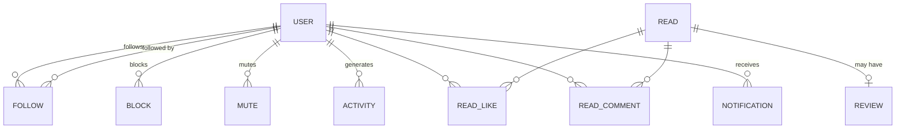

## 11.3 Relationship states

| State | Meaning | Visible to the other party |
|---|---|---|
| None | No relationship | — |
| Following | You see their activity | Yes — they are notified |
| Pending | Request sent to a private account | Yes — in their requests |
| Mutual | Both follow each other | Shown as "Follows you" |
| Muted | You follow them but they are hidden from your feed | **No** — silent by design |
| Blocked | No interaction possible in either direction | **No** — never revealed |

## 11.4 Blocking semantics

Blocking must be thorough or it does not protect anyone:

- Neither party sees the other's profile, reviews, comments, lists or activity anywhere in the product.
- Existing follows in both directions are severed.
- Existing likes and comments from the blocked user on your content are hidden from you.
- A blocked user's view of your profile is **indistinguishable from an account that does not exist** — the block must never be confirmable.
- Blocking is silent. No notification is ever sent.

## 11.5 Muting

Muting is the low-stakes tool that prevents most blocks. You keep following (no social awkwardness) but their activity disappears from your feed. Entirely invisible to the muted user. Available per-user, and **[ASSUMPTION]** per-book — muting a specific book removes it from your feed, which solves the "everyone is reading the same hyped release" problem elegantly.

## 11.6 Follow discovery

| Source | Priority | Notes |
|---|---|---|
| Onboarding suggestions | P0 | Genre and favourite-book overlap |
| "Readers like you" | P1 | Taste correlation over co-rated works |
| Followers of people you follow | P1 | The classic second-degree expansion |
| Reviewers on books you rated highly | P0 | Highest-intent discovery moment |
| Contact import | **Rejected** | Privacy cost is high; reading is a more private taste signal than most, and address-book upload is a trust-destroying request |

## 11.7 Anti-abuse limits

| Limit | Value |
|---|---|
| Follows per day | 200 **[ASSUMPTION]** |
| Follows per hour | 50 |
| Follow-unfollow-refollow of the same user | Blocked after 3 cycles in 24 hours |
| Comments per minute | 5 |
| New accounts | Cannot follow more than 20 users in the first 24 hours |

---

# 12. Home Feed

## 12.1 Feed structure

Two tabs, one control:

| Tab | Content | Default for |
|---|---|---|
| **Friends** | Activity from people you follow, reverse-chronological with light re-ranking | Users following ≥ 3 people |
| **Popular** | Highly-engaged reviews and trending books across the whole product | Users following < 3 people |

**[ASSUMPTION]** Chronological-first with light re-ranking, **not** a fully algorithmic feed. Reasons: the follow graph is small early, so ranking has little to work with; a chronological feed is predictable and builds trust; and the volume of activity in a reading app is naturally low, so there is not enough content to justify aggressive filtering.

## 12.2 Activity types and weights

| Activity | Feed weight | Aggregation | Notes |
|---|---|---|---|
| **Reviewed a book** | **1.0 — highest** | Never | The richest content; largest card |
| **Finished + rated** | 0.9 | Never | The core social event |
| **Finished, no rating** | 0.7 | Never | Still likeable and commentable — the like targets the read, not a review that does not exist (§10.3) |
| **DNF'd a book** | 0.5 | Never | Shown honestly, framed neutrally |
| Added to a shelf | 0.3 | **Yes** — "added 6 books to Monsoon Reading" | Six cards would be noise |
| Started a book | 0.2 | Yes, per user per day | Shown only when the feed is thin |
| Reached a reading goal | 0.6 | Never | A genuine celebration moment |
| Followed someone | 0.1 | Yes — "followed 4 readers" | Lowest priority |
| Liked a review | **Excluded** | — | Like-activity feeds are noise and create surveillance anxiety |
| Progress updates | **Excluded** | — | Far too frequent; would drown everything else |
| **Imported history** | **Excluded entirely** | — | Critical: a new user importing 800 books must not flood every follower |

## 12.3 Ranking

```
rank = activity_weight
     * recency_decay(age_hours)
     * affinity(viewer, actor)
     * diversity_penalty
```

| Component | Definition |
|---|---|
| `recency_decay` | `exp(-age_hours / 36)` — a day-and-a-half half-life suits a low-volume feed |
| `affinity` | Higher for people whose activity you engage with, and for mutual follows. Learned from taps and likes |
| `diversity_penalty` | Reduces the score of the third-and-later consecutive item from the same actor or about the same book |

## 12.4 Diversity rules

Hard constraints applied after ranking:

1. **No more than 2 consecutive cards from the same person.**
2. **No more than 3 cards about the same book** in a single 20-item page.
3. **At least 1 card from someone you engage with rarely** per 10 items — prevents the feed collapsing onto three accounts.
4. **At most 1 "started reading" card** per 10 items.

## 12.5 Cold start

| Situation | Behaviour |
|---|---|
| 0 follows | Auto-switch to Popular; persistent banner "Follow readers to build your feed" with an inline suggestion carousel |
| 1–3 follows | Friends tab shown but **blended** with Popular content, clearly labelled "Popular on Flyleaf" |
| Follows but no recent activity | Backfill with older activity from those users, plus "While you wait" popular content |
| Never empty | The feed must **never** render an empty state. Fall back to Popular, then to editorial content |

## 12.6 Avoiding a toxic engagement system

Explicit design constraints, stated so they survive future pressure to increase engagement:

| Constraint | Rationale |
|---|---|
| **No infinite algorithmic amplification.** Popular is capped by a per-item exposure ceiling | Prevents one viral review dominating the product for a week |
| **No engagement-bait surfaces** — no polls, no "hot takes", no controversy ranking | Argument drives engagement and destroys reading communities specifically |
| **Negative ratings are never amplified.** A 0.5-star review ranks the same as a 5-star one | Ranking by controversy is how book communities turn ugly |
| **No "X is reading this too" pressure notifications** | Manufactured FOMO |
| **A visible end to the feed.** After ~100 items, "You're all caught up" | Infinite scroll is not required for a low-volume product and its absence is a genuine feature |
| **No streak-loss or goal-shortfall notifications** | Guilt mechanics |
| **Comments capped at single-level** | Structural limit on argument threads |

## 12.7 Feed technical design

**Fan-out on read** for v1 **[LOCKED]**: query `activity` where the actor is in your following set, with a covering index on `(actor_id, created_at desc)`, cursor-paginated.

| | Fan-out on read (chosen) | Fan-out on write |
|---|---|---|
| Write cost | O(1) | O(followers) |
| Read cost | O(following) | O(1) |
| Follow/unfollow | Instantly correct | Requires backfill |
| Celebrity accounts | Fine | Expensive |
| Complexity | One query | Inbox table, workers, reconciliation |

Correct while following counts stay in the hundreds, which covers the first several tens of thousands of users. **Migration trigger:** p95 feed latency exceeding 200ms. The query sits behind a repository interface so the swap is contained.

---

# 13. Discovery

## 13.1 Discovery philosophy

Books have a discovery problem that films do not: roughly two million are published each year, most are invisible, and the algorithmic answer converges on whatever is already popular. Flyleaf's differentiated answer is **discovery through people**, not through an algorithm's model of you.

Priority order for every discovery surface:

1. **People you follow** — what they rated highly
2. **People like you** — taste-correlated readers
3. **Editorial curation** — human-made lists
4. **Algorithmic** — collaborative and content-based
5. **Popularity** — the floor, never the ceiling

## 13.2 Discovery surfaces

| Surface | Definition | Cold-start safe? | Priority |
|---|---|---|---|
| **Popular this week** | Highest finish+rating velocity in 7 days | Yes | P0 |
| **New releases** | Publication date within 90 days, minimum rating threshold | Yes | P0 |
| **Highly rated in [genre]** | Bayesian-weighted rating, filtered by chosen genres | Yes | P0 |
| **Friends are reading** | Currently-reading among people you follow | No | P0 |
| **Friends loved** | ≥4.5 stars from people you follow | No | P0 |
| **Because you liked X** | Content and collaborative similarity to a specific highly-rated book | No — needs ≥5 ratings | P1 |
| **Hidden gems** | High weighted rating, low rating count, above the confidence threshold | Yes | P1 |
| **Readers like you** | Taste-correlated users, with their top books | No — needs ≥10 ratings | P1 |
| **Curated lists** | Editorial and community lists | Yes | P0 |
| **Browse by genre** | The 40-genre taxonomy | Yes | P0 |
| **Mood-based** | "Something short and funny", "slow and atmospheric" | Yes | P2 |
| **Similar books** | On the book detail page | Partially | P1 |
| **Series continuation** | "You're 3 of 7 through this series" | No | P1 |

**Rule:** a personalised row that cannot be computed well is **hidden entirely, never shown empty or bad**. A poor recommendation is worse than no recommendation, because it teaches the user the product does not know them.

## 13.3 "Hidden gems" definition

The most-loved discovery surface in this category, and easy to get wrong.

```
is_hidden_gem =
      weighted_rating >= 4.2
  AND rating_count BETWEEN 25 AND 2000
  AND published_year >= (current_year - 25)
  AND NOT is_globally_trending
```

Both bounds matter: below 25 ratings the average is noise, above ~2,000 the book is not hidden.

## 13.4 Recommendation strategy evolution

### V1 — Simple (MVP)

Purely deterministic and explainable. No machine learning.

| Method | Implementation |
|---|---|
| Genre affinity | Your top genres by finished count → highest weighted-rated unread books in those genres |
| Author affinity | Other works by authors you rated ≥4 |
| Series continuation | Next unread book in a series you have started |
| Social | Books rated ≥4.5 by people you follow that you have not read |
| Popularity fallback | Weighted rating within your chosen genres |

**Cost:** SQL queries only. **Latency:** <100ms. **Quality:** adequate, and — critically — every recommendation is explainable in one sentence, which builds trust faster than accuracy does.

### V2 — Personalised (Phase 3)

| Method | Implementation |
|---|---|
| Item-item collaborative filtering | Co-occurrence matrix over `reads`; "readers who rated X highly also rated Y highly"; recomputed nightly |
| Taste correlation | Pearson correlation over co-rated works, top-K neighbours per user |
| Content similarity | TF-IDF over subjects, description and author; cosine similarity |
| Hybrid ranking | Weighted blend, with the weights per-surface |

**Cost:** a nightly batch job. **Data requirement:** roughly 10,000 users with 20+ ratings each before collaborative filtering produces non-embarrassing results.

### V3 — AI-powered (Phase 4)

| Method | Implementation |
|---|---|
| Book embeddings | Sentence-transformer embeddings over description, subjects and review text, stored in `pgvector` |
| User embeddings | Weighted mean of embeddings of highly-rated books, minus a component for disliked ones |
| Semantic retrieval | Vector nearest-neighbour, then re-rank with collaborative and social signals |
| Natural-language discovery | "A sad literary novel set in Japan, under 300 pages" → embedding + structured filters (§20) |

**Critical design rule:** the vector search **retrieves**; social and collaborative signals **rank**. Embeddings alone produce recommendations that are thematically similar but socially irrelevant.

## 13.5 Explainability

Every recommendation carries a one-line reason, always visible:

- "Because you rated *Piranesi* 5 stars"
- "Aisha and 3 others you follow loved this"
- "Next in the Broken Earth series"
- "Highly rated in Literary Fiction, and few people have found it"

**[ASSUMPTION]** Explainability increases both trust and click-through more than marginal accuracy improvements do, and it is far cheaper. It is a P0 requirement, not a nicety.

---

# 14. Search

## 14.1 Scope

| Entity | Matched on | Priority |
|---|---|---|
| **Books** | Title, subtitle, author names, series, ISBN | P0 |
| **Authors** | Name, alternate names | P0 |
| **Users** | Username, display name | P0 |
| **Lists** | Name, description | P1 |
| **Genres** | Name and synonyms | P1 |
| **Tags** | User-defined tags | P2 |

## 14.2 Search architecture

**[LOCKED] Postgres-native for MVP.** No Elasticsearch, no Typesense, no Algolia.

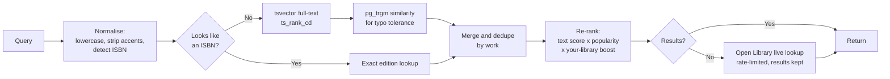

### Why Postgres is sufficient

| Requirement | Postgres capability |
|---|---|
| Full-text | `tsvector` + `ts_rank_cd` with weighted lexemes (title A, author B, subtitle C) |
| Typo tolerance | `pg_trgm` trigram similarity with a GIN index |
| Autocomplete | Prefix matching on a materialised popular-titles table |
| Faceted filters | Ordinary `WHERE` clauses on indexed columns |
| Ranking | Arbitrary SQL expressions |

**Migration trigger:** p95 search latency exceeding 300ms, or relevance complaints that ranking changes cannot fix. Only then introduce a dedicated engine.

### Index design

```sql
-- Weighted search vector, maintained by trigger
search_vector =
    setweight(to_tsvector('simple', title), 'A')
 || setweight(to_tsvector('simple', coalesce(subtitle,'')), 'B')
 || setweight(to_tsvector('simple', author_names), 'B')
 || setweight(to_tsvector('simple', coalesce(series_name,'')), 'C');

CREATE INDEX works_search_idx ON works USING GIN (search_vector);
CREATE INDEX works_title_trgm ON works USING GIN (title gin_trgm_ops);
CREATE INDEX editions_isbn13_idx ON editions (isbn_13);
```

Use the `simple` dictionary rather than `english` — stemming damages proper nouns and non-English titles badly, and book search is dominated by proper nouns.

## 14.3 Ranking

```
score = 0.45 * text_relevance
      + 0.25 * log(1 + times_logged_on_flyleaf)
      + 0.15 * has_cover_and_metadata
      + 0.10 * your_library_boost
      + 0.05 * recency
```

**`times_logged_on_flyleaf` is the key term.** It solves the "seven identical editions" problem better than any deduplication pass: the edition real users actually log rises naturally to the top, and the ranking improves on its own as the product grows.

`has_cover_and_metadata` matters because a result with no cover looks broken, regardless of how well it matches.

## 14.4 Behaviour requirements

| Requirement | Value |
|---|---|
| Debounce | 250ms |
| Minimum query length | 2 characters |
| Autocomplete | After 3 characters, from a materialised popular-titles table |
| Results per page | 20, cursor-paginated |
| Recent searches | Last 10, stored locally, clearable |
| ISBN detection | 10 or 13 digits with optional hyphens → exact lookup first |
| Diacritics | Stripped on both sides — "Murakami" must match "Murakami" and "Haruki Murakami" |
| Non-Latin scripts | Must work; `simple` dictionary and trigram matching both handle them |

## 14.5 Filters and sorting

| Filter | Values |
|---|---|
| Genre | The 40-genre taxonomy |
| Format | Hardcover · Paperback · Ebook · Audiobook |
| Language | ISO list, defaulting to the device language plus English |
| Page count | Ranges: <200 · 200–400 · 400–600 · 600+ |
| Publication year | Range slider |
| Minimum rating | 3.0 · 3.5 · 4.0 · 4.5 |
| Your status | Unread · Want to read · Read · Not on my shelves |
| Maturity | `explicit` excluded unless enabled in Settings → Content by an 18+ account (§7.8) |

| Sort | Notes |
|---|---|
| Relevance | Default |
| Highest rated | Uses the **weighted** rating |
| Most popular | By Flyleaf log count |
| Newest | Publication date |
| Shortest / longest | Page count, nulls last |

## 14.6 Measuring whether search actually works **[LOCKED]**

Every search target in this document so far measures **speed** — p95 latency, autocomplete latency, zero-result rate. None measures **correctness.** Search can return in 80ms and return the wrong book, and every one of those metrics would look healthy while the product was failing at the thing users judge it on in the first thirty seconds (§4.1).

### The metric

> **Top-3 accuracy: for a sampled set of real queries, is the intended book in the first three results?** Target **≥ 95%** for English-language queries.

| Aspect | Detail |
|---|---|
| **The fixed panel** | The 50 books from the Phase 0 exit condition, plus 150 more spanning the hard cases below. Each entry is a query and its correct work ID. Run automatically in CI |
| **The live sample** | Weekly, 100 random real queries that produced a result; a human judges whether the tapped result was in the top 3, and whether it was right at all. **[ASSUMPTION]** Automating this needs click data the product will not have for months, so it is manual and cheap at this scale |
| **Reported as** | Top-1 accuracy, top-3 accuracy, and zero-result rate together. Top-1 is the number that actually matters for user experience; top-3 is the honest tolerance |

### The hard cases the panel must contain

If the panel is 200 easy titles it will report 99% and mean nothing. It has to include the queries that break search:

| Case | Example shape |
|---|---|
| Series entries with near-identical titles | The second and third books of a trilogy |
| Very short or single-word titles | *It* · *Dune* · *Beloved* |
| Author-name queries used as title queries | Typing an author and expecting their best-known book |
| Diacritics and transliteration | *Murakami* · *Márquez* · non-Latin scripts |
| Common misspellings | *Ishigoro* · *Dostoyevsky* variants |
| Subtitle-heavy non-fiction | Long marketing subtitles that swamp the real title |
| Translated titles | Searching the English title of a work catalogued in another language |
| Books sharing a title with a famous film | Where the film is more searched than the book |
| Recent releases | Where Open Library is thinnest |
| Books with no cover in the catalog | Which should still rank if they match |

### What to do when it drops

A regression here is a **product** defect, not a tuning task. In order:

1. Fix ranking weights (§14.3) — cheapest, and usually enough.
2. Fix the ingest filter — a book that never made it into the catalog cannot be found (§40.3).
3. Only then consider a search engine. **This metric, not latency, is the honest trigger for adopting Meilisearch or Typesense** — relevance that ranking changes cannot fix is what a dedicated engine buys, and it is worth knowing that before paying for one.

## 14.7 Zero-result handling

Sequence, in order:

1. Spelling suggestion — "Did you mean *Kazuo Ishiguro*?" from trigram similarity.
2. Broaden — drop the most restrictive filter and re-run, labelled.
3. Live Open Library lookup — rate-limited, results kept permanently (CC0).
4. "Suggest we add this book" — creates a provisional record (§7.7).

Zero-result queries are logged as `search_zero_results` and reviewed weekly. They are the highest-signal input to catalog quality work.

---

# 15. Lists & Collections

## 15.1 Terminology

The product uses **"Shelves"** as the user-facing term for both. **[ASSUMPTION]** Readers already think in shelves; "list" is generic and "collection" implies ownership of physical copies.

**Important:** shelves are **only** user-curated lists. `Want to read`, `Reading`, `Finished` and `DNF` are **statuses on the read record**, not shelves. Conflating them is the Goodreads design mistake that produces both an unusable shelf list and ambiguous data.

## 15.2 Shelf model

| Field | Type | Notes |
|---|---|---|
| `id`, `user_id`, `name`, `slug` | | Slug for future web URLs |
| `description` | text | |
| `is_ranked` | bool | Ranked shelves show position numbers |
| `privacy` | enum | `public` · `followers` · `private` |
| `is_collaborative` | bool | P1 |
| `cover_work_ids` | uuid[] | Up to 4, for the mosaic card |
| `item_count`, `save_count` | int | Denormalised |

`shelf_items(shelf_id, work_id, position, note, added_at, added_by_user_id)`

The per-entry **note** is the feature that turns a list into content: "read this one first", "the ending is worth it". It is what makes a Flyleaf list better than a Goodreads shelf.

## 15.3 Shelf types

| Type | Example | Ranked? |
|---|---|---|
| Taste declaration | "My favourite books of all time" | Yes |
| Themed curation | "Best sci-fi written by women" | Optional |
| Temporal | "2026 reading list" | No |
| Recommendation | "Start here if you've never read fantasy" | Yes |
| Mood | "Comfort reads for a bad week" | No |
| Personal collection | "Books I own" | No |
| Aspirational | "Books to read before 30" | No |

## 15.4 Collaborative shelves (P1)

- Owner invites collaborators by username.
- Any collaborator may add; only the owner may remove or reorder.
- Each entry attributed to whoever added it.
- Serves the book-club persona without building a club product.
- Limit of 20 collaborators **[ASSUMPTION]**.

## 15.5 Shelf discovery and ranking

Public shelves are browsable and are a significant discovery surface.

```
shelf_score = 0.30 * log(1 + saves)
            + 0.20 * log(1 + views)
            + 0.20 * social_proximity_to_owner
            + 0.15 * curation_quality
            + 0.15 * freshness
```

`curation_quality` is a composite of: has a description, has per-entry notes, item count between 5 and 100, and cover art completeness. **Rationale:** a 500-item unannotated shelf is a data dump, not curation, and should not outrank a thoughtful list of twelve.

## 15.6 Constraints

| Rule | Value |
|---|---|
| Max shelves per user | 200 |
| Max items per shelf | 1,000 |
| Duplicate works in one shelf | Prevented |
| Shelf name length | 60 characters |
| Note length | 280 characters |
| Saving another's shelf | Creates a reference, not a copy — it stays in sync |
| Deleting a shelf | Soft delete, 30-day recovery |

---

# 16. User Profiles

## 16.1 Design intent

The profile must answer one question in five seconds of scrolling:

> **"What kind of reader is this person?"**

It is the product's identity artefact, its primary organic growth surface, and later its main SEO asset. It deserves more design investment than any screen except Reading.

## 16.2 Profile hierarchy

| Order | Section | Why here | Priority |
|---|---|---|---|
| 1 | Avatar, display name, @username, bio | Identity basics | P0 |
| 2 | Follower / following counts | Social proof | P0 |
| 3 | Follow / Edit button | Primary action, above the fold | P0 |
| 4 | **Four favourites** | **The single strongest taste signal.** Borrowed directly from Letterboxd because it works | **P0** |
| 5 | Stats strip — books this year · pages · average rating · streak · goal ring | Quantified identity at a glance | P0 |
| 6 | Currently reading carousel | Makes the profile feel alive rather than archival | P0 |
| 7 | **The Wall** — poster grid of everything read | The taste signal at scale. Four favourites say who you want to be; a wall of three hundred covers says who you are. The most screenshotted surface after the favourites row | **P0** |
| 8 | **Diary** — recent dated entries | Proof of ongoing use, and the archive that makes an old account valuable. Named for Letterboxd's central metaphor: a history is a database view, a diary is something a person keeps | P0 |
| 9 | Recent reviews | The writing that earns follows | P0 |
| 10 | Shelves | Curation as identity | P1 |
| 11 | Rating distribution | "Am I a generous or harsh rater?" — a personality result | P1 |
| 12 | Top genres and authors | Taste summary | P1 |
| 13 | Reading personality | A derived archetype (§16.4) | P2 |
| 14 | Achievements | Only if §18 justifies them | P2 |

**The four favourites sit above the statistics deliberately.** Taste comes before quantity. A profile that leads with "247 books read" is a leaderboard; one that leads with four covers is a person.

## 16.3 Privacy on profiles

| Setting | Public profile | Private profile |
|---|---|---|
| Header, bio, avatar | Visible | Visible |
| Follower counts | Visible | Visible |
| Favourites | Visible | Followers only |
| Stats | Visible | Followers only |
| Activity, reviews, shelves | Per-item visibility | Followers only |
| To a blocked user | Indistinguishable from a non-existent account | Same |

Switching an account to private must **retroactively** restrict existing public activity, and this must be stated clearly at the moment of switching.

## 16.4 Reading personality (P2)

A derived archetype from reading patterns, shown as a single expressive label with an explanation:

| Archetype | Derived from |
|---|---|
| The Completionist | DNF rate under 5% |
| The Explorer | High genre diversity |
| The Devotee | High author concentration |
| The Marathoner | High average page count |
| The Sprinter | Many short books, high finish velocity |
| The Critic | Average rating well below the platform mean |
| The Enthusiast | Average rating well above the mean |
| The Night Owl | Progress events concentrated after 10pm |

**Design constraint:** every archetype must be **flattering or neutral**. "The Critic" is a compliment; "The Quitter" would never ship. This is a shareable identity feature, not an audit.

## 16.5 Public profile URLs

`flyleaf.app/@username` — reserved from day one, even before the web app exists. **[ASSUMPTION]** A minimal server-rendered public profile page ships in Phase 2 as an SEO and sharing surface, well before the full web application in Phase 6. Without it, every share is a dead link for anyone without the app installed, which breaks the primary growth loop.

---

# 17. Reading Statistics

## 17.1 Principle

Every statistic must answer **"what does this say about me as a reader?"** — not merely "how much have I read?" Volume metrics alone produce a leaderboard, which is a different and worse product.

## 17.2 Statistics inventory

### Volume

| Metric | Source | Notes |
|---|---|---|
| Books finished | `reads` where status = finished | Split by attempt vs distinct work |
| Pages read | Sum of edition page counts for finished reads | Print and normalised |
| Listening hours | Sum of `audio_seconds` | Shown separately, never silently merged |
| Books in progress | Current reading count | |
| Books abandoned | DNF count and rate | |

### Temporal

| Metric | Visualisation |
|---|---|
| Books per month | Bar chart, 12 months |
| Pages per month | Area chart |
| Reading pace over time | Line chart of a 7-day rolling average |
| Longest streak | Number plus the date range |
| Reading velocity | Days-to-finish trend |
| **Reading speed** | Pages per hour, from progress events that carry `minutes`. Sample size always disclosed (§8.4) |
| Time of day | Heatmap of progress events **[ASSUMPTION]** — a delightful and unique statistic |

### Taste

| Metric | Visualisation |
|---|---|
| Genre distribution | Donut, top 8 plus Other |
| Rating distribution | Histogram of the 10 half-star buckets |
| Average rating | Number, with the delta from the platform mean |
| **You vs. the crowd** | "You rate 0.4 stars below average" — the most screenshot-worthy statistic in the product |
| Most-read author | Cover mosaic |
| Format split | Print / ebook / audio, sourced from `reads.format_override` and falling back to the edition (§7.4) |
| Language distribution | Shown only when >1 language |
| Decade distribution | Publication years — reveals classics readers vs contemporary readers |

### Extremes

Longest book · shortest book · fastest read · slowest read · highest rated · lowest rated · oldest publication · most re-read.

These are the most-shared statistics because they are specific and story-like. They are cheap to compute and belong in the MVP.

## 17.3 Mobile visualisation requirements

| Requirement | Detail |
|---|---|
| **Card-based** | One statistic per card, each independently shareable |
| **Vertical scroll** | No dashboards, no dense grids — this is a phone |
| **One number dominant** | Each card has a single hero figure with the chart as support |
| **Charts must be readable at a glance** | No axes crowded with labels, no legends requiring study |
| **Share on every card** | The share button is the point of the screen |
| **Animate on entry** | Bars grow, donuts sweep — a 300ms reward |
| **Tap for method** | Any derived or normalised figure explains itself on tap |

## 17.4 Handling incomplete data honestly

Imported libraries frequently lack dates and page counts. Rules:

1. **Never fabricate.** A book without a page count contributes nothing to page totals.
2. **Disclose exclusions.** "Based on 180 of your 247 books — 67 are missing page counts." with a link to fix them.
3. **Offer repair.** A batch screen to fill in missing data, ordered by how much each fix would change the statistics.
4. **Undated imports** are excluded from all time-based charts, stated plainly.

Fabricating figures to make a screen look complete is the fastest way to lose the serious-reader segment permanently.

## 17.5 Private reads and statistics **[LOCKED]**

A single figure — "books read this year" — has **two correct answers depending on who is asking**, and failing to specify this ships as a bug.

| Viewer | What the figure includes |
|---|---|
| **You, looking at your own stats** | **Everything**, including reads marked private. Marking one book private must never silently corrupt your own totals — the whole point of tracking is an accurate personal record |
| **Anyone else, looking at your profile** | **Public and follower-visible reads only**, according to what that specific viewer is entitled to see |

This means every statistic is computed **twice, against different row sets**, and the viewer's identity is an input to the calculation — not a filter applied afterwards to a shared result.

### Consequences

| Rule | Detail |
|---|---|
| Statistics functions take a viewer ID | Same discipline as the repository layer in §25.3. A stats query without a viewer argument should not be expressible |
| Cached aggregates are keyed by visibility tier | Not one cached total per user. At minimum: `owner`, `follower`, `public` |
| The owner's view never advertises the difference | Your own stats screen shows your real numbers without labelling which books were private — you already know |
| Year in Review uses the owner's full data | It is generated for you. The **share card**, being public, uses public-visible figures, and says so in small print if the two differ |
| Rating averages contributed to `work_stats` | A private read's rating **still counts** toward the book's community average. Privacy governs whose profile shows what, not whether your opinion counts. This is disclosed in the privacy policy |
| Follower-visible reads | Counted for accepted followers, excluded for everyone else — so two different visitors can legitimately see two different totals on the same profile |

**[ASSUMPTION]** The rating-contribution rule above is the one debatable choice: a user might reasonably expect a private read to be private end-to-end. The alternative — excluding private ratings from community averages — is defensible but weakens aggregates for exactly the sensitive books where honest signal is most useful. Disclose it plainly and offer a separate "don't count this rating publicly" option if users object.

## 17.6 Year in Review

| Aspect | Decision |
|---|---|
| Availability | Unlocks 1 December, permanently re-viewable |
| Format | Vertically paged story cards, portrait, story dimensions |
| Rendering | **Server-side to a real image**, so sharing is one tap and looks identical everywhere |
| Cards | Books read · Pages · Genre mix · Your top 4 by rating · Longest book · You vs. average · Most-read author · Reading calendar heatmap · Summary with handle |
| Low-volume variant | Under 5 books → a celebratory variant that avoids quantity framing entirely |
| Timing rationale | Late November through December is the wrapped-content window; launching in January misses it by a year |

---

# 18. Gamification

## 18.1 Position

Gamification in reading apps is usually a mistake. It converts an intrinsically motivated activity into an extrinsically motivated one, and the well-documented consequence is that people optimise for the metric — reading short books to hit a count, or abandoning long books near year-end.

**Principle: gamify *reflection*, never *volume*.**

## 18.2 Evaluation

| Mechanism | Verdict | Reasoning |
|---|---|---|
| **Reading streak** | **Include, with a 2-day grace period** | Genuinely motivating for daily reading; the grace period removes the punishment mechanic |
| **Annual goal** | **Include, strictly confined** | Most-used feature in the category; confined to a profile ring, never a notification |
| **Year in Review** | **Include** | Reflection, not competition. The best kind of gamification |
| **Milestone moments** | **Include** — 10th book, 100th, 1,000th; first review; first follower | Rare, meaningful, celebratory. Not a badge grid |
| **Reading challenges** (themed, e.g. "read a translated book") | **P2 — include carefully** | Encourages breadth rather than volume, which is the right axis. Must be opt-in and never sit on the home screen |
| **Badges / achievement grids** | **Exclude** | Cheap, cluttering, and reward volume. A grid of 60 badges is visual noise that says nothing about taste |
| **Points / XP / levels** | **Exclude** | Turns reading into grinding. Actively hostile to the product's positioning |
| **Leaderboards** | **Exclude** | Reading is not a competition. This is the single most damaging possible feature — it would punish slow readers of difficult books, who are among the most valuable users |
| **Daily reminders to read** | **Exclude** | Nagging. The product should never tell someone they have not read today |
| **Loss-framed streak alerts** | **Exclude** | "Your 40-day streak is about to end!" is a guilt mechanic |

## 18.3 The tone rule

> Every gamified element must feel like **a mirror, not a scoreboard.**

Reflection ("you read more in October than any other month") is welcome. Comparison ("you are ranked 43rd among your friends") is not.

## 18.4 Milestone moments (P1)

| Milestone | Treatment |
|---|---|
| 1st book logged | Full-screen celebration, share prompt |
| 10th book | Subtle in-app moment |
| 100th, 500th, 1,000th | Full celebration with a share card |
| 1st review | Celebration and encouragement |
| 1st follower | Notification with warmth |
| Annual goal reached | Celebration and share card |
| Longest book yet | Inline note on the finish screen |

Each fires **once**, in-app, and never becomes a push notification.

---

# 19. Notifications

## 19.1 Governing principle

> **Notify about people, never about behaviour.**

Someone reacting to your review is worth an interruption. A reminder that you have not read today is not. This distinction alone eliminates the majority of notification spam in this category.

## 19.2 Catalogue

| # | Notification | Channel | Default | Priority | Rate limit |
|---|---|---|---|---|---|
| 1 | New follower | Push + in-app | **On** | High | Aggregated hourly beyond 3 |
| 2 | Follow request (private) | Push + in-app | **On** | High | — |
| 3 | Review liked | Push + in-app | **On** | Medium | Aggregated: "X and 5 others" |
| 4 | Review commented | Push + in-app | **On** | High | Max 1 per thread per hour |
| 5 | Reply to your comment | Push + in-app | **On** | High | — |
| 6 | Mentioned in a review or comment | Push + in-app | **On** | High | — |
| 7 | Import complete | Push + in-app | **On** | Medium | Once |
| 8 | Year in Review ready | Push + in-app | **On** | Medium | Once annually |
| 9 | Someone you follow joined from your invite | In-app | On | Low | — |
| 10 | A friend finished a book on your Want-to-Read list | Push | **Off** | Low | Max 1/day |
| 11 | New book by an author you follow | Push | **Off** | Low | Max 1/week |
| 12 | Milestone reached | In-app only | On | Low | — |
| 13 | Weekly reading summary | Push | **Off** | Low | 1/week |
| 14 | **Reading reminder — user-set time only** | Push | **Off** | Low | 1/day max, at the time the user chose |
| 15 | ~~Goal shortfall warnings~~ | — | **Never built** | — | — |
| 16 | ~~Streak-about-to-break~~ | — | **Never built** | — | — |

Items 15 and 16 are listed explicitly so that future product pressure to add them meets a documented decision.

### Item 14 is a deliberate reversal, with bounds **[LOCKED]**

An earlier draft of this document listed reading reminders as never built, on the §19.1 principle: *notify about people, never about behaviour.* That was too blunt, and the distinction that matters is **who authored the reminder**.

| | Product-initiated nag | User-set alarm |
|---|---|---|
| Who decided it fires | The product, to raise engagement | The reader, to support a habit they chose |
| Typical copy | "You haven't read today!" · "Your 40-day streak is at risk!" | "8:00pm — reading time" |
| Whose interest it serves | The metric | The reader |
| Verdict | **Never built** | **Allowed, under the bounds below** |

A person who sets an 8pm alarm to read is using the app as a tool. Refusing them that is not principle, it is inflexibility — and it is a real want for the serious-reader persona (§3.2), who is the segment most likely to build a deliberate reading routine.

**Bounds, all mandatory:**

1. **Off by default.** Never suggested during onboarding, never offered after a streak.
2. **The user sets the time.** No smart timing, no "we noticed you usually read at…". The moment the product picks the time, it becomes the product's reminder.
3. **Copy contains no guilt, no streak language, no counts, and no book title.** "Time to read." Nothing about what they have or have not done.
4. **Never fires as re-engagement.** If the app has not been opened in 14 days, the reminder is silently suspended and only resumes when the user returns. A habit tool for a lapsed user is a nag with extra steps.
5. **Counts against the 5-per-day ceiling** like everything else.
6. **One tap to turn off, from the notification itself.**

If any of those bounds is ever relaxed to improve a metric, the feature has become the thing this section exists to prevent.

## 19.3 Frequency governance

| Control | Value |
|---|---|
| Global cap | **5 push notifications per user per day**, hard ceiling |
| Quiet hours | Default 10pm–8am local; user-adjustable |
| Aggregation window | 1 hour for likes and follows |
| Batching | Multiple low-priority items combine into one digest |
| New-user grace | No push in the first 24 hours except import completion |
| Re-engagement push | **At most one per 30 days**, only after 14 days of inactivity, and only with genuine content ("3 people you follow reviewed books you want to read") |

## 19.4 Controls

Settings offers per-category toggles (all 13 live categories), a push/in-app split per category, quiet hours, and a single master switch. Nothing is bundled into a vague "social notifications" group — bundling is how users end up disabling everything.

## 19.5 Technical notes

- Delivered via **FCM directly from the Go backend** — no push relay intermediary.
- Every notification carries a deep link resolving to the exact screen (§35).
- Tokens refresh on app launch; stale tokens are pruned on delivery failure.
- Notifications for deleted content are suppressed at send time and removed from the in-app list.
- Delivery is a River job, so a backlog never blocks a request.

---

# 20. AI Features

## 20.1 Position

AI ships only where it removes real work or does something genuinely impossible without it. Three tests every proposed feature must pass:

1. **Would a user notice if it were removed?**
2. **Is the non-AI version meaningfully worse?**
3. **Does it cost less per use than the value it creates?**

Features failing any test are not built. Several obvious candidates fail and are listed in §20.5.

## 20.2 MVP AI — ship in v1

### A1. Semantic "more like this" *(P1, borderline MVP)*

| Field | Detail |
|---|---|
| **User problem** | "I loved this book, find me another like it." Genre tags are far too coarse — *Piranesi* and a generic fantasy novel share tags and share nothing else |
| **Input** | A work ID |
| **Output** | 10 similar works with a one-line reason |
| **Model** | Sentence-transformer embeddings (e.g. a small open MiniLM-class model) over description + subjects + top review text |
| **Data** | Catalog descriptions; no user data required — so it works at zero users |
| **Cost** | One-time batch embedding of the catalog, then a nightly delta. Self-hosted, so compute only. `pgvector` for storage and search |
| **Latency** | <50ms for a vector nearest-neighbour query with an HNSW index |
| **Failure cases** | Books with thin descriptions produce poor neighbours → require a minimum description length, else fall back to subject overlap |
| **Privacy** | None — operates on public catalog data only |

**Why it qualifies for MVP:** it is the only recommendation method that works with zero users, which is exactly the cold-start situation at launch.

### A2. Review summarisation on book pages *(P1)*

| Field | Detail |
|---|---|
| **User problem** | 400 reviews are unreadable; a reader wants the consensus in ten seconds |
| **Input** | Top 50 reviews for a work |
| **Output** | 3 bullets — what readers loved, what they criticised, who it suits |
| **Model** | A small instruction-tuned LLM; API-based initially |
| **Data** | Public reviews only |
| **Cost** | Cached per work, regenerated only after +50 new reviews. **[ASSUMPTION]** roughly $0.002 per generation, so a few dollars a month at MVP scale |
| **Latency** | Precomputed as a River job, so zero perceived latency |
| **Failure cases** | Hallucinated plot claims → constrain the prompt to opinions about the reading experience, never plot summary. Sparse reviews → hide the feature below 20 reviews |
| **Privacy** | Public content only. Must be clearly labelled "Summarised from reader reviews" |

## 20.3 Post-MVP AI — Phase 4

### A3. Natural-language book search

| Field | Detail |
|---|---|
| **Problem** | "A short sad literary novel set in Japan" is unexpressible in filters |
| **Input** | Free text |
| **Output** | Ranked results with an explanation |
| **Model** | LLM extracts structured filters (length, mood, setting, era, genre) → embedding search → SQL filters → re-rank |
| **Cost** | One small LLM call per query. Cache aggressively — query distributions have a heavy head |
| **Latency** | Target under 1.5s; show intermediate state |
| **Failure** | Over-constrained queries return nothing → progressively relax filters and say which were dropped |
| **Privacy** | Queries are personal data; retained 30 days, excluded from training |

### A4. Mood-based discovery

Curated moods ("cosy", "devastating", "propulsive", "strange") mapped to embedding centroids derived from review language rather than publisher metadata. Cheap at query time because centroids are precomputed. Reviews describe how a book *feels*; blurbs describe how it is *marketed* — this is why the review corpus is the right source.

### A5. Personalised reading insights

Natural-language observations over a user's own statistics: "You finish books 40% faster in winter." "Your ratings are harshest on books over 500 pages." Runs monthly as a batch job over the user's own data only, never shared, and never framed as criticism.

### A6. Smart tagging

Auto-generate content tags and content warnings from review text and descriptions, human-reviewed before display. Content warnings are a significant unmet need in the reading community and a real StoryGraph advantage.

## 20.4 Advanced AI — Phase 5+

| Feature | Description | Main risk |
|---|---|---|
| **AI reading companion** | Spoiler-aware conversation about a book you are partway through | Spoiler leakage is a severe failure. Requires strict progress-aware retrieval, and is genuinely hard |
| **Taste-graph explanations** | "You and Aisha agree on literary fiction but diverge on genre fantasy" | Low risk, high delight |
| **Semantic list generation** | Auto-draft a themed list from a prompt, for the user to edit | Quality control; must always be a draft, never published automatically |
| **Similar-reader discovery** | Embedding-based user similarity beyond simple co-rating | Privacy: users must be able to opt out of being matchable |

## 20.5 Rejected AI features

| Feature | Why not |
|---|---|
| **AI-generated book summaries** | Copyright exposure, hallucination risk, and it competes with the reading itself |
| **AI-written reviews** | Directly destroys the product's core value — reviews are the human content |
| **AI chatbot for support** | The product is not complex enough to need one |
| **AI-generated cover art** | Misrepresents real books; a factual error, not a stylistic choice |
| **Predicted rating shown before reading** | Anchors the reader's opinion before they form one, corrupting the rating data that everything else depends on |
| **AI moderation as the sole layer** | Insufficient alone; used only as a triage stage (§27) |

## 20.6 Cost and governance

| Control | Rule |
|---|---|
| Budget ceiling | AI inference must stay under **5% of infrastructure cost** at every stage |
| Caching | Every generated artefact is cached and regenerated only on a material input change |
| Batch over real-time | Anything that can be precomputed as a River job is |
| Graceful degradation | Every AI feature has a non-AI fallback; none is on a critical path |
| Labelling | All AI-generated content is visibly labelled |
| Training | User content is **never** used to train third-party models. Stated in the privacy policy |

---

# 21. Recommendation Engine

## 21.1 Architecture evolution

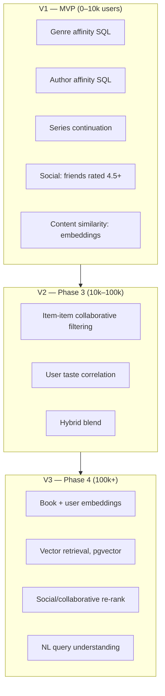

## 21.2 The candidate-generation / ranking split

At every stage the architecture is two-stage, which keeps it comprehensible and cheap:

```
CANDIDATE GENERATION  (fast, recall-oriented, ~500 candidates)
  · genre and author affinity
  · collaborative co-occurrence
  · vector nearest neighbours
  · social — what people you follow rated highly
  · series continuation
        ↓
RANKING  (precise, precision-oriented, top 20)
  score = w1*predicted_affinity
        + w2*social_proof
        + w3*quality (weighted rating)
        + w4*novelty (penalise the obvious)
        + w5*diversity (penalise same author/genre repeats)
        - w6*already_known (seen, shelved, or read)
```

**`novelty` matters more here than in most recommender systems.** Recommending *The Midnight Library* to someone who reads contemporary fiction is technically correct and completely useless — they have already seen it everywhere. Penalise globally-popular items in personalised surfaces; popularity has its own row.

## 21.3 Cold start

| Situation | Strategy |
|---|---|
| **New user, no data** | Onboarding genre selection + favourite books → content similarity to those favourites. This is why favourites are collected during onboarding, not just for the profile |
| **New user who imported** | Immediately rich — treat imported ratings as full-weight signal. A major argument for prioritising import |
| **New book, no ratings** | Content-based only, via embeddings; surfaced in New Releases rather than personalised rows |
| **Cold product (launch)** | No collaborative signal exists at all. V1 is deliberately content- and rule-based for exactly this reason |
| **Sparse user (<5 ratings)** | Personalised rows hidden; genre and popularity rows shown instead |

## 21.4 Feedback signals, by strength

| Signal | Strength | Notes |
|---|---|---|
| Rating (explicit) | **Strongest** | Especially the delta from the work's mean |
| Finished | Strong | Completion is a strong positive |
| **DNF** | **Strong negative** | Uniquely valuable — most products discard it. Knowing what someone abandoned at page 60 is at least as informative as knowing what they finished |
| Added to Want to Read | Medium positive | Intent, not experience |
| Reviewed at length | Medium | Engagement, sign-agnostic |
| **Hearted** | **Very strong positive** | Affinity rather than quality judgement — the single best "more like this" signal the product collects (§9.4) |
| Added to a favourites shelf | Strong positive | |
| Viewed and did not act | Weak negative | Noisy; low weight |
| Time on book page | **Not used** | Too noisy to be worth the tracking cost and privacy overhead |

**The DNF signal is a genuine competitive advantage.** Because Flyleaf treats abandonment as a first-class state with a page number and an optional reason, it accumulates negative-preference data that Goodreads and Letterboxd structurally cannot collect.

## 21.5 Evaluation

| Metric | Definition | Target |
|---|---|---|
| CTR on recommendation rows | Taps ÷ impressions | >8% |
| Save rate | Added to Want to Read ÷ impressions | >3% |
| **Conversion to finish** | Recommended → started → finished | **>15%** — the metric that actually matters |
| Diversity | Distinct authors and genres in the top 20 | >12 authors |
| Novelty | Share of recommendations outside the global top 1,000 | >50% |

Offline evaluation is misleading in this domain because the ground truth is "would they have enjoyed it", which is unobservable. **Ship behind a flag, A/B test, and trust conversion-to-finish over every offline metric.**

---

# 22. Backend Architecture

## 22.1 Modular monolith vs microservices

> **Recommendation: modular monolith. [LOCKED]**

| Factor | Assessment |
|---|---|
| Team size | One developer. Microservices require roughly one team per service to be worth their overhead |
| Traffic | Thousands of users at launch. A single Go binary handles orders of magnitude more |
| Data coupling | Feed, social and reading data are highly interrelated — splitting them forces distributed joins, the worst possible outcome |
| Transactions | "Finish a book, write an activity row, enqueue a notification" must be atomic. Trivial in one database; a saga across services |
| Operational cost | One binary, one database, one deploy, one log stream. This matters enormously on a zero budget |
| Migration path | Module boundaries drawn now allow a later extraction if it is ever justified |

Microservices at this stage would be a strict downgrade: more failure modes, more latency, more operational surface, and no benefit.

## 22.2 Module boundaries

Enforced as Go packages with explicit interfaces, no cross-module database access, and no circular imports. These are the seams along which services could later be extracted.

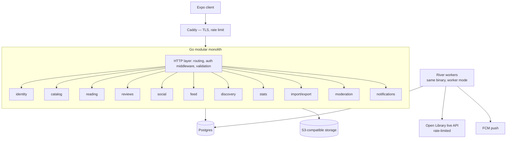

| Module | Responsibility | Key dependencies |
|---|---|---|
| `identity` | Users, auth, sessions, tokens, profiles | — |
| `catalog` | Works, editions, authors, series, subjects, search, ingest | — |
| `reading` | Reads, progress events, goals, statuses | catalog |
| `reviews` | Reviews, likes, comments | reading, catalog |
| `social` | Follows, blocks, mutes, activity generation | identity |
| `feed` | Feed assembly and ranking | social, reviews, reading |
| `discovery` | Recommendations, browse rows | catalog, reading |
| `stats` | Aggregations, Year in Review | reading, catalog |
| `importexport` | CSV mapping, job orchestration | catalog, reading |
| `moderation` | Reports, filters, admin actions | reviews, social |
| `notifications` | Composition, delivery, preferences | all |

## 22.3 Runtime topology

| Process | Description |
|---|---|
| **API server** | The Go binary in server mode. Stateless; horizontally scalable behind Caddy |
| **Worker** | The **same binary** in worker mode, running River jobs. Deploying one artifact for both eliminates version skew |
| **Postgres** | Single primary. Add a read replica only when read load demonstrably requires it |
| **Object storage** | S3-compatible — MinIO in development, any provider in production. Avatars and generated share images only |
| **Caddy** | TLS termination, HTTP/2, static asset serving, first-line rate limiting |

## 22.4 Background jobs

| Job | Schedule | Notes |
|---|---|---|
| Catalog dump ingest | Monthly | Streaming, resumable, `COPY`-based |
| Catalog gap-fill | On demand | Behind a shared global rate limiter |
| CSV import | On demand | Chunked, progress-reporting, resumable |
| Work stats recompute | Hourly (incremental) | Averages, distributions, DNF rates |
| Feed activity cleanup | Daily | Prune activity older than 180 days |
| Notification delivery | On demand | Batched, respects quiet hours |
| Share image rendering | On demand | Server-side 2D drawing |
| Recommendation precompute | Nightly | V2 onwards |
| Embedding refresh | Nightly delta | V3 onwards |
| Database backup | Every 6 hours | Off-machine, with a monthly restore drill |
| Search vector rebuild | Weekly | Catches drift after ingest |

## 22.5 Technology choices

| Concern | Choice | Rationale |
|---|---|---|
| Language | **Go** | Single static binary, low memory, excellent concurrency for the ingest and importer |
| Router | stdlib `net/http` + `chi` middleware | Go 1.22+ handles method-and-path patterns natively; almost no framework needed |
| API contract | **OpenAPI 3.1**, hand-written, TS client generated from it | The Go/TypeScript boundary is otherwise defined twice and drifts (§24.1) |
| DB driver | **pgx** | Binary protocol; `CopyFrom` is what makes a 45GB ingest finish in hours |
| Queries | **sqlc** | Plain SQL in, type-safe Go out. No ORM, no reflection, and the SQL stays tunable — critical for feed and search |
| Migrations | **goose** | Versioned SQL in the repo, applied deterministically, forward-only |
| Jobs | **River** | Postgres-backed, pgx-native. No Redis, and jobs commit in the same transaction as the data that triggered them |
| Config | Environment variables, 12-factor | |
| Logging | `log/slog`, structured JSON | |
| Testing | stdlib + `testcontainers` for integration | Real Postgres in tests, not mocks |

---

# 23. Database Design

## 23.1 Database evaluation

| Technology | Verdict | Reasoning |
|---|---|---|
| **PostgreSQL** | **YES — primary and, for the MVP, only** | Relational data with heavy joins; full-text and trigram search built in; `pgvector` for embeddings later; JSONB where needed; transactional integrity for the finish-write-notify path |
| **Redis** | **NO for MVP, P1 later** | Would add a second stateful service for caching Postgres can currently absorb. Add when a measured hot path justifies it — session storage does not, since tokens are stateless JWT plus a hashed database row |
| **MongoDB** | **NO** | The data is deeply relational. A document store would force application-level joins for the feed, which is the opposite of what is needed |
| **Elasticsearch / OpenSearch** | **NO for MVP** | Postgres full-text plus trigram meets requirements at this scale. ES is an entire operational burden — cluster management, memory tuning, reindexing — for relevance gains that ranking changes can deliver first |
| **Vector database** (Pinecone, Weaviate) | **NO — use `pgvector`** | A Postgres extension keeps embeddings in the same transaction and the same backup as everything else. A dedicated vector DB is justified only above roughly 10M vectors |
| **Graph database** (Neo4j) | **NO** | The social graph is two hops deep at most. Recursive CTEs in Postgres handle "followers of people I follow" comfortably. A graph DB pays off at six-plus hops |

> **Summary: one database. Postgres, with `pg_trgm` and later `pgvector`.** Every additional datastore must justify itself against a measured problem.

## 23.2 Conceptual ER model

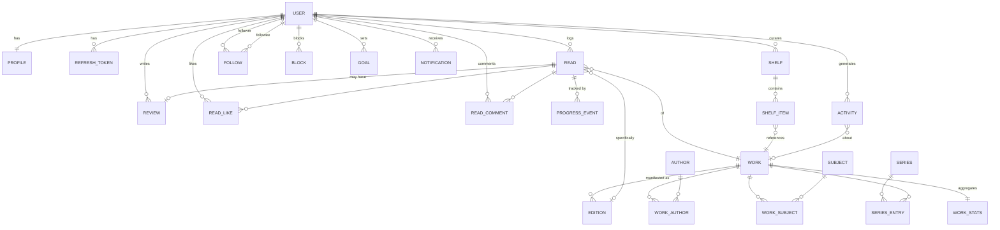

## 23.3 Key indexes

| Index | Purpose |
|---|---|
| `external_ids(provider, external_id, entity_type)` unique | Provider ID resolution — recognise a work from any source (§7.8) |
| `external_ids(entity_type, entity_id)` | Reverse lookup for a canonical record |
| `field_provenance(entity_type, entity_id, field_name)` unique | Per-field origin, freshness and correction locks (§7.8) |
| `raw_payloads(provider, external_id)` unique | Verbatim provider responses, so a normaliser fix is a reprocess rather than a re-fetch (§7.9) |
| `works(search_vector)` GIN | Full-text search |
| `works(title) gin_trgm_ops` | Typo tolerance |
| `editions(isbn_13)`, `editions(isbn_10)` | ISBN and barcode lookup |
| `editions(work_id)` | Edition listing |
| `reads(user_id, status, updated_at desc)` | The Reading tab — the hottest query in the product |
| `reads(work_id) where status='finished'` | Work aggregates |
| `reads(user_id, work_id, attempt_no)` unique | Prevents duplicate attempts |
| `progress_events(read_id, at desc)` | Current position |
| `progress_events(client_event_id)` unique | Offline idempotency |
| `activity(actor_id, created_at desc)` | **The feed query's covering index** |
| `follows(follower_id, state)` | Following set for the feed |
| `follows(followee_id, state)` | Follower lists |
| `read_likes(read_id, user_id)` PK | Prevents double-likes for free |
| `read_comments(read_id, created_at)` | Comment threads |
| `quotes(work_id, created_at desc)` | Quotes on a book page |
| `quotes(user_id, created_at desc)` | A reader's saved passages |
| `reviews(work_id, created_at desc)` | Book review lists |
| `reviews(user_id, created_at desc)` | Profile reviews |
| `shelf_items(shelf_id, position)` | Ordered shelf rendering |

## 23.4 Denormalisation, deliberately

| Denormalised field | Maintained by | Why |
|---|---|---|
| `work_stats.avg_rating`, `rating_count`, `read_count`, `dnf_rate` | Trigger + hourly reconciliation | Never aggregate on read |
| `reads.like_count`, `comment_count` | Trigger | Feed rendering would otherwise need two subqueries per card. Counters live on the **read**, so a finish with no review still carries them (§10.3) |
| `profiles.follower_count`, `following_count` | Trigger | Rendered on every profile and feed card |
| `shelves.item_count`, `save_count` | Trigger | Shelf grids |
| `activity` rows themselves | Written at action time | The feed is denormalised by design |

**Rule:** every denormalised counter has a scheduled reconciliation job. Triggers drift; reconciliation is what makes drift survivable.

## 23.5 Data retention

| Data | Retention |
|---|---|
| User reading data | Indefinite, until deletion is requested |
| `activity` rows | 180 days, then pruned — the feed never looks back further |
| `progress_events` | Indefinite — the basis of all longitudinal statistics |
| Deleted reviews | Soft-deleted 30 days, then purged |
| Deleted accounts | 30-day grace, then hard-deleted (§26) |
| Raw provider payloads | Current version indefinitely; superseded versions 90 days |
| Search query logs | 30 days, then aggregated and anonymised |
| Application logs | 14 days |
| Backups | 30 daily, 12 monthly |

---

# 24. API Design

## 24.1 Style

**REST over HTTPS, JSON.** GraphQL was considered and rejected for the MVP: the client is a single first-party app whose queries are known ahead of time, so GraphQL's flexibility buys nothing while adding N+1 risk, caching complexity and a heavier client. Revisit if a third-party API is ever offered.

### The spec is the contract **[LOCKED]**

The API is Go and the client is TypeScript, which means every endpoint is defined twice — once in the handler and once in whatever the client believes it returns. That gap is where a whole class of bugs lives, and it is invisible until something is null in production.

**Write an OpenAPI 3.1 spec and generate the TypeScript client from it.**

| Decision | Detail |
|---|---|
| Source of truth | A hand-written OpenAPI 3.1 document in the repo, reviewed like code. **[ASSUMPTION]** Hand-written rather than generated from Go annotations — annotation-driven specs drift silently and read badly |
| Client | Generated into `packages/api-client`, committed, regenerated in CI. A spec change that breaks the client fails the build, which is the entire point |
| Server validation | Request and response bodies validated against the spec in tests, so the spec cannot quietly become fiction |
| Also gets you | Free API documentation, a Postman/Bruno collection, and the contract the Phase 6 web app consumes without a second integration effort |
| Not for | A public developer API. That is a Phase 6+ question and needs versioning guarantees this does not imply |

| Convention | Value |
|---|---|
| Base | `https://api.flyleaf.app/v1` |
| Auth | `Authorization: Bearer <access_token>` |
| Content type | `application/json; charset=utf-8` |
| Pagination | **Cursor-based**: `?cursor=<opaque>&limit=20` → `{data, next_cursor}` |
| Errors | `{"error": {"code": "snake_case_code", "message": "Human readable", "field": "optional"}}` |
| Idempotency | `Idempotency-Key` header on all POSTs that create |
| Rate limit headers | `X-RateLimit-Limit`, `-Remaining`, `-Reset` |
| Versioning | URL path. v1 supported for 12 months past a v2 |

**Cursor pagination is mandatory, not preferred.** Feeds and review lists grow while a user pages through them, and offset pagination silently duplicates and skips rows when that happens.

## 24.2 Core endpoints

### Authentication

| Method | Endpoint | Auth | Description |
|---|---|---|---|
| POST | `/auth/register` | — | `{email, password}` → `{user, access_token, refresh_token}` |
| POST | `/auth/login` | — | Same shape. Generic error on failure |
| POST | `/auth/refresh` | — | `{refresh_token}` → new pair. **Rotates**; reuse revokes the family |
| POST | `/auth/logout` | Bearer | Revokes the presented refresh token |
| POST | `/auth/logout-all` | Bearer | Revokes every token family for the user |
| POST | `/auth/verify-email` | — | `{token}` |
| POST | `/auth/resend-verification` | Bearer | Rate limited: 1/60s |
| POST | `/auth/forgot-password` | — | Always 200, regardless of email existence |
| POST | `/auth/reset-password` | — | `{token, new_password}`; revokes all sessions |
| GET | `/auth/sessions` | Bearer | Active devices |
| DELETE | `/auth/sessions/{id}` | Bearer | Revoke one device |

**Errors:** `401 invalid_credentials` · `409 email_taken` · `422 weak_password` · `429 rate_limited` · `403 token_reused` (triggers family revocation).

### Catalog

| Method | Endpoint | Auth | Description |
|---|---|---|---|
| GET | `/search?q=&type=&filters` | Optional | Types: `books` `authors` `users` `lists` |
| GET | `/works/{id}` | Optional | Includes your status and rating when authenticated |
| GET | `/works/{id}/editions` | Optional | |
| GET | `/works/{id}/reviews?sort=` | Optional | Friends first when authenticated |
| GET | `/works/{id}/similar` | Optional | Embedding-based |
| GET | `/editions/isbn/{isbn}` | Optional | Barcode path |
| GET | `/authors/{id}` | Optional | |
| GET | `/series/{id}` | Optional | Includes your progress |
| POST | `/works/{id}/corrections` | Bearer | Suggest a metadata fix |

### Reading

| Method | Endpoint | Auth | Description |
|---|---|---|---|
| GET | `/me/reads?status=&cursor=` | Bearer | |
| POST | `/reads` | Bearer | `{work_id, edition_id?, status, started_at?}` → creates an attempt |
| PATCH | `/reads/{id}` | Bearer | Status, dates, rating, edition, visibility |
| DELETE | `/reads/{id}` | Bearer | |
| POST | `/reads/{id}/progress` | Bearer | `{client_event_id, page? , percent?, audio_seconds?, note?}` — **idempotent** |
| GET | `/reads/{id}/progress` | Bearer | Event history |
| POST | `/reads/{id}/finish` | Bearer | `{finished_at?, rating?, review?}` — one call for the whole finish flow |
| GET | `/me/goals/{year}` · PUT | Bearer | |

**Errors:** `404 read_not_found` (also returned for another user's read — never 403, which would confirm existence) · `409 duplicate_active_read` · `422 invalid_date_range`.

### Reviews and social

| Method | Endpoint | Auth | Description |
|---|---|---|---|
| POST | `/reviews` | Bearer | `{read_id, body, has_spoilers, spoiler_after_page?, visibility}` |
| PATCH / DELETE | `/reviews/{id}` | Bearer | Owner only |
| POST / DELETE | `/reads/{id}/like` | Bearer | Likes target the read, so a finish with no review is likeable (§10.3) |
| GET / POST | `/reads/{id}/comments` | Bearer | Same target as likes |
| POST / DELETE | `/users/{id}/follow` | Bearer | 202 when the target is private (request pending) |
| GET | `/users/{id}/followers` · `/following` | Optional | |
| POST / DELETE | `/users/{id}/block` · `/mute` | Bearer | |
| GET | `/feed?tab=friends|popular&cursor=` | Bearer | |
| GET | `/notifications?cursor=` · POST `/notifications/read` | Bearer | |

### Shelves, profile, data

| Method | Endpoint | Auth | Description |
|---|---|---|---|
| GET / POST | `/shelves` | Bearer | |
| GET | `/shelves/{id}` | Optional | Respects privacy |
| PATCH / DELETE | `/shelves/{id}` | Bearer | Owner |
| POST / DELETE | `/shelves/{id}/items` | Bearer | |
| PUT | `/shelves/{id}/order` | Bearer | Bulk reorder |
| GET | `/users/{id}` · `/users/{id}/reviews` · `/reads` | Optional | |
| GET / PATCH | `/me` | Bearer | |
| PUT | `/me/favourites` | Bearer | Ordered array of up to 4 work IDs |
| GET | `/me/stats?year=` | Bearer | |
| GET | `/me/year-in-review/{year}` | Bearer | |
| POST | `/imports` | Bearer | Multipart upload → `{job_id}` |
| GET | `/imports/{job_id}` | Bearer | Progress and unmatched rows |
| POST | `/exports` | Bearer | → emailed link |
| DELETE | `/me` | Bearer | Requires password re-entry; 30-day grace |
| POST | `/reports` | Bearer | |

## 24.3 Example: the finish call

```http
POST /v1/reads/9a3f.../finish
Authorization: Bearer eyJ...
Idempotency-Key: 7c2e...
Content-Type: application/json

{
  "finished_at": "2026-09-01",
  "rating": 4.5,
  "review": {
    "body": "Structurally perfect. The last forty pages rearranged the whole book.",
    "has_spoilers": false,
    "visibility": "public"
  }
}
```

```http
201 Created
{
  "read": { "id": "9a3f...", "status": "finished", "rating": 4.5, "attempt_no": 1 },
  "review": { "id": "b81c...", "created_at": "2026-09-01T18:22:10Z" },
  "share_card_url": "https://cdn.flyleaf.app/cards/b81c....png",
  "milestone": { "type": "books_100", "achieved": true }
}
```

One round trip produces the read update, the review, the activity row, the share card and the milestone check — because they are one database transaction plus one enqueued job.

## 24.4 Rate limits

| Group | Authenticated | Anonymous |
|---|---|---|
| Auth endpoints | 10/min per account, 30/min per IP | 20/min per IP |
| Search | 60/min | 20/min |
| Writes (reads, reviews, shelves) | 120/min | — |
| Progress events | 300/min | — |
| Follows | 50/hour, 200/day | — |
| Comments | 5/min | — |
| Import | 3/day | — |
| Export | 2/day | — |
| Global | 1,000/hour | 200/hour |

---

# 25. Authentication & Authorization

## 25.1 Methods and phasing

| Method | Phase | Notes |
|---|---|---|
| **Email + password** | **MVP** | The only method at launch |
| Sign in with Google | Phase 3 | |
| **Sign in with Apple** | Phase 3 — **required if Google ships on iOS** | Apple mandates it alongside other third-party sign-in options. This is why both are deferred together |
| Magic link | Considered, rejected | Adds email-delivery latency to every login; password managers already solve this better |
| Phone / OTP | Rejected | SMS costs money and adds no value for this audience |

**Rationale for deferring social sign-in [LOCKED]:** adding Google on iOS obliges Sign in with Apple, which requires a paid Apple Developer account. Deferring both keeps the MVP at zero cash cost and is a contained change to add later.

## 25.2 Token design

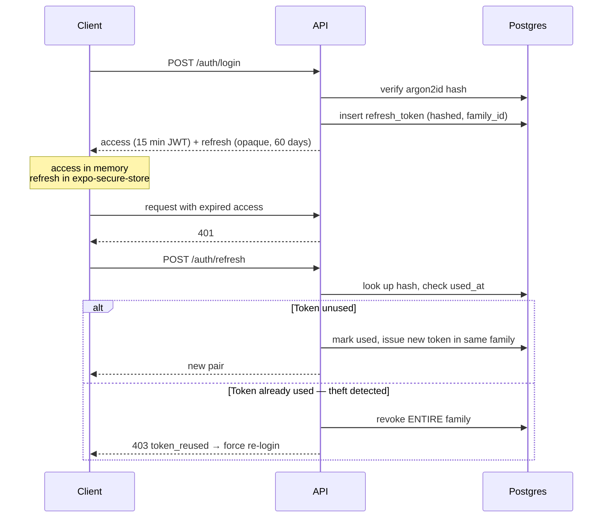

| Property | Value |
|---|---|
| Password hashing | **argon2id** with documented library defaults; never bcrypt, never SHA |
| Password policy | Minimum 10 characters, checked against a common-password list. **No composition rules** — they reduce real entropy |
| Access token | JWT, 15 minutes, signed HS256, carries `sub` and `iat` only |
| Refresh token | Opaque 256-bit random, **stored hashed**, 60-day expiry, **rotated on every use** |
| Reuse detection | `family_id` — presenting a used token revokes the whole family and signs the user out everywhere |
| Client storage | Refresh in `expo-secure-store` (OS keychain). **Never AsyncStorage**, which is plaintext on disk |
| Revocation | Individual device, all devices, or automatic on password reset |

Reuse detection costs one column and converts a stolen refresh token from a permanent breach into a brief one. It is not optional.

## 25.3 Authorization model

There is no row-level security layer as a managed backend would provide, so authorization is enforced in the application — in **exactly one place**.

| Rule | Implementation |
|---|---|
| Every user-scoped query takes a viewer ID | Enforced by the repository layer's function signatures; a query cannot be written without one |
| Ownership checks live in the repository, not handlers | Scattered handler checks are how data leaks |
| Not-found over forbidden | Another user's private read returns **404, not 403** — a 403 confirms the resource exists |
| Visibility resolution | One shared function: `canView(viewer, resource)` covering public / followers / private / blocked |
| Integration tests | A test suite asserting a second user gets 404 on every private resource type. **This suite is the actual security control** |

### Roles

| Role | Capabilities |
|---|---|
| `anonymous` | Public books, authors, public profiles, public shelves and reviews (read-only) |
| `unverified` | All of the above plus tracking; **cannot** review, comment or follow |
| `user` | Full product access |
| `moderator` | Review reports, hide content, suspend accounts (Phase 2) |
| `admin` | Catalog edits, merges, user administration |
| `author` (verified) | Claim works, view reception analytics. **Cannot reply to reviews** (§10.9) |

## 25.4 Account deletion **[store requirement]**

Apps offering account creation must offer in-app account deletion; temporary deactivation alone is explicitly insufficient.

| Step | Behaviour |
|---|---|
| 1 | Settings → Delete account, with a plain-language list of what will be lost |
| 2 | Password re-entry |
| 3 | Final confirmation naming the consequences |
| 4 | `deleted_at` set; account immediately inaccessible; all content hidden platform-wide |
| 5 | **30-day grace** — logging in restores the account, with this stated at deletion time |
| 6 | After 30 days: hard delete of personal data. Reviews are deleted. Anonymised aggregate contributions (a rating's effect on an average) are retained, which is disclosed in the privacy policy |
| 7 | An export is offered before deletion completes |

---

# 26. Privacy & Safety

## 26.1 Privacy model

| Setting | Levels | Default |
|---|---|---|
| Account | Public · Private | **Public** |
| Reads | Public · Followers · Private | Public |
| Reviews | Public · Followers · Private | Public |
| Shelves | Public · Followers · Private | Public per shelf |
| Currently reading | Visible · Hidden | Visible |
| Statistics | Visible · Hidden | Visible |
| Discoverable by email | On · Off | **Off** |
| Show in "readers like you" | On · Off | On |

**[ASSUMPTION]** Public-by-default is correct for a social discovery product — a private-by-default network cannot bootstrap discovery. But three protections make this defensible: private mode is prominent in onboarding, per-item visibility is always available in the composer, and switching to private retroactively restricts existing content.

## 26.2 Per-item visibility

Any individual read, review or shelf can override the account default. The most common real use: reading something personal (a self-help book, a book about an illness) and wanting it off the record. **This must be available at the moment of logging**, not buried in settings afterwards — by then the activity row already exists.

**Implementation:** `reads.visibility` and `reviews.visibility` are checked in `canView()`, and a private read generates **no activity row at all**.

**And it changes what other people see in your statistics, not what you see in your own** — see §17.5, which specifies the two-answer rule in full.

## 26.3 Safety features

| Feature | Priority | Notes |
|---|---|---|
| Block | P0 | Complete bidirectional invisibility (§11.4) |
| Mute | P0 | Silent, per-user and per-book |
| Report | P0 | Content and accounts |
| Private account | P0 | Follow requests |
| Comment controls | P1 | Disable comments per review |
| Restrict | P2 | Instagram-style: their comments visible only to them |
| Word filters | P2 | Personal muted-word list |

## 26.4 Data rights

| Right | Implementation | Timeline |
|---|---|---|
| Access | Full export: reads, progress, reviews, shelves, follows, profile | Within 24 hours |
| Portability | Machine-readable CSV and JSON | Same |
| Rectification | All user content editable in-app | Immediate |
| Erasure | Account deletion flow (§25.4) | 30 days |
| Restriction | Private mode; per-item visibility | Immediate |
| Objection | Opt out of "readers like you" and personalised recommendations | Immediate |

**Export ships in the MVP.** It costs about a day, it is a store data-rights checkbox, and it is the single most credible signal to a Goodreads refugee that they will not be trapped again.

## 26.5 Data minimisation

Collected: email, password hash, username, optional profile fields, reading data, device push token, coarse app analytics.

**Explicitly not collected:** real name (unless volunteered), phone number, contacts, precise location, advertising identifiers, cross-app tracking, reading content itself.

**[ASSUMPTION]** No third-party analytics SDK that transmits personally identifiable data. Product analytics are first-party, stored in the same Postgres, which is simpler, cheaper and a genuine privacy differentiator worth stating publicly.

## 26.6 Children

Minimum age 13 (16 in jurisdictions requiring it), enforced by a date-of-birth gate at signup. Under-age accounts detected later are suspended pending verification. No behavioural profiling of accounts registered as under 18.

**Content exposure.** Accounts under 18 never see `explicit` catalog titles in search, browse or recommendations, and cannot access the setting that would reveal them (§7.8). This is the mechanism that makes a 13+ age rating defensible on a catalogue that contains adult material.

---

# 27. Content Moderation

## 27.1 Scope

| Surface | Risk | Volume |
|---|---|---|
| Reviews | Harassment, spoilers, spam, fake reviews | High |
| Comments | Harassment, argument | High |
| Usernames and bios | Impersonation, slurs | Low |
| Shelf names and descriptions | Abuse vectors via titles | Medium |
| **Quotes** | Copyright over-extraction; passages used as an abuse vector | Medium |
| Avatars | NSFW imagery | Low |
| Corrections | Vandalism of the catalog | Low |
| **Catalog content** | Explicit material surfacing to users who did not ask, or to minors | **Medium — store-review risk** |

## 27.2 Three-layer model

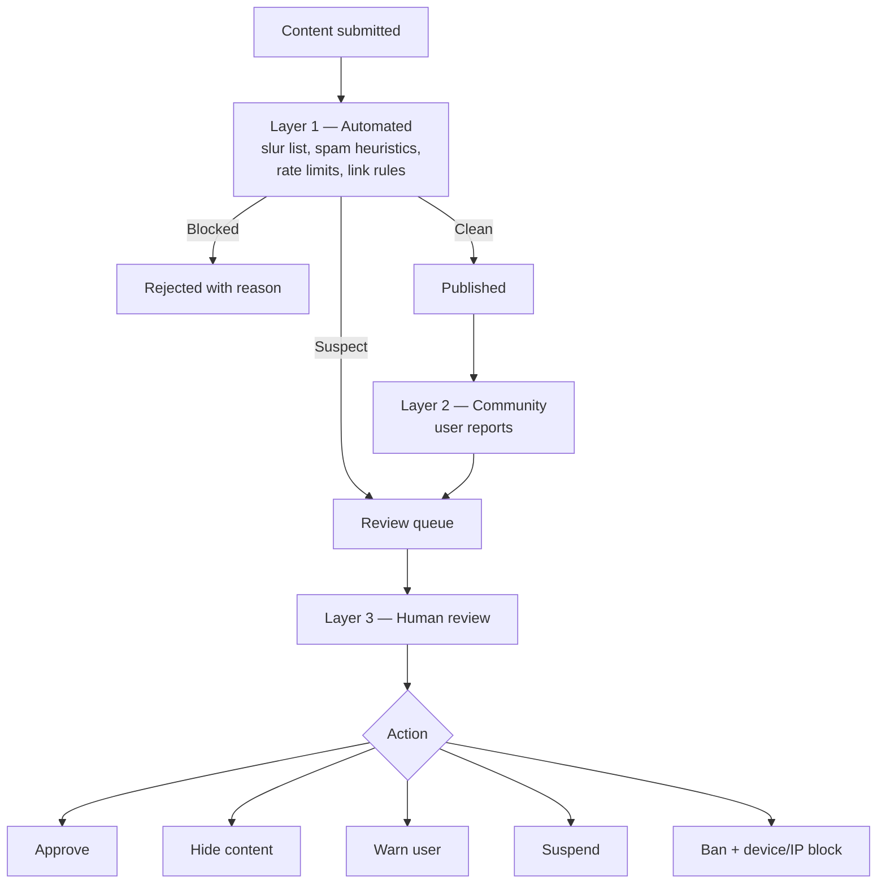

### Layer 1 — Automated (P0)

| Check | Action |
|---|---|
| Slur and hate-term list | Block at submission with a clear reason |
| Link rules | No links for accounts under 7 days old; max 2 links per review |
| Duplicate content | Same text posted on 3+ works → queue |
| Rate limits | §24.4 |
| New-account restrictions | No reviews before email verification |
| **AI triage** *(P1)* | Small classifier scores toxicity, spam and spoiler likelihood; high scores queue rather than block. **Never auto-deletes** — false positives on strong literary criticism would be common and damaging |

### Layer 2 — Community (P0)

Reports with the reason taxonomy in §6.44. Reporter reputation is weighted: users whose reports are consistently upheld carry more weight; users who mass-report are down-weighted and eventually rate-limited.

### Layer 3 — Human (P0, small scale)

At MVP, this is the founder in an admin queue. It must exist from day one because the stores require "timely responses to concerns", and because automated moderation alone cannot handle the actual hard cases.

## 27.3 Enforcement ladder

| Violation | 1st | 2nd | 3rd |
|---|---|---|---|
| Unmarked spoilers | Content flagged, user notified | Warning | Reviews auto-flagged for 30 days |
| Spam | Content removed | 7-day posting suspension | Ban |
| Harassment | Content removed + warning | 30-day suspension | Ban |
| Hate speech | **Immediate removal + ban** | — | — |
| Fake or paid reviews | Removed, ratings excluded | Ban | — |
| Impersonation | Profile reset + warning | Ban | — |
| Vote manipulation | Ratings excluded from aggregates | Ban | — |

## 27.4 Book-community-specific risks

These are the failure modes specific to this domain, and each has a designed mitigation:

| Risk | Mitigation |
|---|---|
| **Review bombing** — coordinated attacks on a book or author, often politically motivated | Velocity anomaly detection freezes the displayed average and queues for review |
| **Author–reviewer conflict** — historically the ugliest dynamic in book communities | **Authors structurally cannot reply to reviews.** This single design decision prevents most of it |
| **Spoiler warfare** — deliberate spoilers as harassment | Report category with fast action; repeat offenders auto-flagged |
| **Paid review rings** | Graph clustering on account creation time, follow patterns and rating co-occurrence |
| **Content warning disputes** | Content warnings are community-contributed and shown as such, never as editorial fact |
| **Rating brigades against marginalised authors** | Anomaly detection plus manual monitoring of newly-published works with unusual rating velocity |

## 27.5 The admin console **[LOCKED]**

The PRD has been quietly assuming this exists. §27 needs a report queue, §34.1 needs a merge tool, §6.46 needs a correction review queue, §7.8 needs a maturity-classification override, §25.3 defines `moderator` and `admin` roles — and none of it is scoped anywhere. Someone has to build it, and if it is not written down it gets built in a panic the week before launch.

**Form:** a plain server-rendered web application at `admin.flyleaf.app`, behind the same Go binary. Not a React app, not a separate service — Go templates and forms. It has one to three users and needs to be reliable, not pretty.

| Area | Capability | Needed by |
|---|---|---|
| **Reports queue** | List open reports by type, age and reporter reputation · view the reported content in context · approve, hide, warn, suspend, ban · record the rule applied · handle appeals | Phase 2 — the stores require timely response to reports |
| **User administration** | Search by username or email · view a user's content and report history · suspend with duration and reason · restore · force password reset · view active sessions | Phase 2 |
| **Catalog: merges** | Review the queued fuzzy-match duplicates from §40.3 stage 3 · see both records side by side with edition counts and log counts · merge with a preview of what moves · **undo within 30 days** | Phase 0 |
| **Catalog: corrections** | Queue of user-submitted corrections (§6.46) · apply, reject, or apply-and-lock · bulk-apply from trusted reporters | Phase 1 |
| **Catalog: maturity** | Override the ingest classification (§7.8) · review titles the rules flagged as borderline | Phase 0 |
| **Catalog: editions and authors** | Repoint an edition to a different work · split an author record that merged two people · set the default edition | Phase 1 |
| **Ingestion status** | Last dump run, records processed, records filtered out, failures · gap-fill queue depth and rate-limiter headroom · **circuit-breaker state** | Phase 0 |
| **Operations** | Job queue depth by type · dead-letter queue with retry · recent errors · backup status and last successful restore drill | Phase 3 |
| **Metrics** | The §44 dashboard — activation, retention, north star — read from the first-party analytics tables | Phase 3 |

### Rules

| Rule | Detail |
|---|---|
| **Every action is audit-logged** | Actor, target, action, reason, timestamp. Non-negotiable: moderation decisions get challenged, and "I don't remember why" is not an answer |
| **Destructive actions are reversible** | Merges undo for 30 days; content is hidden rather than deleted; suspensions lift |
| **No direct database editing** | If a fix needs raw SQL, that is a missing admin feature. Ad-hoc SQL against production is how data gets silently corrupted |
| **Separate authentication** | Admin login is distinct from the app account, with mandatory two-factor. An admin session must never be obtainable from a stolen app token |
| **Read-only by default** | The moderator role sees everything and can act on content; only `admin` touches the catalog or user accounts |

**Effort:** roughly one week spread across the phases above, not a project. The point of writing it down is that it stops being invisible work.

## 27.6 Transparency

- Reporters see the report status but never the specific outcome for another user.
- Users whose content is removed are told which rule was applied and may appeal once.
- Appeals are reviewed by a human, not automation.
- **[ASSUMPTION]** A public transparency summary (report volumes, action rates) is published annually from Phase 3.

---

# 28. Analytics

## 28.1 Approach

**[ASSUMPTION]** First-party analytics, written to the same Postgres database as an `events` table, with no third-party SDK transmitting personal data. Rationale: it is cheaper, simpler, avoids an entire class of privacy disclosure, and at MVP scale the query volume is trivial. Move to a dedicated analytics store only when event volume affects production performance.

Every event carries: `event_name`, `user_id` (nullable), `session_id`, `timestamp`, `platform`, `app_version`, and a JSONB `properties` object.

## 28.2 Event taxonomy

### Acquisition

| Event | Key properties |
|---|---|
| `app_installed` | source, campaign |
| `app_opened` | is_first_open, cold_start |
| `welcome_viewed` / `welcome_skipped` | |
| `signup_started` | |
| `account_created` | method |
| `signup_failed` | reason |
| `login_succeeded` / `login_failed` | reason |
| `deep_link_opened` | destination, source |

### Activation

| Event | Key properties |
|---|---|
| `username_set` · `avatar_set` | |
| `import_started` | source |
| `import_completed` | source, matched, unmatched, duration_seconds |
| `genres_selected` | count |
| `favourites_set` | count |
| `follow_suggestions_shown` | count |
| `onboarding_completed` | duration_seconds, steps_skipped |
| **`first_book_logged`** | source, time_since_signup |
| **`first_rating_created`** | |
| **`first_review_created`** | |

### Reading (the core loop)

| Event | Key properties |
|---|---|
| `book_added` | status, source |
| `book_started` | source |
| **`progress_updated`** | method (slider / sheet / quick_add), delta_pages, days_since_last |
| `book_finished` | days_to_finish, page_count, format, had_rating, had_review, hearted |
| `book_hearted` / `book_unhearted` | source |
| `book_dnf` | percent_reached, reason |
| `book_paused` / `book_resumed` | |
| `reread_started` | attempt_no |
| `goal_set` | target_books |
| `goal_reached` | year |

### Engagement

| Event | Key properties |
|---|---|
| `feed_viewed` | tab, item_count |
| `feed_card_impression` | type, position |
| `feed_card_tapped` | type, position |
| `book_viewed` | source |
| `review_viewed` / `read_liked` / `review_shared` | `read_liked` carries `has_review` so like rates on bare finishes vs reviews are separable |
| `comment_created` | |
| `quote_saved` | method (typed / ocr), length, has_note |
| `quote_shared` | |
| `search_performed` | query_length, tab, result_count |
| `search_zero_results` | query |
| `discover_row_impression` / `discover_book_tapped` | row, position |
| `stats_viewed` | year |
| `session_ended` | duration_seconds, screens_viewed |

### Social

| Event | Key properties |
|---|---|
| `user_followed` / `user_unfollowed` | source |
| `profile_viewed` | is_own, source |
| `shelf_created` | is_ranked, privacy |
| `shelf_saved` / `shelf_shared` | |
| `content_reported` | type, reason |
| `user_blocked` / `user_muted` | |

### Growth

| Event | Key properties |
|---|---|
| `share_card_generated` | template |
| `share_completed` | template, destination |
| `profile_shared` | |
| `yir_viewed` / `yir_card_shared` | year, card |
| `invite_sent` / `invite_accepted` | |

### Reliability

| Event | Key properties |
|---|---|
| `api_error` | endpoint, status, code |
| `offline_queue_flushed` | queued_count, age_seconds |
| `app_crashed` | (via crash reporter) |
| `screen_load_slow` | screen, duration_ms |

## 28.3 North Star and supporting KPIs

> **North Star: Weekly Reading Actions per Active User** — the count of progress updates, finishes, ratings and reviews per WAU.

**Why this and not DAU or books-finished:** it captures the behaviour that both retains the user (tracking) and feeds the network (rating, reviewing), it moves weekly rather than annually, and it cannot be inflated by vanity behaviour. Book counts alone would reward reading short books; DAU alone would reward notification spam.

| Layer | Metric | MVP target | Why it matters |
|---|---|---|---|
| **Acquisition** | Install → signup | >40% | Measures whether the value proposition lands |
| **Activation** | Signup → first book logged within 24h | **>60%** | The single best predictor of retention |
| | Onboarding completion | >70% | Detects friction in the funnel |
| | Import completion (of those who start) | >85% | Import failures lose the highest-value users |
| **Engagement** | D1 / D7 / D30 retention | 40% / 25% / 15% | Standard consumer social benchmarks |
| | Weekly progress updates per WAU | **>3** | The daily-hook health metric |
| | Sessions per WAU | >4 | |
| **Retention** | W4 retention of activated users | >30% | Activation-conditioned retention is the honest number |
| | Resurrection rate | >5%/month | Casual readers return in cycles by nature |
| **Social** | Median follows per user at day 7 | **>5** | Below 3, the feed is dead and churn follows |
| | Reviews per 100 finishes | >25 | Content supply for discovery |
| | Review like rate | >15% | Feed health |
| **Reading** | Books finished per MAU per month | >1.2 | |
| | DNF rate | 10–25% | Outside this band suggests users are not logging honestly |
| **Discovery** | Recommendation → finish conversion | **>15%** | The only recommendation metric that matters |
| **Growth** | Share rate per finish | >8% | The external growth loop |
| | K-factor | >0.3 | Below 0.15, paid acquisition is required |

## 28.4 Cohort dimensions

Every metric segmented by: signup week · acquisition source · imported vs manual · books-read band (0–5, 6–25, 26–100, 100+) · follows band (0, 1–5, 6–20, 20+) · platform.

**The two most decision-relevant cuts** are *imported vs manual* (expected to be the strongest retention divide, which would justify further import investment) and *follows band* (which sets the target for onboarding follow suggestions).

---

# 29. Growth Loops

## 29.1 Loop inventory

### Loop 1 — The share loop *(primary, P0)*

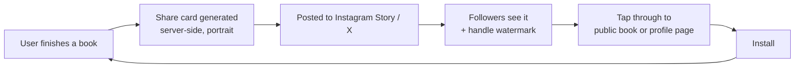

| Requirement | Detail |
|---|---|
| Cards rendered **server-side** to real images | So they look identical everywhere and sharing is one tap, not a screenshot |
| Portrait, story dimensions | Instagram Stories is the dominant surface for this audience |
| Handle watermark on every card | The card is useless as growth without attribution |
| Offered at the emotional peak | Immediately after finishing, never as a nagging prompt later |
| **Public landing pages required** | Without them every share is a dead link for non-users. This is why minimal public book/profile pages ship in **Phase 2**, not Phase 6 |
| **Guest mode required** | The person who *installs* from a share must see the content that convinced them, not a signup wall (§4.2) |

**Loop strength:** high. This is the primary organic engine, and it is exactly how Letterboxd grew.

### Loop 2 — Year in Review *(P1, seasonal, very high intensity)*

An annual burst rather than a continuous loop, but historically the highest-volume acquisition event in this category (Spotify Wrapped, Goodreads Year in Books). Requirements: unlocks 1 December; every card individually shareable; a low-volume variant so light readers still share; and the previous year's data must be complete, which means the product must have shipped by roughly September to have a meaningful first Wrapped.

### Loop 3 — The profile loop *(P0)*

A user links their profile in an Instagram bio or a Discord signature → visitors see a beautiful reader identity → install. Requires `flyleaf.app/@username` to render server-side with rich Open Graph previews.

### Loop 3b — The quote loop *(P1)*

A saved passage rendered as a typographic card is the most *forwardable* thing the product makes — it carries no obligation to explain yourself the way a review does, and it works as content on Instagram, X and WhatsApp without modification. Requirements: server-rendered, attribution on the card, the handle watermark, and a link that resolves to the book page for anyone without the app. Expect this to outperform rating cards on share rate.

### Loop 4 — The list loop *(P1)*

Curated lists ("Best sci-fi by women") are inherently shareable and become durable SEO assets once web pages exist. This is a slow-burn loop that compounds.

### Loop 5 — The friend-invite loop *(P1)*

A reading app is far better with friends. Requirements: an invite link carrying the inviter's identity; the invitee auto-follows the inviter on signup; both are notified. **No incentives, no rewards** — incentivised invites in social products produce low-quality signups that never activate.

### Loop 6 — SEO *(P2, Phase 6)*

Public book pages, review pages, list pages and profiles, server-rendered. Long-tail queries ("books like Piranesi", "is Babel worth reading") are high-volume and low-competition. This becomes the dominant acquisition channel at scale but requires the web platform.

### Loop 7 — The import loop *(indirect, P0)*

Import does not directly acquire users, but it converts high-intent visitors at a far higher rate — and imported users are the ones with enough content to trigger loops 1 and 3.

## 29.2 Loop prioritisation

| Loop | Effort | Impact | Phase |
|---|---|---|---|
| Share cards | Medium | **Very high** | 1 |
| Public profile pages | Medium | **Very high** | 2 |
| Import | High | High (indirect) | 1 |
| Invite | Low | Medium | 2 |
| Year in Review | Medium | Very high, seasonal | 3 |
| Lists | Low | Medium | 2 |
| SEO | High | Very high, slow | 6 |

## 29.3 Launch strategy

**[ASSUMPTION]** Seed with **one tight community** rather than a broad launch. A social product with 500 users spread across the world is dead; 500 users in one book-focused subreddit or Discord is a functioning network.

Candidate seeds: a large reading subreddit, a BookTok creator's audience, a university reading society, or the Letterboxd community directly ("we made this for books"). The last is the highest-fit: they already understand and want the model.

---

# 30. Monetization

## 30.1 Principles

1. **Never charge for tracking.** The core loop must be free forever, or the network cannot grow.
2. **Never put social features behind a paywall.** Paywalling follows or reviews fragments the graph and kills the product.
3. **Never inject advertising into the feed.** It is the fastest way to destroy trust in a taste product, and this audience is unusually hostile to it.
4. **Charge for depth and expression, not access.**
5. **Monetize only after product-market fit.** No monetization before Phase 5.

## 30.2 Options evaluated

| Option | Verdict | Reasoning |
|---|---|---|
| **Premium subscription** | **RECOMMENDED — primary** | Aligned incentives: revenue from people who love the product, not from their attention. Proven in this exact category by StoryGraph and Hardcover |
| **Affiliate book links** | **RECOMMENDED — secondary** | Genuinely useful ("where can I buy this?"), non-intrusive, and available from day one at zero build cost beyond link generation. Must be clearly labelled and never influence ranking |
| Advanced statistics | Include in premium | Natural fit; power users want depth casual users do not |
| AI features | Include in premium | Has a real marginal cost, so gating it is honest rather than artificial |
| Custom profile themes | Include in premium | Pure expression, zero functional gating — the ideal premium feature for an identity product |
| Author tools | P2, separate tier | Verified profiles, reception analytics. Small market, high willingness to pay |
| Sponsored discovery | **REJECT** | Publisher-paid placement in recommendations destroys the one thing the product sells: trustworthy taste |
| Display advertising | **REJECT** | See principle 3 |
| Selling user data | **REJECT** | Absolutely not |
| Paid early access | Reject | Creates a two-tier community |

## 30.3 Recommended structure

### Flyleaf Free — permanently generous

Unlimited tracking · unlimited reviews and ratings · unlimited shelves · full social features · basic statistics · import and export · Year in Review.

### Flyleaf Plus — **[ASSUMPTION]** ~₹299/month or ₹2,499/year (roughly $4/month, $30/year)

| Feature | Rationale |
|---|---|
| Advanced statistics — full history, custom date ranges, deeper breakdowns | Depth for the serious reader |
| AI recommendations and natural-language search | Real marginal cost |
| Custom profile themes and accent colours | Expression, no functional gating |
| Multiple reading goals and custom challenges | Power-user depth |
| Advanced content filters and word muting | Safety depth |
| Early access to new features | Community goodwill |
| Supporter badge | Status, and it signals the product is independent |
| No ads — **because there are never ads** | Stated explicitly as a values position, not a feature |

**Target:** 3–5% conversion **[ASSUMPTION]**, consistent with independent consumer subscription apps. At 100,000 MAU that is roughly ₹9–15 lakh/year — enough to fund one developer and infrastructure.

### "Where to read" — library first, retail second **[LOCKED]**

The obvious version of this is a row of buy buttons. That is what Goodreads does, and being Amazon-owned is one of the top three complaints about it in §1.5. Doing the same thing with a different affiliate tag is not a differentiator.

**The better version leads with the library.** "Can I borrow this?" is one of the most common questions a reader has after deciding they want a book, and no competitor answers it well. A library link earns nothing and is therefore the most trustworthy thing on the page — which is exactly why it should come first.

| Order | Source | Revenue | Notes |
|---|---|---|---|
| **1** | **Your library — Libby / OverDrive deep link** | **None** | The user sets their library once in Settings; the link goes straight to the title in their system. Pure utility |
| 2 | Other library systems the user has added | None | Many readers hold cards at two or three |
| 3 | Bookshop.org | Affiliate | Supports independent bookshops; the right default retailer for this audience |
| 4 | Regional retailers | Affiliate | India-first launch means the relevant retailers here are not the US defaults **[ASSUMPTION]** |
| 5 | Amazon / Kobo / Audible | Affiliate | Present because people use them, last because everyone else puts them first |

**Rules:**

| Rule | Detail |
|---|---|
| Library options are never below a retail option | Structural, not a setting |
| Never above the fold | The page is about the book, not about buying it |
| **Never affects ranking, recommendations or search** | Stated in §30.1 and worth repeating: the moment commerce touches ranking, the product's one asset — trustworthy taste — is gone |
| Affiliate links disclosed on the page | And in the privacy policy |
| Permanently dismissible | A user who never wants to see retailers can turn the section off entirely and keep the library links |
| Pro can reorder or hide retailers | §30.3 |

**Why this is worth building beyond the revenue.** It is the clearest possible signal of what the product is for. Goodreads funnels you to a purchase; Flyleaf tells you the book is free at your local library and lets you get on with reading it. That difference is cheap to build, impossible for an Amazon subsidiary to copy, and it is the kind of thing readers tell each other about.

**[ASSUMPTION]** Library availability lookup via OverDrive's public title endpoints. If that proves unreliable or unavailable, degrade to a search deep link into the user's library system rather than dropping the feature — an imperfect library link still beats a perfect buy button.

## 30.4 Timing

| Phase | Monetization |
|---|---|
| 1–3 | **None.** Focus entirely on retention and network growth |
| 4 | Affiliate links only |
| 5 | Plus subscription launch |
| 6+ | Author tools |

**Launching a subscription before product-market fit is the classic failure mode** — it converts a small number of early users while capping the growth needed to reach fit at all.

---

# 31. MVP Definition

## 31.1 Scoping principle

The MVP must validate one hypothesis:

> **Will readers use a low-friction progress tracker daily, and will finishing a book generate social activity worth returning for?**

Everything not needed to test that is cut.

## 31.2 P0 — required to launch

| Area | Features |
|---|---|
| **Catalog** | Open Library ingest; maturity classification and filtering; duplicate detection; search with typo tolerance; book, author and series pages; edition picker; ISBN and barcode lookup |
| **Auth** | Email + password; verification; password reset; session management; account deletion |
| **Tracking** | Want / Reading / Paused / Finished / DNF; progress events (page, percent, time); format override; start and finish dates; re-reads; predicted finish date; annual goal (ring only) |
| **Rating** | Half-stars 0.5–5.0, optional; weighted averages; distribution histogram |
| **Reviews** | Write, edit, delete; spoiler flag; visibility; like; comment |
| **Social** | Asymmetric follow; private accounts; block; mute; report; follower and following lists |
| **Feed** | Friends and Popular tabs; activity cards; aggregation; diversity rules; cold-start fallback |
| **Discovery** | Popular, New releases, Highly rated, Friends loved, Browse by genre, Curated lists |
| **Shelves** | Create, edit, ranked and unranked, privacy, per-entry notes |
| **Profile** | Four favourites; **the Wall** (poster grid of everything read); stats strip; currently reading; Diary; reviews; shelves |
| **Stats** | Volume, temporal, taste and extremes; share cards per card |
| **Import / Export** | Six sources in, CSV out, unmatched-row review |
| **Sharing** | Server-rendered share cards for finishes, reviews and stats |
| **Notifications** | Follows, likes, comments, mentions, import complete; full per-category controls |
| **Offline** | Queued progress updates; cached feed and reading list |
| **Moderation** | Automated filters; reports; the admin console (§27.5) |
| **Settings** | Privacy, notifications, appearance, blocked users, data |

## 31.3 P1 — first fast-follow (Phase 2–3)

Public web pages for books, profiles and lists (growth-critical) · **quotes and passages (§10.8)** · Year in Review · social sign-in · "spoilers after page N" · similar books via embeddings · readers-like-you · collaborative shelves · rich text in reviews · mentions · milestone moments · owned-book flag · review summarisation · invite flow · reading personality.

## 31.4 P2 — later

Book clubs · author profiles and claiming · reading challenges · mood-based discovery · AI reading companion · natural-language search · timer-based sessions · tags · full web application · premium subscription · content warnings · restrict mode · word filters.

## 31.5 Explicitly out of scope for v1

| Cut | Why |
|---|---|
| iOS **launch** (the codebase supports it) | Apple Developer costs $99/year; Play Console is $25 once. Ship Android, let it fund iOS |
| Social sign-in | Forces the Apple cost forward (§25.1) |
| Web application | The mobile experience is the hypothesis; minimal public pages cover the growth need |
| Book clubs | A distinct product surface that would break the five-tab rule |
| Direct messaging | Enormous moderation burden for marginal value |
| Author tools | Small market; needs a mature product first |
| Advanced AI | Needs data the product does not yet have |
| Monetization | Premature before fit |
| Timer-based sessions | Different core loop; niche segment |

---

# 32. Roadmap

| Phase | Name | Duration | Goal | Exit criteria |
|---|---|---|---|---|
| **−1** | Walking skeleton | 1 week | One crude path through every layer, end to end | You can sign up, find a book, log it, finish it, rate it and see it on a profile — on your own phone |
| **0** | Foundation | 7 weeks, or **3 with the accelerator** | A searchable catalog and a working API with auth | Search returns the right book for 50 personally-owned titles, and the 200-query relevance panel (§14.6) passes at ≥90%; auth passes the cross-user access test suite |
| **1** | MVP — the solo loop | 8 weeks | A tracker good enough to use alone | Founder tracks two full books through the app; the 20-second finish budget is met |
| **2** | Social | 6 weeks | The network functions | 50 beta users; median follows ≥5; feed is non-empty for all of them |
| **3** | Launch & growth | 5 weeks | Public Android launch | Play Store live; share loop measurable; D7 retention ≥25% |
| **4** | Personalisation | 8 weeks | Discovery that works | Recommendation→finish conversion ≥15% |
| **5** | AI & monetization | 10 weeks | Revenue and differentiation | Plus subscription live; ≥3% conversion |
| **6** | Web platform | 12 weeks | SEO and desktop | Public pages indexed; organic search a top-3 acquisition channel |

## Phase −1 — The walking skeleton *(1 week, before anything else)* **[LOCKED]**

Every phase below builds a layer *horizontally* — the whole catalog, then the whole auth system, then the whole client. That is how a solo project spends ten weeks discovering in week eleven that two layers do not fit together.

**Build one thin vertical path through every layer first, however crudely, and make it work end to end:**

```
Sign up (email/password, no verification yet)
   ↓
Search one hardcoded set of 100 books (a CSV loaded by hand)
   ↓
Book detail page (title, author, cover)
   ↓
Mark as reading → update progress → finish → rate
   ↓
See it on a profile
```

One week. Ugly on purpose. No verification emails, no refresh rotation, no ingest pipeline, no styling beyond the design tokens, 100 books loaded from a spreadsheet.

### What this is for

| It answers | Before you have spent |
|---|---|
| Does the Expo → Go → Postgres round trip actually work on a physical device? | 6 weeks |
| Is the work/edition split workable in a real UI, or does it force an edition picker into every flow? | 4 weeks |
| Does an append-only progress event stream feel right, or is it over-engineered for what the screen needs? | 3 weeks |
| Is the 20-second finish budget (§4.4) achievable, or is it a fantasy? | 8 weeks |
| Can a person other than you understand the core loop? | 12 weeks |

The last one matters most. **Anything the skeleton reveals is cheap to change; the same discovery in Phase 3 is a rewrite.**

### Rules

1. **Throw away the parts that were shortcuts, keep the parts that were decisions.** The hardcoded CSV goes; the screen layouts and the API shapes stay.
2. **Do not polish it.** The temptation is to make the skeleton nice and call it Phase 1. It is a probe, not a foundation.
3. **Ship it to your own phone.** A skeleton in a simulator proves nothing about how the log flow feels one-handed on a train.
4. **Write down what surprised you.** That list is the real output of the week, and it should change the phases below.

Phase 0 then proceeds with the benefit of having seen the whole product work once.

---

## Phase 0 — Foundation *(7 weeks, or 3 with the accelerator below)*

*Nothing user-visible. This is the phase solo projects die in — set a hard exit condition and honour it.*

### The accelerator: ship before the full ingest finishes **[recommended]**

§45 names "Phase 0 swallows the project" as the second-largest risk: four weeks of catalog work with nothing to show anyone, before a single screen exists. That risk is avoidable, because **the full ingest does not have to complete before the app is usable.**

The catalog can be built in three layers that come online independently:

| Layer | What it is | Build time | Covers |
|---|---|---|---|
| **1 — Seed** | Ingest only works above a popularity threshold — those with several editions, a cover and an author. A few hundred thousand works | **2–3 days** | The overwhelming majority of what real users search for |
| **2 — Lazy fill** | Any search miss falls through to the rate-limited Open Library API; results are stored permanently (CC0), so each gap is fetched exactly once and the catalog self-heals toward real demand | **2 days** | The long tail, on demand |
| **3 — Full ingest** | The complete filtered dump, run as a background River job | **3–4 weeks, but in parallel with Phase 1** | Everything |

Layers 1 and 2 together are roughly **one week** and produce a catalog good enough to build and demo the entire app against. Layer 3 then runs in the background during Phase 1 and simply makes search better while you are busy elsewhere.

**Why this ordering is better, not just faster.** Layer 2 has to exist regardless — no ingest is ever complete, and the live fallback is permanent infrastructure. Building it in week one means it is tested by real use from the start rather than bolted on. And the zero-result log from layers 1–2 tells you exactly what the filter for layer 3 is getting wrong, which is far better than guessing the filter up front.

**The one thing not to skip:** the exit condition still applies. Search must return the right book for fifty titles you personally own before Phase 1 begins. The accelerator changes *when* the full catalog lands, never *whether* search actually works.

**Do not use the accelerator as an excuse to skip layer 3.** A lazy-only catalog — the design some competing specs propose — means every early search waits on a one-request-per-second external API, which is a poor first-run experience and puts your Open Library access at risk (§45, risk 5). Layer 3 is deferred, not cancelled.

### Phase 0 work items

- Docker Compose stack: Postgres, MinIO, API
- goose migrations for the full catalog schema
- **Streaming, resumable, `COPY`-based Open Library dump ingest** with the filter rule (§40)
- Full-text and trigram search, tuned against 50 known books
- **Maturity classification rules** at ingest — cannot be bolted on later (§7.8)
- **Raw payload retention**, so classification and normalisation rules stay re-runnable (§7.9)
- **Duplicate detection pipeline**, stages 1–2 automated, 3–4 queued (§40.3)
- Shared outbound rate limiter; Open Library gap-filler behind it
- Go API skeleton: chi middleware, sqlc wiring, structured logging
- Complete auth: argon2id, JWT access, rotating refresh with family reuse detection, verification, reset
- Repository layer with mandatory viewer ID, plus the cross-user access test suite
- CI: server tests, migrations, `go vet`, `govulncheck` (§33.5)

## Phase 1 — MVP solo loop *(8 weeks)*

- Expo Router shell, secure token storage, 401-refresh interceptor
- Search, book detail, edition picker, barcode scanner
- Reads and progress events, with offline-queued idempotent writes
- Reading tab, log sheet, finish flow, DNF flow
- Ratings, reviews, review composer
- Shelves and lists
- Profile with four favourites
- Statistics and share cards
- **Universal import and export** *(deliberately early — importing a real 1,000-book library is the best load test the catalog will get)*

## Phase 2 — Social *(6 weeks)*

Follows, private accounts, blocks, mutes · feed with ranking, aggregation and diversity · likes, comments, mentions · FCM notifications with full controls · moderation: filters, reports, and the **admin console** reports and user-administration areas (§27.5) · **public server-rendered book, profile and list pages** · onboarding follow suggestions.

## Phase 3 — Launch & growth *(5 weeks)*

Onboarding polish and empty states · deploy pipeline, Caddy, backups **and a tested restore** · monitoring, health checks, crash reporting · Play Console setup, store listing, privacy labels · closed beta of 30–50 readers on sideloaded APKs · public Android launch · Year in Review (if timing aligns) · invite flow.

## Phase 4 — Personalisation *(8 weeks)*

Item-item collaborative filtering · taste correlation and readers-like-you · book embeddings in `pgvector`; similar books · improved feed ranking · review summarisation · mood-based discovery · reading personality · **iOS launch** (funded by this point).

## Phase 5 — AI & monetization *(10 weeks)*

Natural-language search · personalised reading insights · smart tagging and content warnings · Flyleaf Plus subscription · affiliate links · advanced statistics · custom profile themes.

## Phase 6 — Web platform *(12 weeks)*

Full responsive web app · SEO-optimised public pages · desktop-optimised review writing and list curation · web onboarding and import · sitemap and structured data.

---

# 33. Technical Non-Functional Requirements

| Category | MVP target | Scale target (100k MAU) |
|---|---|---|
| **API p50 latency** | <100ms | <80ms |
| **API p95 latency** | <300ms | <250ms |
| **API p99 latency** | <800ms | <600ms |
| **Feed load p95** | <400ms | <300ms |
| **Search p95** | <300ms | <200ms |
| **Progress write p95** | <150ms | <120ms |
| App cold start | <2.0s to interactive | <1.5s |
| App warm start | <500ms | <400ms |
| Crash-free sessions | >99.5% | >99.9% |
| **Availability** | 99.5% (~3.6h/month) | 99.9% |
| Concurrent users | 500 | 10,000 |
| Requests/second | 50 | 2,000 |
| Database size | ~50GB (filtered catalog) | ~200GB |
| **Recovery point objective** | 6 hours | 15 minutes |
| **Recovery time objective** | 4 hours | 1 hour |

## 33.1 Scalability approach

| Stage | Action |
|---|---|
| 0–10k users | Single VM: API + workers + Postgres. Vertical scaling only |
| 10k–50k | Separate the database VM; add a read replica for feed and search |
| 50k–200k | Multiple stateless API instances behind Caddy; Redis for hot caches; workers on their own machine |
| 200k+ | Consider extracting the feed and search modules; partition `progress_events` and `activity` by time |

**Explicitly deferred until measured:** Redis, a search engine, a CDN beyond static assets, read replicas, sharding. Each is added in response to a metric, never in anticipation.

## 33.2 Caching

| Layer | Content | TTL |
|---|---|---|
| Client (React Query) | Book details, profiles, feed pages | 5 min stale-while-revalidate |
| Client (persistent) | Reading list, recent books, drafts | Indefinite, invalidated on write |
| HTTP (Caddy) | Static assets, share card images | 1 year, content-hashed |
| Application (in-process) | Genre taxonomy, global rating mean, config | 1 hour |
| Database (materialised) | `work_stats`, popular-titles autocomplete | Hourly refresh |

## 33.3 Reliability

| Concern | Approach |
|---|---|
| Graceful degradation | Search failure → cached recents; recommendation failure → popularity; AI failure → non-AI path. **No single feature failure takes down the app** |
| Timeouts | Every outbound call has one. Open Library: 5s. Database: 10s. Total request budget: 15s |
| Retries | Exponential backoff with jitter on idempotent operations only |
| Circuit breaker | Open Library calls trip after 5 consecutive failures, retry after 60s |
| Job durability | River jobs are transactional with the data that created them; failed jobs retry with backoff and land in a dead-letter queue |
| Idempotency | All creating POSTs accept `Idempotency-Key`; progress events dedupe on `client_event_id` |

## 33.4 Observability

| Signal | Implementation |
|---|---|
| Logs | `log/slog`, structured JSON, request ID on every line, 14-day retention |
| Metrics | Prometheus-format `/metrics`: request rate, latency histograms, error rate, job queue depth, DB pool saturation |
| Traces | Deferred; request IDs plus structured logs are sufficient at MVP scale |
| Health | `/healthz` (liveness) and `/readyz` (checks DB and storage) |
| Uptime | External pinger every 60s, alerting to phone |
| Errors | Sentry for both app and API |
| **Alerts** | p95 >1s for 5 min · error rate >2% · job queue >1,000 · disk >70% · **backup job failure** · certificate expiring within 14 days |

## 33.5 Testing strategy **[LOCKED]**

The document has specified exactly one test suite so far — the cross-user authorization tests in §25.3 — and called it the real security control. That is correct but incomplete: nothing says how the client gets tested, and a solo developer without a safety net stops refactoring, which is how a codebase ossifies in month four.

**Principle: test what is expensive to get wrong, not everything.** A solo project cannot afford full coverage and does not need it.

### Server

| Layer | Approach | Priority |
|---|---|---|
| **Authorization** | The cross-user suite from §25.3 — a second user gets 404 on every private resource type. **This is the highest-value test in the project** | P0 |
| **Repository / query layer** | Integration tests against a real Postgres via `testcontainers`, never mocks. sqlc-generated queries are only as correct as the SQL, and mocks would test nothing | P0 |
| **The ingest program** | Golden-file tests: a fixture of ~200 real dump lines in, expected normalised rows out. This is where the raw payloads (§7.9) pay off twice — they *are* the fixtures | P0 |
| **The importer** | One real export file per source (§10 lists six), asserting matched and unmatched counts. Import bugs hit the highest-value users | P0 |
| **Business rules** | Unit tests on the things with real arithmetic: Bayesian rating (§9.4), pace and predicted finish, streak-with-grace, feed ranking, dedupe scoring | P0 |
| **Handlers** | Thin by design (§22.2), so a few smoke tests per route group is enough | P1 |
| **Migrations** | CI applies every migration to an empty database and then to a seeded one | P0 |

### Client

| Layer | Approach | Priority |
|---|---|---|
| **The offline mutation queue** | Unit tests over the queue itself: enqueue offline, replay, assert idempotency on `client_event_id`, assert ordering, assert nothing is lost across a simulated process death. **The most defect-prone code in the app** and the one place a bug silently destroys user data | **P0** |
| **Component tests** | React Native Testing Library on the log sheet, finish flow, progress control and rating control — the four surfaces the §4.4 budgets depend on | P1 |
| **E2E** | Maestro or Detox on exactly one flow: sign up → search → log → progress → finish → rate → see it on the profile. **The same path as the Phase −1 walking skeleton**, which makes it the regression test for the whole product | P1 |
| **Accessibility** | A screen-reader pass on the core flows as part of the definition of done (§38), not a separate audit | P0 |
| **Snapshot tests** | **Avoided.** They break on every intentional change and teach the developer to update them without reading. Component tests assert behaviour instead | — |

### CI

| Gate | Rule |
|---|---|
| On every push | Server tests, migrations, `go vet`, `govulncheck`, client unit tests |
| Blocking | Any test failure; any high-severity vulnerability |
| Nightly | The E2E flow on the reference device class in a device cloud, or manually before each phase closes if that is not affordable |
| Not gated | Coverage percentage. It is a metric that gets gamed and says nothing about whether the right things are tested |

**[ASSUMPTION]** Roughly a week of setup across Phases 0–1, then a steady tax of maybe 10% of feature time. The offline-queue tests alone justify it — that bug class corrupts a user's reading history, which §33.6 identifies as the only failure mode that ends the project.

## 33.6 Backup and disaster recovery **[critical]**

| Element | Requirement |
|---|---|
| Frequency | `pg_dump` every 6 hours |
| Destination | **Object storage on a different machine and provider from the database** |
| Retention | 30 daily, 12 monthly |
| Encryption | At rest and in transit |
| **Restore drill** | **Monthly, mandatory.** Restore into a scratch database and verify row counts and a sample of user data |
| Alerting | A failed backup pages immediately — it is a higher-severity alert than an outage |

> **An untested backup is not a backup.** Losing the database is the only failure mode on this list that ends the project. A reading app that loses ten years of someone's history does not get a second chance.

---

# 34. Edge Cases

## 34.1 Catalog

| Case | Handling |
|---|---|
| **Duplicate works** | Admin merge tool: `merged_into_id` on the loser; all reads, reviews and shelf items repoint; the old ID redirects permanently |
| **Multiple editions** | Default to most-logged edition with a cover; explicit picker; ratings always aggregate at work level |
| **Same book, many languages** | Translations are editions of the original work; ratings pool together (§7.5) |
| **Book with no ISBN** | Fully supported — ISBN is nullable. Pre-1970 books and many audiobooks have none |
| **ISBN mismatch** | Scanned ISBN not in the catalog → live lookup → provisional record → daily match attempts |
| **Author name collision** | Separate author records with a `disambiguation` field; a report-and-merge affordance |
| **Wrong metadata** | User correction flow; changes queued for review, high-reputation users auto-applied |
| **Book removed from the catalog** | Never hard-deleted. Marked `hidden`; existing reads keep working with a "limited information" note |
| **Box sets** | Flagged, excluded from default search, logging one logs each contained work |
| **Missing page count** | Percentage-based progress; user prompted to contribute the count |
| **Missing cover** | Generated typographic placeholder using title and author. **Never a broken image** |
| **Book published in the future** | Allowed on Want to Read; cannot be marked finished before its publication date without a confirmation |

## 34.2 Reading records

| Case | Handling |
|---|---|
| **Re-reading** | A new `reads` row with `attempt_no + 1`; independent rating and dates; history shows all attempts |
| **DNF then finish later** | Two rows, both preserved; stats count one finish |
| **Finish date before start date** | Inline validation with a clear message; never silently corrected |
| **Progress beyond the page count** | Prompt: "Did you finish?" or "Fix the page count" |
| **Progress moved backwards** | Allowed silently — re-reading a section is normal |
| **Book abandoned at 99%** | Still a DNF if the user says so. Never argue with the user's own judgement |
| **Book "reading" for two years** | One gentle in-app prompt after 60 days of no progress; never repeated, never a push |
| **50 concurrent reads** | No artificial limit; the list virtualises |
| **Changing edition mid-read** | Progress converts proportionally by percentage, with the change disclosed |
| **Rating changed later** | Allowed; aggregates recompute; **no activity row is generated** for the change |
| **Deleting a finished read** | Confirmation naming what will be lost (review, progress history) |

## 34.3 Social

| Case | Handling |
|---|---|
| **Deleted user** | Profile becomes "This account no longer exists"; their reviews are deleted; their ratings' contribution to aggregates is anonymised and retained |
| **Deleted review with comments** | Tombstone: "This review was removed"; comments become read-only |
| **Blocked user's content in a cached feed** | Filtered client-side on render as well as server-side on fetch |
| **User blocks someone who follows them** | Both follow directions severed silently |
| **Private account's content already shared publicly** | Going private retroactively restricts it; already-rendered share cards cannot be recalled, which is stated at the moment of switching |
| **Mentioning a user who later blocks you** | The mention renders as plain text; the link is severed |
| **Following yourself** | Prevented |
| **Feed with 5,000 follows** | Query is bounded; ranking caps per-actor representation |
| **Mass-follow bot** | Rate limits (§11.7) plus new-account restrictions |

## 34.4 Import and data

| Case | Handling |
|---|---|
| **5,000-row import** | Chunked River job with progress reporting; the app stays usable throughout |
| **Unrecognised CSV format** | Show detected columns and offer manual mapping |
| **Rows with no ISBN** | Fall back to title + author fuzzy match; ambiguous matches go to the unmatched-review list rather than guessing |
| **Duplicate import** | Detected by content hash; offer merge or replace |
| **Import interrupted** | Resumable from the last committed chunk |
| **Unrated books in a Goodreads export** (`My Rating = 0`) | Imported as `rating = NULL`. **This is why the rating column is nullable** |
| **Import creating 800 activity rows** | Imported reads are marked `source='import'` and **excluded from the feed entirely** |
| **Two accounts importing the same library** | Allowed; no cross-account deduplication |

## 34.5 Client and network

| Case | Handling |
|---|---|
| **Offline progress update** | Queued locally with a `client_event_id`; synced on reconnect; idempotent so retries are safe |
| **Offline review** | Draft saved locally; posted on reconnect with the original timestamp |
| **Conflicting edits across devices** | Last-write-wins on scalar fields; progress events never conflict because they are append-only |
| **App killed mid-review** | Draft restored from local autosave |
| **Clock skew on the device** | Server timestamps are authoritative for ordering; client timestamps are informational only |
| **Very slow network** | Optimistic UI everywhere; skeletons; **never a blocking spinner on a progress update** |
| **App updated with a schema change** | Local database migrations run before the first render |
| **Deep link to deleted content** | Friendly explanation plus a route to related content, never a crash or a blank screen |
| **Push received while blocked** | Suppressed at send time |

## 34.6 Additional cases identified

| Case | Handling |
|---|---|
| **Timezone changes mid-streak** | Streaks computed in the user's current timezone; a change never breaks a streak retroactively |
| **Leap day in Year in Review** | Date arithmetic uses a proper date library, never day-count approximations |
| **Username released and re-registered** | Old handle reserved 30 days after a change to prevent impersonation |
| **User in a country where a book is unavailable** | Metadata is global; affiliate links are region-aware |
| **Right-to-left language content in a review** | Bidirectional text rendering must be correct (§39) |
| **Extremely long author name or book title** | Clamped in UI with full text on tap; never truncated in the database |
| **A work with 300 editions** | Edition picker paginates and searches |
| **Two users with confusable usernames** (`rahul` vs `rahuI`) | Confusable-character detection at registration |
| **A review consisting only of emoji** | Valid — no minimum length rule |
| **Reading a book that is later merged into another work** | Reads repoint automatically during the merge |

---

# 35. Offline & Mobile Considerations

## 35.1 Offline capability matrix

| Feature | Offline behaviour |
|---|---|
| **View currently reading** | **Full** — cached locally |
| **Update progress** | **Full** — queued, idempotent, synced later |
| Mark finished | Full — queued |
| Mark DNF | Full — queued |
| Write a review | Draft saved; posted on reconnect |
| Rate a book | Queued |
| View cached feed | Read-only, with an offline banner |
| View cached book details | Read-only for recently-viewed books |
| Search | **Requires network**; recent searches shown offline |
| Discovery | Requires network |
| Follow / like / comment | Queued, with an optimistic UI |
| Import | Requires network |

**The critical requirement:** *progress updates must never be blocked by the network.* People read on planes, trains and in basements. A tracker that fails offline at the exact moment of use is not a tracker.

## 35.2 Sync architecture

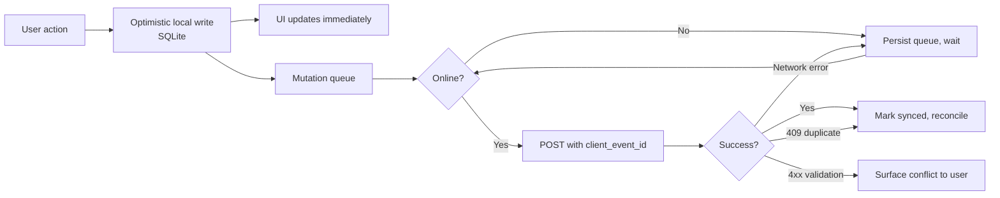

| Element | Detail |
|---|---|
| Local store | SQLite via `expo-sqlite` |
| Queue | Persisted mutation queue surviving app restarts |
| Idempotency | Every queued mutation carries a client-generated UUID |
| Ordering | Per-entity FIFO; independent entities sync in parallel |
| Conflict resolution | Progress events never conflict (append-only). Scalar fields use last-write-wins with the server as arbiter |
| Retry | Exponential backoff, max 5 attempts, then surfaced to the user with a retry action |
| Background sync | On app foreground and on network reconnect |

## 35.3 Mobile platform requirements

| Concern | Requirement |
|---|---|
| **Deep links** | `flyleaf://` scheme plus universal links (`https://flyleaf.app/...`) for iOS and App Links for Android. Every entity is addressable |
| **Back stack synthesis** | A deep link to a review synthesises Home → Book → Review so back behaves sensibly |
| **State restoration** | Scroll position, active tab, open drafts restored after process death |
| **Push** | FCM; permission requested contextually (after the first follow), never on first launch |
| **Battery** | No background location, no background fetch beyond sync-on-foreground, no polling |
| **Image loading** | Progressive covers with blurhash placeholders; aggressive disk caching; downscaled variants per surface |
| **List performance** | `FlashList` for all long lists; 60fps scroll target |
| **Memory** | Image cache capped; feed pages released beyond 3 screens of scroll |
| **App size** | Under 40MB download **[ASSUMPTION]** |
| **Permissions** | Camera (barcode) and photos (avatar) only, both requested contextually with a rationale |

## 35.4 Device support and the reference device **[LOCKED]**

Every performance budget in §43 says "a mid-range Android device" without ever saying which one, which makes the budgets unfalsifiable. And the launch market is India-first (§1.7), where low-end and mid-range Android dominates — so "works on my phone" is close to worthless as a signal.

### Minimum supported

| Platform | Minimum | Reason |
|---|---|---|
| **Android** | **10 (API 29)** | Covers the overwhelming majority of active devices while staying inside what current Expo SDKs support without special handling |
| **iOS** | **15** | Same reasoning; iOS adoption is fast enough that going older buys very little |
| RAM | **3 GB** | Below this, image-heavy grids thrash. It is also where a large share of the India market sits |
| Screen width | **360 dp** (Android) / **375 pt** (iPhone SE) | The narrowest widths still in real use |

### The reference device

> **All §43 budgets are measured on a Redmi Note / Galaxy A-class Android device — roughly 3–4 GB RAM, mid-tier SoC — on a 4G connection, not Wi-Fi.**

Not a flagship, not an emulator, not a simulator on a laptop. **[ASSUMPTION]** This class is the modal device for the target market; revisit if analytics show otherwise. A budget met only on a Pixel or an iPhone 15 is not met.

### What the narrow-screen constraint actually forces

These are the places the 360 dp / 375 pt floor bites, and each needs checking at that width before the layout is considered done:

| Surface | Constraint |
|---|---|
| **The Wall** (§6.37a) | A 3-column 2:3 grid at 360 dp leaves ~104 dp per cover after gutters. Verify covers stay legible; drop to 2 columns below 340 dp rather than shrinking further |
| **Five-tab bar plus FAB** | Six targets across 360 dp is ~60 dp each. Labels must not truncate — if they do, the tab names are too long, not the bar too small |
| **Half-star rating control** | Ten touch zones across the available width. At 360 dp this is the tightest control in the product and needs its extra hit area (§36.9) verified here specifically |
| **Reading card progress slider** | Must remain draggable one-handed without triggering the tab bar |
| **Diary rows and feed cards** | Must not truncate title *and* author *and* rating |

### Low-end behaviour

| Concern | Requirement |
|---|---|
| Image cache | Capped by device RAM tier, not a fixed number. On a 3 GB device, aggressively evict beyond 2 screens of scroll |
| Cover sizes | Never request a size larger than the surface renders (§40.3 stage 1) |
| Animation | Respect `prefers-reduced-motion`, and additionally degrade the stats reveal on low-end devices where 60fps is not achievable |
| Startup | The 2.0s cold-start budget is on the reference device, not a flagship |

### Test matrix

| Tier | Devices | When |
|---|---|---|
| **Primary** | The reference Android device — physical, not emulated | Every phase; this is the daily driver |
| Narrow | A 360 dp Android and an iPhone SE-class screen | Before each phase closes |
| Low-end | A 3 GB RAM device | Before Phase 3 launch |
| iOS | One current iPhone | Phase 4, when iOS ships |
| Tablet | Not supported in v1 — the app runs at phone width on tablets and that is acceptable | — |

**One physical Android device is the minimum viable test setup**, and it should be the reference class rather than whatever the developer happens to own. If the developer's own phone is a flagship, buying a mid-range device is the single cheapest quality investment in the project.

## 35.5 Platform-specific notes

| Platform | Note |
|---|---|
| Android | Ships first. Predictive back gesture support; Material 3 motion where it does not conflict with the brand; edge-to-edge |
| iOS | Same codebase; ships Phase 4. Respects safe areas, dynamic type, and iOS share sheet conventions |
| Both | Dark mode follows the system by default with a manual override |

---

# 36. Design System

## 36.1 Direction

The product should feel like **a well-made hardback, not a SaaS dashboard**. Literary but modern; expressive but calm; premium through restraint rather than ornament.

**The governing metaphor:** covers are the content. The interface is the shelf they sit on — it should recede.

## 36.2 Colour philosophy

**[ASSUMPTION]** A near-monochrome, cover-forward palette. Book covers are wildly varied and saturated; an interface with its own strong colour fights every one of them.

| Token | Light | Dark | Use |
|---|---|---|---|
| `ground` | `#F7F7F5` | `#0F1113` | App background |
| `surface` | `#FFFFFF` | `#17191C` | Cards, sheets |
| `surface-2` | `#EFEFEC` | `#1F2226` | Nested surfaces |
| `ink` | `#14161A` | `#ECEEF0` | Primary text |
| `ink-2` | `#43484F` | `#B4BAC2` | Secondary text |
| `muted` | `#6E747C` | `#868D96` | Tertiary, metadata |
| `line` | `#E2E2DE` | `#262A2F` | Dividers, borders |
| `accent` | `#2F5D50` | `#7FB3A1` | Interactive, links, active tab |
| `star` | `#C8951F` | `#E0AF45` | Rating stars only |
| `positive` | `#2E6B4E` | `#6DB68B` | Success |
| `critical` | `#93441D` | `#D4906A` | Destructive, errors |

**Dark mode is a first-class design, not an inversion.** This audience reads at night; a significant share will never see the light theme. Dark surfaces are warm-neutral rather than pure black, so covers do not appear to float.

**Accent restraint:** one accent, used only for interactive elements. Stars are the only other coloured element. Everything else is neutral, so covers provide all the colour in the product.

## 36.3 Typography

| Role | Direction | Rationale |
|---|---|---|
| **Display** — book titles, headings, review body | A contemporary serif with real personality (Literata, Newsreader, Source Serif class) | Signals literary without costume; serif for review bodies makes long text feel like reading, which is thematically exact |
| **UI** — labels, buttons, navigation, metadata | A neutral grotesque (Inter-alternative such as Archivo, Public Sans, IBM Plex Sans) | Legible at small sizes, gets out of the way |
| **Numerals** — statistics | Tabular figures from the UI face | Numbers must align in columns |

| Scale | Size / line height | Use |
|---|---|---|
| Display L | 34 / 38 | Screen titles |
| Display M | 26 / 32 | Section headings, book titles on detail |
| Title | 20 / 26 | Card titles |
| Body L | 17 / 26 | Review body (serif) |
| Body | 15 / 22 | Standard UI text |
| Caption | 13 / 18 | Metadata |
| Micro | 11 / 14 | Labels, uppercase with letterspacing |

**Review text is set in the serif at 17/26** — deliberately book-like, because reviews are the reading experience inside a reading app.

## 36.4 Spacing and layout

4pt base grid. Spacing scale: 4, 8, 12, 16, 24, 32, 48, 64. Screen margin 16pt. Card padding 16pt. Section gap 32pt.

**Book cover aspect ratio: 2:3**, universally, with the placeholder generated at the same ratio so grids never jump.

| Cover size | Dimensions | Use |
|---|---|---|
| XS | 32 × 48 | Inline lists, mentions |
| S | 56 × 84 | Search results, feed metadata |
| M | 88 × 132 | Shelf grids, carousels |
| L | 120 × 180 | Reading cards, favourites |
| XL | 180 × 270 | Book detail hero |

## 36.5 Components

| Component | Specification |
|---|---|
| **Cards** | 12pt radius, 1pt border in `line`, no drop shadow in light mode; elevation via surface contrast in dark mode |
| **Buttons** | Primary: filled accent, 48pt height, 12pt radius. Secondary: outline. Tertiary: text. Destructive: `critical` outline, filled only on confirmation |
| **Bottom sheets** | The primary modal pattern. Detents at 50% and 90%, grabber handle, backdrop scrim at 40%, spring dismissal |
| **Star rating** | 44pt touch target minimum; half-star hit zones; haptic tick at each half step |
| **Progress bar** | 6pt height, fully rounded, accent fill, animated on change |
| **Tab bar** | 5 tabs plus a central FAB; icons with labels; active state in accent |
| **Empty states** | Always an illustration or content, a warm line of copy, and a concrete action. **Never a shrug** |
| **Skeletons** | Shape-matched to real content, subtle shimmer, never a centred spinner on a full screen |

## 36.6 Motion

| Interaction | Treatment |
|---|---|
| Screen push | 280ms, standard ease-out, with a shared-element transition on covers |
| Bottom sheet | Spring, damping 0.8 |
| Progress bar change | 400ms ease-out — the small reward that makes tracking feel good |
| Star selection | Scale to 1.15 and back, 150ms, with haptic |
| Like | Scale bounce, 200ms |
| Card entry | 40ms stagger, 8pt rise with fade |
| Statistics reveal | Bars grow and donuts sweep over 600ms on first view |
| **Reduced motion** | All of the above become instant opacity changes. Non-negotiable |

**Restraint rule:** motion confirms actions and rewards the core loop. It never decorates. A book app that animates constantly feels cheap.

## 36.7 Gesture vocabulary

Gestures are the difference between an app that feels native and one that feels like a website in a shell. Every gesture below has a visible, tappable equivalent — **a gesture is never the only way to do something** (§38).

| Gesture | Context | Action |
|---|---|---|
| **Swipe right** | Reading card | Quick +10 pages, with a haptic confirm |
| **Swipe left** | Reading card | Reveal Finish · Pause · Stop reading |
| **Swipe left** | Shelf item | Reveal Remove, with undo |
| **Swipe left** | Want-to-read row | Reveal Start reading · Remove |
| **Swipe left** | Notification row | Mark read · Dismiss |
| **Swipe right** | Feed card | Reveal Save book to Want to read |
| **Swipe left** | Feed card | Reveal Rate and review this book — the fastest path from "my friend loved it" to "so did I" |
| **Long-press** | Any cover, anywhere | Quick-action sheet: shelve, rate, share, view |
| **Double-tap** | Review card | Like, with the standard bounce |
| **Drag** | Ranked shelf row | Reorder, with a "move to position" alternative |
| **Pull down** | Any feed or list | Refresh |
| **Swipe down** | Any bottom sheet | Dismiss, with velocity-aware spring |
| **Horizontal swipe** | Year in Review, onboarding | Page between cards |

**Rules.** Destructive swipes always require the second tap on the revealed action — never a single swipe-to-delete. Every swipe action shows a labelled, colour-coded background as it opens, so the gesture teaches itself. Swipe actions are disabled while a list is horizontally scrolling to avoid conflicts. All swipe actions are duplicated in the row's overflow menu.

## 36.8 Micro-interactions worth building

| Interaction | Why |
|---|---|
| Haptic tick as the progress slider crosses each 5% | Makes the core action tactile and satisfying |
| Cover lifts slightly on long-press before the quick-actions menu | Communicates that the cover is an object |
| The star row filling as you drag across it | The single most-repeated interaction in the product |
| A finished book's cover briefly gaining a subtle sheen | A moment of ceremony at completion |
| The goal ring animating on the profile | Ambient, unpushy progress |
| Pull-to-refresh revealing a rotating book spine | Brand personality in a place users see daily |

## 36.9 Accessibility in the design system

Minimum contrast 4.5:1 for body text and 3:1 for large text, verified in **both** themes. Minimum touch target 44 × 44pt. Every interactive element has a visible focus state. Colour is never the sole carrier of meaning — ratings show a number alongside the stars; status shows a label alongside its colour.

---

# 37. UX Principles

1. **Tracking must be effortless or the data rots.** Every added tap in the log flow is paid for in abandoned accounts. Hard budgets: 5 seconds to update progress, 2 taps to shelve, 20 seconds to a full finish.

2. **The user should always know their reading status without hunting.** Currently-reading is a tab, not a section inside a section.

3. **Discovery should feel like a recommendation from a friend, not an algorithm.** Every recommendation carries a human-readable reason. Social proximity outranks engagement in every ranking in the product.

4. **Reviews should feel expressive, not administrative.** Serif body text, no required fields, generous composer, drafts that never vanish.

5. **Profiles should feel personal, not statistical.** Taste before quantity — four favourites sit above the numbers.

6. **Never manufacture urgency.** No countdowns, no streak-loss warnings, no "you're behind" messaging. Reading is not a race.

7. **Failure states must never lose user work.** Drafts autosave. Progress queues offline. A network error is never a reason to retype a review.

8. **Empty states are opportunities, not apologies.** Every empty state contains either content or a single concrete action.

9. **Honesty over flattery.** Show DNF rates, low ratings and incomplete data plainly. A tracker that only records success is one nobody trusts.

10. **Optimistic by default.** Every action renders immediately and reconciles in the background. The user never waits on the network to see their own action.

11. **The interface recedes; covers advance.** Near-monochrome chrome so that book art carries the visual identity.

12. **One primary action per screen.** If two things compete for primacy, the screen is doing too much.

13. **Respect the reader's attention.** Five push notifications a day is a hard ceiling, and most days should use none.

---

# 38. Accessibility

**Target: WCAG 2.1 AA** for the mobile app and, later, the web platform.

| Requirement | Implementation |
|---|---|
| **Screen readers** | Every interactive element has a meaningful `accessibilityLabel`. Book covers announce "Cover of *Title* by *Author*", never "image". Star ratings announce "4.5 out of 5 stars", never a decorative glyph count |
| **VoiceOver / TalkBack** | Full navigation without sight. Custom components declare correct roles. The rating control exposes an adjustable trait so it can be set with swipe gestures |
| **Dynamic type** | Support up to 200% system text scaling. Layouts reflow; **no fixed-height text containers anywhere**. Tested at maximum scale as part of the definition of done |
| **Contrast** | 4.5:1 body, 3:1 large text and UI components, verified in both themes |
| **Touch targets** | Minimum 44 × 44pt. The half-star control gets extra hit area since it is inherently fine-grained |
| **Reduced motion** | `prefers-reduced-motion` respected; all transitions become instant opacity changes; the statistics reveal renders in its final state |
| **Colour independence** | Ratings show a numeral; read status shows a text label; chart series carry direct labels rather than relying on a colour legend |
| **Focus management** | Opening a sheet moves focus into it; closing returns focus to the trigger. Focus never becomes trapped |
| **Alternative input** | Drag-to-reorder always has a "move to position" alternative. Slider progress always has numeric entry |
| **Captions** | Any future video or motion content carries captions |
| **Keyboard (web, Phase 6)** | Full keyboard navigation, visible focus rings, skip links, logical tab order |

**Process requirement:** accessibility is checked before merge, not audited before launch. A screen-reader pass on the core flows — log a book, update progress, finish, review — is part of the definition of done for those flows.

---

# 39. Internationalization

## 39.1 Approach

**[ASSUMPTION]** The v1 interface ships in English only, but the product is **built i18n-ready from day one** — retrofitting internationalisation is far more expensive than designing for it. The catalog is multilingual from the start, because Open Library is.

## 39.2 Requirements

| Concern | Requirement |
|---|---|
| **String externalisation** | No hardcoded user-facing strings anywhere. All copy in resource files from the first commit |
| **Unicode** | Full UTF-8 end to end. Usernames, reviews, book titles and search must handle every script |
| **Search across scripts** | The `simple` Postgres dictionary plus trigram matching handles non-Latin scripts. Stemming with the `english` dictionary would break them, which is a second reason for that choice (§14.2) |
| **RTL** | Layouts use logical properties (start/end, not left/right) from day one. RTL is a configuration change, not a redesign |
| **Bidirectional text** | Reviews mixing Arabic or Hebrew with Latin script must render correctly |
| **Dates** | Locale-aware formatting; never hardcoded `DD/MM` or `MM/DD` |
| **Numbers** | Locale-aware separators. Indian numbering (lakh, crore) supported in Indian locales |
| **Pluralisation** | ICU message format — languages have between one and six plural forms |
| **Text expansion** | Layouts accommodate 40% expansion; German and Finnish routinely need it |
| **Sorting** | Locale-aware collation for author and title sorting |
| **Currency** | Locale currency for affiliate and subscription pricing |

## 39.3 Catalog localisation

| Concern | Handling |
|---|---|
| Multilingual editions | Editions carry `language`; the picker filters by it |
| Localised titles | The edition's title, distinct from the work's canonical title |
| Search across languages | A Hindi-language search should find the English work and offer the Hindi edition |
| Default language | Device language, plus English as a fallback, both surfaced in search filters |
| Regional availability | Metadata is global; only affiliate links are region-aware |

## 39.4 Language rollout

| Phase | Languages | Rationale |
|---|---|---|
| 1–3 | English | Launch market |
| 4 | Hindi, Spanish | Largest addressable readerships in the initial markets |
| 5 | Portuguese, German, French, Indonesian | Large reading communities with strong Goodreads penetration |
| 6 | Arabic, Japanese | **RTL and CJK validation** — these two prove the i18n foundation genuinely works |

---

# 40. Book Data Providers

## 40.1 Provider comparison

| Provider | Coverage | Cost | Rate limits | Licence | Covers | Editions | Commercial use | Verdict |
|---|---|---|---|---|---|---|---|---|
| **Open Library** | ~20M editions, ~6M authors | **Free** | Live API ~1 req/s anonymous, ~3 req/s identified; covers by ISBN ~100 req/IP per 5 min. **Bulk via monthly dumps** | **CC0 — public domain** | Yes, via cover CDN | **Yes — native work/edition model** | **Permitted** | **PRIMARY — MVP and scale** |
| **Google Books** | Very large | Free tier | ~1,000 req/day | Restrictive — **caching beyond response cache headers not permitted** | Yes | Weak | Restricted | **Fallback only, never stored** |
| **ISBNdb** | ~108M titles, 19 fields | Paid, from ~$15/mo | Tier-dependent | Commercial licence | Yes | Yes | Yes, per licence | **Optional top-up at scale** |
| **Hardcover** | Smaller | Free GraphQL API | Reasonable | Requires review | Yes | Yes | Requires review | Not needed given Open Library |
| **Goodreads** | Largest | **API closed to new developers since 2020** | — | — | — | — | — | **Unavailable. Scraping is prohibited and is not an option** |
| **WorldCat / library SRU** | Authoritative | Free/institutional | Low | Varies | No | Yes | Restricted | Edge-case gap-filling only |

## 40.2 Recommendation

### MVP: Open Library as the sole catalog source **[LOCKED]**

The decision turns on one asymmetry:

> **Open Library's data is CC0 — you may ingest it in bulk and keep it permanently. Google Books' terms do not permit caching beyond the response cache headers. You therefore cannot build a catalog on Google Books; you can build one entirely on Open Library.**

Open Library also models **works and editions natively**, which is exactly the structure §7 requires. No other free source does.

### Scale: Open Library + optional ISBNdb top-up

Add ISBNdb only when correction requests cluster around specific missing fields — typically page counts and publication dates for very recent releases, where Open Library is thin. This is a Phase 4+ decision driven by data, not a launch requirement.

## 40.3 Ingest specification

The numbers that determine the design:

| Dump | Compressed | Uncompressed |
|---|---|---|
| Editions | ~9 GB | **~45 GB** |
| Works | ~2.5 GB | — |
| Authors | ~0.5 GB | — |
| **Unfiltered full import** | — | **~250 GB of free disk required** |

A complete unfiltered load is impractical on a laptop and expensive on any server. Therefore:

### The filter rule **[LOCKED]**

> Keep a record only if it has **a title, an author, and at least one of an ISBN or a cover ID.** Store only the columns the product renders.

This removes the large majority of noise records and brings the working catalog into a range any ordinary machine handles.

### Ingest program requirements

| Requirement | Reason |
|---|---|
| **Stream, never load** | Read the gzip line by line, parse, filter, discard. Memory stays flat regardless of file size |
| **Use `COPY`, not `INSERT`** | Via pgx `CopyFrom`. The difference is an afternoon versus a week |
| **Build indexes after loading** | Including the `tsvector`. Indexing during bulk load is several times slower |
| **Resumable and idempotent** | Upsert on the Open Library key, checkpoint file position. A 45GB stream will be interrupted |
| **Monthly re-run as a River job** | The same program handles deltas because it upserts |

### Duplicate detection

Open Library contains genuine duplicate works — the same book entered twice under slightly different titles, or split across records never merged. Ranking by usage (§14.3) hides duplicates in search but never resolves them: the ratings stay split across both records, so **both averages are wrong**.

A defined pipeline, run monthly after ingest:

| Stage | Rule | Action |
|---|---|---|
| 1 — Exact | Two works whose editions share an ISBN-13 | **Auto-merge.** An ISBN identifies one edition; two works claiming it are one work |
| 2 — Strong | Normalised title identical (case, punctuation, leading articles and subtitle stripped) **and** a shared author ID | **Auto-merge** |
| 3 — Probable | Trigram similarity on normalised title above 0.85 **and** author name similarity above 0.9 **and** first-publication years within 2 | **Queue for review — never auto-merged.** This band contains genuinely distinct books: reissues, different translations, and series entries with near-identical titles |
| 4 — Reported | "These are the same book" from the correction flow (§6.46) | Queue, weighted by reporter reputation |

**Merge semantics.** The survivor is the work with more editions, then more Flyleaf logs. The loser gets `merged_into_id` set and is **never deleted** — every `reads`, `reviews` and `shelf_items` row repoints, and the old ID redirects permanently so existing links and already-shared cards keep working (§34.1).

**Merges are reversible for 30 days.** A wrong merge destroys two books' worth of ratings at once, so the operation records exactly what it moved.

### Who is allowed to call out

**Rule [LOCKED]: every credentialed third-party call originates from the backend. The client never holds a provider key.**

| Path | Allowed from the client? | Why |
|---|---|---|
| Open Library search / works / editions | **No** | Goes through your API, so one shared rate limiter governs all traffic. Thousands of clients each making their own requests would breach Open Library's limits immediately and untraceably, and would make the circuit breaker impossible |
| Google Books | **No** | Holds an API key, and the response must never be persisted — both are backend concerns |
| ISBNdb, if adopted | **No** | Paid credential |
| **Open Library cover CDN** | **Yes — the deliberate exception** | No credential, no rate-limited endpoint when resolving by cover ID, and routing image bytes through your server would add latency and bandwidth cost for nothing. This is an exception for *unauthenticated static images only*, and Stage 2 of §40.3 moves even this behind your own domain |

The exception is stated explicitly so that nobody generalises from "we fetch covers directly" to "we can fetch metadata directly."

### Live API rules

| Rule | Detail |
|---|---|
| **Identify every request** | `User-Agent: Flyleaf/1.0 (contact@flyleaf.app)` — this triples the rate limit and means they email rather than silently block |
| **One shared global rate limiter** | The gap-filler and the importer must share it. Two independent limiters will exceed the limit together |
| **Never for bulk** | Their documentation states the APIs are not a bulk data backend. Bulk goes through dumps |
| **Keep the results** | CC0 means gap-fill results are stored permanently, so each gap is fetched exactly once |
| **Circuit breaker** | 5 consecutive failures opens it for 60s |

### Covers — a staged delivery strategy

Covers are not a metadata detail in this product; they **are** the interface. §36 makes the chrome near-monochrome precisely so cover art carries the visual identity, and the busiest screens render 20–30 covers in a grid. That makes cover delivery a performance requirement, not just a storage question.

**The tension to resolve honestly:** Open Library's cover CDN is free, sanctioned and legally clean — but it offers **no WebP or AVIF, no responsive size negotiation beyond three fixed sizes (S/M/L), no cache-control guarantees, and it is rate-limited.** The performance budget in §43 asks for covers in under 200ms cached and under 800ms cold. Hotlinking will meet that for a single hero cover and will **struggle in a 30-cover grid on a slow Indian mobile network**. Any claim that hotlinking is simply correct is a cost decision wearing a performance decision's clothes.

The resolution is to stage it, and to make the trigger measurable rather than a matter of taste.

| Stage | Approach | When |
|---|---|---|
| **Stage 1 — MVP** | Store `ol_cover_id` (an integer, never a URL or bytes). Request the size that matches the surface — `S` for list rows, `M` for grids, `L` only for the detail hero. Client-side disk cache with a long TTL, blurhash placeholders, and a generated typographic placeholder when no cover exists. Never request `L` for a grid | Phase 0–3 |
| **Stage 2 — Caching proxy** | A thin Go handler in front of Open Library: fetch once, convert to WebP, generate the three sizes, store in your own S3-compatible bucket, serve with immutable cache headers. **Only covers users actually view get stored**, so the bucket grows with real usage rather than catalog size | When Stage 1 breaches the trigger below |
| **Stage 3 — Edge CDN** | Put a CDN in front of the Stage 2 bucket | At meaningful traffic, or the first month bandwidth costs exceed a few dollars |

**Migration trigger [LOCKED]:** move to Stage 2 when **p75 cover load in a grid exceeds 600ms**, or when the cover error/timeout rate exceeds 2%, measured on the reference device (§35.4) on a 4G connection. Instrument this from the first build — it is a `screen_load_slow` variant, and it is the only way to know which stage you are actually in.

**Why build the proxy yourself rather than use a managed image service.** A hosted transformation service (Cloudinary and similar) does this well, and their free tiers are real — but they meter storage, bandwidth and transformations against a single small monthly credit pool, which a cover-forward app consumes quickly, and hitting the ceiling degrades the most visible part of the product. Stage 2 is roughly 150 lines of Go plus a bucket, it costs only storage, and it keeps the image path inside the system you already operate. Use a managed service only if Stage 2 is somehow blocking the roadmap.

| Standing rule | Detail |
|---|---|
| **Resolve by cover ID or OLID, never by ISBN** | ISBN-based cover lookups are limited to ~100 requests per IP per 5 minutes; cover-ID lookups are the intended path. This applies at every stage |
| **Never bulk-download covers** | Explicitly prohibited by Open Library. Stage 2 is lazy and user-driven, which is why it stays within their terms |
| **Record provenance per stored image** | Required to answer a takedown (§41.2) |
| **Never treat covers as owned assets** | No use in advertising or promotional material |

---

# 41. Data Ownership & Licensing

## 41.1 Book metadata

| Source | Licence | Obligation |
|---|---|---|
| **Open Library** | **CC0 1.0 Universal — public domain dedication** | **No legal attribution requirement.** Attribution is nonetheless given in About → Data sources, because it is right and because it costs nothing |
| Google Books | Restrictive terms; **no caching beyond response cache headers**; attribution required on display | Used as a live pass-through only, never stored. **This constraint is architectural, not optional** — and it is enforced by a database `CHECK` constraint forbidding any persisted field with `provider = 'google_books'` (§7.8), not by convention |
| ISBNdb (if adopted) | Commercial licence per plan | Review the specific plan terms before ingesting |

**The CC0 status of Open Library is the single most important legal fact in this document.** It is what makes an owned catalog possible at zero cost and with no revocation risk.

## 41.2 Cover images

**This is the area of greatest legal ambiguity and requires review.**

- Cover images are typically **copyright of the publisher**, not public domain, even when the metadata around them is CC0.
- Open Library's cover service aggregates images from mixed sources and is intended for display on public-facing sites.
- Industry practice — followed by every product in this category — treats cover display as nominative fair use in the context of identifying and discussing a book.

| Practice | Requirement |
|---|---|
| Display covers for identification and discussion | Standard practice; proceed |
| Serve from Open Library's CDN rather than rehosting | Reduces exposure and is their documented use |
| Record the origin per image | Necessary to respond to a takedown |
| **Provide a takedown path** | A documented contact and a defined response process |
| Never treat covers as owned assets | No use in advertising, merchandise or promotional material without permission |

> **⚠️ REQUIRES LEGAL REVIEW** before any commercial launch.

## 41.3 User-generated content

**[ASSUMPTION]** The Terms of Service should establish:

| Point | Position |
|---|---|
| **Ownership** | Users retain full copyright in their reviews, lists and profile content |
| **Licence to Flyleaf** | A non-exclusive, worldwide, royalty-free licence to host, display, distribute and create share cards from the content, for the purpose of operating the service |
| **Termination** | The licence ends when the user deletes the content or their account, except for copies already distributed (share cards already posted elsewhere cannot be recalled) |
| **AI training** | **User content is never used to train third-party models.** Stated explicitly and prominently — it is a genuine trust differentiator |
| **Aggregate data** | Anonymised aggregate contributions (a rating's effect on an average) are retained after deletion, disclosed in the privacy policy |
| **Moral rights** | Attribution preserved wherever content is displayed |

## 41.4 Other considerations

| Item | Position |
|---|---|
| **Review excerpts in share cards** | Only the user's own review, generated by that user. Never another user's |
| **AI review summarisation** | Derives from public reviews and must be labelled as a summary, not attributed to any individual reviewer |
| **Author bios and photos** | Sourced from Open Library (CC0 metadata) — but photos carry the same ambiguity as covers |
| **Book descriptions** | Frequently publisher marketing copy. CC0 in Open Library's dataset, but the underlying provenance is mixed. **Flag for legal review** |
| **Affiliate programmes** | Each has its own disclosure requirements; disclose on-page and in the privacy policy |
| **Trademark** | "Flyleaf" needs a search in the relevant software class before launch |
| **Competitor visual identity** | Borrowing Letterboxd's *interaction model* is fine and is the product's premise. Borrowing its visual identity is not. A half-star rating control is a generic pattern and unownable, but the specific colour system, iconography, wordmark treatment and orange-green-blue rating palette are theirs. Design the rating control to be instantly recognisable **as Flyleaf's** |

## 41.5 Items requiring legal review before commercial launch

1. Cover image usage and the takedown process
2. Book description provenance
3. **User-saved quotes — length caps, volume caps, and the public-domain exemption (§10.8)**
4. Terms of Service and UGC licensing
5. Privacy policy, including GDPR and India's DPDP Act
6. Affiliate disclosure compliance
7. "Flyleaf" trademark clearance
8. Age-gating requirements per jurisdiction, including **COPPA** in the US (largely addressed by the 13+ gate in §26.6, but confirm)

---

# 42. Security Threat Model

| # | Threat | Likelihood | Impact | Mitigations |
|---|---|---|---|---|
| 1 | **Account takeover via credential stuffing** | High | High | argon2id; rate limits (10/min per account, 30/min per IP); breached-password checking at registration; **refresh-token family reuse detection**; email alert on new-device login; forced re-auth on password change |
| 2 | **Refresh token theft** | Medium | High | Tokens stored hashed server-side; rotation on every use; **family revocation on reuse** turns a permanent breach into a brief one; short 15-minute access tokens; `expo-secure-store` (OS keychain) on the client, never AsyncStorage |
| 3 | **API abuse / scraping the catalog** | High | Medium | Per-endpoint rate limits; authentication required for bulk-ish endpoints; anomaly detection on request patterns. *Accepted reality: the catalog is CC0 and cannot be meaningfully protected. The moat is the social graph, not the metadata* |
| 4 | **Fake accounts and spam** | High | Medium | Email verification gates posting; new-account restrictions (no links, limited follows); progressive trust; device fingerprinting at scale |
| 5 | **Review manipulation / rating brigades** | Medium | High | Ratings from accounts <7 days old or with <5 ratings excluded from aggregates; velocity anomaly detection freezing displayed averages; follow-graph cluster detection |
| 6 | **Harassment via the social graph** | Medium | High | Block is complete and bidirectional; mute is silent; report queue with human review; **authors structurally cannot reply to reviews** |
| 7 | **Data leakage between users** | Low | **Critical** | Repository layer with mandatory viewer ID; **404 not 403** for other users' private resources; an integration test suite asserting cross-user access fails, treated as the primary control |
| 8 | **SQL injection** | Low | Critical | sqlc generates parameterised queries exclusively; no string-built SQL anywhere; enforced in review |
| 9 | **XSS in reviews** (relevant once web ships) | Medium | High | Store raw, escape on render; strict allowlist if rich text ships; a Content Security Policy on web |
| 10 | **DDoS** | Medium | High | Caddy rate limiting; CDN in front of public pages; graceful degradation to cached content; a documented "static mode" |
| 11 | **Malicious file upload** (avatars, CSV) | Medium | Medium | Magic-byte type validation, not extension; image re-encoding to strip metadata and payloads; 10MB cap; CSV parsed with a strict library, never `eval` |
| 12 | **Server-side request forgery via a supplied URL** | Low | High | No user-supplied URLs are fetched server-side. If ever added: allowlist, block private IP ranges |
| 13 | **Enumeration of users or emails** | Medium | Low | Generic auth errors; "discoverable by email" off by default; rate-limited profile lookups |
| 14 | **Insider or backup compromise** | Low | Critical | Backups encrypted at rest and in transit; separate credentials for backup storage; least privilege on the database role used by the API |
| 15 | **Dependency supply chain** | Medium | High | Pinned versions; `govulncheck` in CI; Dependabot; minimal dependency surface — a genuine benefit of the Go stack |
| 16 | **Open Library IP block** | **Medium** | **High** | Shared global rate limiter; identifying User-Agent; circuit breaker; **the catalog works from the local database even if the live API is unavailable** |

## 42.1 Security practices

| Practice | Requirement |
|---|---|
| Secrets | Environment variables, never in the repository; rotated on staff change |
| TLS | Enforced everywhere via Caddy; HSTS; no plaintext fallback |
| Dependencies | `govulncheck` in CI; block merges on high-severity findings |
| Logging | **Never log tokens, passwords, or full email addresses** |
| Admin access | Separate role; all admin actions audit-logged |
| Penetration test | Before Phase 5 (monetization), when real money and scale are involved |
| Incident response | A documented plan: detect → contain → notify → remediate → post-mortem. Breach notification within 72 hours where required |

---

# 43. Performance Targets

| Metric | MVP | Scale | Measurement |
|---|---|---|---|
| **App cold start → interactive** | <2.0s | <1.5s | Time to first meaningful paint on the **reference device** (§35.4) — not a flagship, not an emulator |
| App warm start | <500ms | <400ms | |
| Tab switch | <100ms | <100ms | Instant perception threshold |
| **Feed first paint** | <400ms | <300ms | Cached content renders first, always |
| Feed pagination | <300ms | <250ms | |
| **Search results** | <300ms p95 | <200ms | From keystroke debounce to render |
| Autocomplete | <120ms | <100ms | |
| Book detail load | <350ms | <300ms | Cover and title render instantly from the navigation payload |
| **Progress write (perceived)** | **<16ms** | **<16ms** | Optimistic — the UI never waits on the network |
| Progress write (server ack) | <150ms p95 | <120ms | |
| Recommendation row | <500ms | <400ms | |
| AI semantic search | <1.5s | <1.0s | With a visible intermediate state |
| Share card generation | <2.0s | <1.5s | Precomputed where possible |
| Image (cover) load — single | <200ms cached, <800ms cold | | Blurhash placeholder immediately |
| **Image (cover) load — 30-cover grid, p75** | **<600ms** | <400ms | Breaching this is the trigger to move to the Stage 2 cover proxy (§40.3) |
| **Crash-free sessions** | >99.5% | >99.9% | |
| **Crash-free users** | >99.0% | >99.5% | |
| ANR rate (Android) | <0.5% | <0.2% | |
| Frame rate on scroll | 60fps, <1% dropped | 60fps, <0.5% | |
| API error rate | <1% | <0.5% | 5xx as a share of all requests |
| App download size | <40MB | <50MB | |

## 43.1 Performance budgets by screen

| Screen | Budget | Strategy |
|---|---|---|
| Reading tab | <200ms to interactive | Fully cached locally; network only reconciles |
| Feed | <400ms first paint | Cache-first, revalidate in background |
| Book detail | <350ms | Hero from the navigation payload; sections stream |
| Search | <300ms | Debounced, cancellable, cached recents |
| Profile | <400ms | Header from cache; sections lazy-load |
| Stats | <600ms | Precomputed server-side; charts animate on arrival |

---

# 44. Success Metrics

## 44.1 North Star

> **Weekly Reading Actions per Active User** — progress updates + finishes + ratings + reviews, per weekly active user.

| Property | Why it qualifies |
|---|---|
| Measures value delivered | Every action is a user getting something out of the product |
| Predicts retention | Users above 3/week retain dramatically better **[ASSUMPTION — validate in Phase 3]** |
| Feeds the network | Ratings and reviews are the supply side of discovery |
| Cannot be gamed by the product | No notification strategy inflates it; only genuine use does |
| Moves weekly | Actionable, unlike books-per-year |

**Rejected alternatives:** DAU (inflatable by notification spam), books finished (rewards short books), time in app (a reading app should *reduce* time in app), signups (a vanity metric).

## 44.2 Supporting metrics

| Layer | Metric | Target | Why it matters |
|---|---|---|---|
| **Activation** | Signup → first book logged in 24h | **>60%** | The strongest single predictor of long-term retention |
| | Onboarding completion | >70% | Detects funnel friction |
| | Import success rate | >85% | Failures lose the highest-value users |
| | Follows at day 7 (median) | **>5** | Below 3 the feed is dead and churn follows |
| **Retention** | D1 / D7 / D30 | 40% / 25% / 15% | Consumer social benchmarks |
| | W4 retention of *activated* users | >30% | The honest, actionable number |
| | Resurrection rate | >5%/month | Casual readers return in cycles |
| **Engagement** | Progress updates per WAU/week | **>3** | Health of the daily hook |
| | **Finish-flow completion time, p75** | **<20s** | The §4.4 budget, instrumented. Erosion here precedes retention decline |
| | Finish-flow abandonment | <8% | Detects a log flow that has grown too heavy |
| | Sessions per WAU | >4 | |
| | Feed engagement rate | >20% | Taps or likes per session |
| **Social** | Reviews per 100 finishes | >25 | Content supply for discovery |
| | Review like rate | >15% | Feed quality signal |
| | Mutual follow rate | >30% | Community health, not just broadcast |
| **Reading** | Books finished per MAU/month | >1.2 | |
| | DNF rate | 10–25% | Outside this band, users are not logging honestly |
| | Books started → finished | >65% | |
| **Discovery** | **Recommendation → finish conversion** | **>15%** | The only recommendation metric worth optimising |
| | **Search top-3 accuracy** | **≥95%** | Measures whether search is *right*, not just fast. Latency targets look healthy while relevance fails (§14.6) |
| | Search top-1 accuracy | ≥85% | The number users actually experience |
| | Search → action rate | >40% | Search quality |
| | Zero-result rate | <5% | Catalog coverage |
| **Growth** | Share rate per finish | >8% | The external loop |
| | K-factor | >0.3 | Below 0.15, organic growth is insufficient |
| | Install → signup | >40% | |
| **Quality** | Crash-free users | >99% | |
| | p95 API latency | <300ms | |
| | Reports per 1,000 reviews | <5 | Community health |

## 44.3 Phase gates

| Phase | Gate to proceed |
|---|---|
| 1 → 2 | The founder tracks two complete books through the app; the 20-second finish budget is met |
| 2 → 3 | 50 beta users; median follows ≥5; nobody has an empty feed |
| 3 → 4 | D7 retention ≥25%; activation ≥50%; share loop measurable |
| 4 → 5 | Recommendation→finish ≥15%; D30 ≥15% |
| 5 → 6 | Plus conversion ≥3%; unit economics positive |

---

# 45. Product Risks

| # | Risk | Likelihood | Impact | Mitigation |
|---|---|---|---|---|
| 1 | **Cold-start network effects — a social app with no users** | **High** | **Critical** | Make the solo experience genuinely excellent so a lone user stays. Seed with one tight community rather than launching broadly. Onboarding follow suggestions with editorial accounts pre-launch. **This is the most likely way the project fails** |
| 2 | **Phase 0 swallows the project** — a month of catalog work with nothing to show | **High** | High | Use the **Phase 0 accelerator** (§32): a seed ingest plus lazy fill in one week, with the full dump running in the background during Phase 1. Plus a hard exit condition: search returns the right book for 50 personally-owned titles, then move on |
| 3 | **User acquisition** — competing with a product that has 150M registered users | High | High | Do not compete on catalog. Compete on the experience Goodreads cannot ship, target Letterboxd users who read, and make import frictionless |
| 4 | **Catalog data quality** — duplicates, missing page counts, bad author records | **High** | Medium | Budget explicitly for a dedup pass and a correction flow. Rank by usage so real books rise. Never assume ingest is a solved problem |
| 5 | **Open Library dependency** — throttling, blocking, or the project changing | Medium | High | The catalog lives in your own database and works without the live API. Dumps are CC0 and can be archived locally. Add ISBNdb as a paid alternative if needed |
| 6 | **Moderation burden exceeds a solo founder** | Medium | High | Automated layer 1 from day one; community reporting; structural prevention (no author replies, no downvotes, single-level comments). Budget for a part-time moderator by Phase 4 |
| 7 | **Cover image licensing challenge** | Low | High | Serve from Open Library's CDN, record provenance, maintain a takedown path, obtain legal review before commercial launch |
| 8 | **Recommendation quality disappoints** | Medium | Medium | V1 is deliberately rule-based and explainable — it cannot be embarrassingly wrong. Ship explanations, which build trust faster than accuracy |
| 9 | **Social toxicity** — book communities have a documented history | Medium | High | Structural prevention over reactive moderation: no author replies, no downvotes, no controversy ranking, flat comments, complete blocking |
| 10 | **Monetization fails to reach sustainability** | Medium | Medium | Costs are near-zero by design, so the runway is long. Affiliate revenue arrives before subscriptions. Target only enough for one developer |
| 11 | **Solo-founder burnout across a 7-month build** | **High** | **Critical** | **Phase −1 puts a working product in your hands in week one**, which is the single strongest defence — the whole thing stops being abstract. Phase 1 then delivers something personally useful. Ship Android only. Resist scope growth using the five-tab rule |
| 12 | **Apple or Google rejection at submission** | Medium | Medium | Account deletion, content moderation, report and block all built in Phase 2, not the week of submission. **Catalog maturity filtering (§7.8) built in Phase 0**, because it is an ingest-time classification and cannot be bolted on afterwards |
| 13 | **Data loss** | Low | **Critical** | 6-hourly backups off-machine, **monthly restore drills**, backup failure as a paging alert |
| 14 | **A competitor ships the same idea first** | Medium | Medium | Execution and community are the moat, not the idea. Speed matters more than secrecy |
| 15 | **Import produces bad data at scale, poisoning early impressions** | Medium | High | Show unmatched rows; never guess ambiguous matches; make imports reversible |

---

# 46. Open Questions

Unresolved items that should be validated before or during development.

| # | Question | Why it matters | How to resolve | Needed by |
|---|---|---|---|---|
| 1 | **Is public-by-default correct for this audience?** | Reading is a more private taste signal than film. Getting this wrong damages trust immediately | Survey 50 target users; consider a prominent choice during onboarding rather than a default | Phase 2 |
| 2 | **Does the progress hook actually drive daily use?** | The entire differentiation rests on this assumption | Instrument from day one; measure progress updates per WAU in the beta | Phase 3 |
| 3 | **What is the right audiobook-to-pages conversion?** | The current 40 pages/hour is an assumption that affects every cross-format statistic | Compare against known audiobook and print editions of the same works; consider showing both units and never converting | Phase 1 |
| 4 | **Should Popular be a tab or a fallback?** | A permanent Popular tab may cannibalise the social feed and weaken follow behaviour | A/B test in the beta | Phase 3 |
| 5 | **What is the minimum viable follow count for a good feed?** | Sets the onboarding suggestion target | Correlate follows at day 7 against D30 retention | Phase 3 |
| 6 | **Do users want book-level or edition-level tracking by default?** | Affects how prominent the edition picker must be | Beta observation: how often is the edition changed? | Phase 1 |
| 7 | **Is the 40-genre taxonomy right?** | Too few is useless, too many is noise | Analyse Open Library subject frequency; test with users | Phase 0 |
| 8 | **Will DNF be used honestly, or will users hide abandonment?** | The DNF signal is a claimed competitive advantage in recommendations | Measure DNF rate in beta against the expected 10–25% band | Phase 3 |
| 9 | **Price point for Plus?** | ₹299/month is an assumption | Van Westendorp survey before Phase 5 | Phase 5 |
| 10 | **Does the serif review body actually feel better, or just different?** | A core design bet | Preference test with 20 users | Phase 1 |
| 11 | **Should reading goals be visible on other people's profiles?** | Could create comparison pressure, which the product explicitly avoids | Default to own-profile only; test making it optional | Phase 2 |
| 12 | **How aggressive should the "still reading?" prompt be?** | Too soon is nagging, too late leaves stale data | Test at 45, 60 and 90 days | Phase 3 |
| 13 | **Is India or the US the right first market?** | Affects pricing, seeding, and language priorities | Depends on where the seed community is; decide in Phase 2 | Phase 3 |
| 14 | **Does review summarisation add enough value to justify the cost?** | Small but real ongoing spend | Ship behind a flag; measure engagement on book pages with and without | Phase 4 |

---

# 47. Product Decisions

| Decision | Recommendation | Reason | Priority |
|---|---|---|---|
| **Product name** | **Flyleaf** | Describes where a reader's identity lives inside a book. Avoids the crowded "Dogear" space (5+ existing products) | **LOCKED** |
| **Rating scale** | **Half-stars, 0.5–5.0, `numeric(2,1)`** | Letterboxd parity; the longest-running Goodreads complaint; imports cleanly from both competitors | **LOCKED** |
| **Rating required?** | **Optional, nullable, prompted once** | Rating regret is real; DNF ratings are contested; and decisively, Goodreads exports encode unrated books as `0` — a required rating would break the importer | **LOCKED** |
| **Core tracking object** | **A reading attempt with an append-only progress event stream** | Enables pace, streaks, prediction, offline idempotency and honest re-read history. Impossible with a mutable current-page field | **LOCKED** |
| **Work vs edition** | **Opinions on the work, physical facts on the edition** | Attaching ratings to editions would split one book's ratings across 60 records | **LOCKED** |
| **DNF** | **First-class terminal state with page and optional reason** | Honest data, a real user need, and a recommendation signal competitors cannot collect | **LOCKED** |
| **Navigation** | **5 tabs: Home · Reading · Discover · Shelves · Profile, plus a central + FAB** | Reading must be a tab — it is the daily hook. Discover absorbs Search. Activity becomes a bell icon | **LOCKED** |
| **Tab discipline** | **Five tabs; a sixth means removing one** | The structural defence against feature sprawl | **LOCKED** |
| **Reading goals** | **In, confined to a profile ring and a Year in Review card** | Most-used feature in the category, but "you're 3 books behind" is the most-complained-about copy | **LOCKED** |
| **Follow model** | **Asymmetric, with optional private accounts** | Taste is a broadcast. Symmetric friendship caps the graph and kills discovery | **LOCKED** |
| **Feed** | **Chronological-first with light re-ranking; fan-out on read** | Low content volume doesn't justify aggressive ranking; fan-out on read is correct to ~tens of thousands of users | **LOCKED** |
| **Import** | **Six sources through one mapping layer, in the MVP** | The dominant switching cost is history. Also the best load test the catalog will get | **LOCKED** |
| **Export** | **Ships day one** | One day of work; a store requirement; the most credible anti-lock-in signal to a Goodreads refugee | **LOCKED** |
| **Catalog source** | **Open Library only for MVP** | CC0 means you can own it outright. Google Books' terms forbid the caching a catalog requires | **LOCKED** |
| **Catalog ingest** | **Filtered, streaming, `COPY`-based, resumable** | A full unfiltered import needs ~250GB and produces mostly noise | **LOCKED** |
| **Ingest sequencing** | **Seed the popular slice, lazy-fill misses, backfill the full dump in the background** | Cuts Phase 0 from 7 weeks to 3 and gets the app buildable in week one. The lazy-fill layer is permanent infrastructure anyway, so building it first means it is tested by real use | **LOCKED** |
| **Cover delivery** | **Staged: hotlink → self-hosted WebP proxy → CDN, on a measured p75 trigger** | Hotlinking is free and legal but has no WebP or responsive sizes, which conflicts with the grid performance budget. Stage on data, not taste | **LOCKED** |
| **Guest browse mode** | **Search, book pages, reviews and public profiles readable with no account; gate at the action, and a local Want-to-Read that migrates on signup** | Every share loop ended at a signup wall for the person who actually installed. The endpoints are already public, so this is a gate, not new surface | **LOCKED** |
| **Session minutes** | **`progress_events.minutes`, nullable, never prompted** | Buys reading-speed statistics — the timer's entire payoff — for one optional field and no behaviour change | **LOCKED** |
| **Diary calendar view** | **List, grid and calendar as three views of the same rows** | The calendar is the only view that shows *absence*: the gaps and binges a list hides. Also the honest home for the streak | **LOCKED** |
| **Where to read** | **Library links (Libby/OverDrive) first, retail affiliate second, never above the fold, never affects ranking** | "Can I borrow this?" is a top reader question nobody answers well. A library link earns nothing and is therefore the most trustworthy thing on the page — and it is the clearest possible statement of what the product is for versus an Amazon subsidiary | **LOCKED** |
| **The heart** | **`reads.hearted`, a boolean independent of rating; a filter, not a sixth tab** | A rating is a judgement, a heart is an affection. A 3.5-star heart is a stronger "more like this" signal than a 4.5-star non-heart, which makes it the best recommendation input the product collects | **LOCKED** |
| **Search relevance** | **Sampled top-3 accuracy ≥95% on a 200-query panel of hard cases, in CI** | Every prior search target measured speed. Search can return in 80ms and return the wrong book while every metric looks healthy. This, not latency, is the honest trigger for adopting a search engine | **LOCKED** |
| **API contract** | **Hand-written OpenAPI 3.1; TypeScript client generated from it in CI** | Go server and TS client otherwise define every endpoint twice, and the gap is invisible until something is null in production | **LOCKED** |
| **Reference device** | **A Redmi Note / Galaxy A-class Android, 3–4 GB RAM, on 4G — all §43 budgets measured there** | "Mid-range Android" made every performance budget unfalsifiable, and the launch market runs on exactly this class of hardware | **LOCKED** |
| **Reading reminder** | **Allowed, but only as a user-set alarm with six mandatory bounds** | A reminder the reader authored is a tool; one the product authored is a nag. The earlier blanket ban confused the two | **LOCKED** |
| **Testing** | **Authorization, offline queue, ingest and importer tested hard; snapshots avoided; coverage not gated** | Test what is expensive to get wrong. The offline queue is the one bug class that silently destroys a user's history | **LOCKED** |
| **Quotes and passages** | **P1 content type on the read, 500-char cap, 20-per-work cap, public-domain exempt** | The most common reading behaviour the product had no answer for, and the most forwardable share artefact after the Wall. Caps are structural because the copyright line is one of degree | **LOCKED** |
| **Budgets are instrumented** | **The §4.4 interaction budgets are tracked metrics, and a regression is a bug** | An unmeasured budget erodes one field at a time until logging is slow and nobody noticed the day it changed | **LOCKED** |
| **Walking skeleton first** | **One crude end-to-end path through every layer in week one, before Phase 0** | Horizontal layer-building means discovering in week eleven that two layers do not fit. Also the strongest defence against solo-founder burnout — a working product in your hands immediately | **LOCKED** |
| **Raw payload retention** | **Store Open Library responses verbatim; never Google Books** | A normaliser bug otherwise means re-fetching against a 1 req/s API — two days of requests and an IP-block risk. Makes classification and dedupe rules re-runnable | **LOCKED** |
| **Admin console** | **A plain server-rendered Go admin app, scoped across phases, every action audit-logged** | Four sections already assume it exists. Unscoped, it gets built in a panic the week before launch | **LOCKED** |
| **Likes and comments target the read** | **`read_likes` and `read_comments`, not review-scoped** | A finish with no review is the second-highest-weight feed card and was unlikeable in the schema while the UI offered a like button. Also survives the 180-day activity prune | **LOCKED** |
| **Progress is optional** | **A read can go want → reading → finished with zero progress events, unprompted** | The daily hook must be available and rewarding, never required. Mandating it would lose the casual persona, who is the largest resurrection cohort | **LOCKED** |
| **Format override** | **`reads.format_override`, nullable, wins over the edition for that user's stats only** | Without it, audiobook listeners log the paperback and every format statistic in the product is quietly false. One nullable column and a row of chips | **LOCKED** |
| **Catalog maturity** | **Classify works; hide `explicit` from search by default and from push surfaces always; 18+ setting to reveal** | Open Library is a full library catalogue and contains adult material. Unfiltered, that is a §1.2 App Store finding. Filters discovery, never the user's own record | **LOCKED** |
| **The Wall** | **A poster grid of everything read, as a first-class profile surface** | Four favourites say who you want to be; three hundred covers say who you are. The most shareable artefact the profile produces, after the favourites row | **LOCKED** |
| **Duplicate detection** | **Four-stage pipeline: ISBN and exact-title auto-merge, fuzzy queued, merges reversible for 30 days** | Usage ranking hides duplicates but never fixes them — split ratings mean both averages are wrong | **LOCKED** |
| **Metadata provenance** | **Per-field source, freshness and confidence, plus a provider ID map** | Makes the Google Books no-persist rule a database constraint rather than a promise; stops the monthly ingest overwriting user corrections; makes adding a paid provider a policy change rather than a migration. Impossible to backfill later | **LOCKED** |
| **Private reads in stats** | **Counted in the owner's own figures, excluded from viewer-facing ones** | One statistic, two correct answers by viewer. Unspecified, this ships as a bug that either leaks private reads or corrupts the owner's totals | **LOCKED** |
| **Outbound API calls** | **Backend only; the cover CDN is the one stated exception** | One shared rate limiter is the only thing standing between the product and an Open Library IP block | **LOCKED** |
| **Diary** | **The dated chronological log is called the Diary, not "reading history"** | Letterboxd's central metaphor, and the right frame: a history is a database view, a diary is something a person keeps | **LOCKED** |
| **Covers** | **Store cover IDs; serve from Open Library's CDN** | Zero storage cost, their sanctioned use. Resolve by cover ID, never ISBN (rate limits) | **LOCKED** |
| **Backend architecture** | **Modular monolith in Go** | One developer, one binary, one database. Microservices would be a strict downgrade at this stage | **LOCKED** |
| **Database** | **Postgres only** — `pg_trgm` now, `pgvector` later | Every additional datastore must answer a measured problem. None currently does | **LOCKED** |
| **Search** | **Postgres tsvector + trigram, `simple` dictionary** | Sufficient to ~300ms p95. English stemming would break proper nouns and other scripts | **LOCKED** |
| **Job queue** | **River (Postgres-backed)** | No Redis; jobs commit transactionally with the data that created them | **LOCKED** |
| **Query layer** | **sqlc, no ORM** | Plain SQL in, type-safe Go out. The feed and search queries need to stay tunable | **LOCKED** |
| **API style** | **REST, cursor-paginated** | Single first-party client with known queries; GraphQL adds cost without benefit. Cursors are mandatory for growing lists | **LOCKED** |
| **Auth** | **Email+password; argon2id; 15-min JWT; rotating refresh with family reuse detection** | Standard, sufficient, and reuse detection converts a stolen token from a permanent breach to a brief one | **LOCKED** |
| **Social sign-in** | **Deferred to Phase 3** | Google on iOS obliges Sign in with Apple, forcing the $99/year Apple cost forward | **LOCKED** |
| **Authorization** | **Repository layer with mandatory viewer ID; 404 not 403** | No RLS layer exists; scattered handler checks are how data leaks. The cross-user test suite is the real control | **LOCKED** |
| **Launch platform** | **Android first; iOS in Phase 4** | $25 once versus $99/year. Same Expo codebase, so it is a deferred payment, not a rewrite | **LOCKED** |
| **Gamification** | **Streaks with grace, goals, milestones, Year in Review. No badges, points, levels or leaderboards** | Gamify reflection, never volume. Leaderboards would be actively harmful | **LOCKED** |
| **Author replies to reviews** | **Never built** | The single largest source of toxicity in book communities | **LOCKED** |
| **Downvotes on reviews** | **Never built** | Punishes unpopular opinions — exactly wrong for a taste product | **LOCKED** |
| **Advertising** | **Never** | Destroys trust in a taste product; this audience is unusually hostile to it | **LOCKED** |
| **Sponsored discovery** | **Never** | Publisher-paid placement destroys the one thing the product sells | **LOCKED** |
| **Monetization** | **Plus subscription (Phase 5) + affiliate links (Phase 4)** | Aligned incentives; proven in this category by StoryGraph and Hardcover | P1 |
| **AI in MVP** | **Only embeddings-based similarity and review summarisation** | Both pass the "would a user notice if removed" test. Everything else waits for data | P1 |
| **Analytics** | **First-party, in Postgres, no third-party PII SDK** | Cheaper, simpler, and a genuine privacy differentiator worth stating publicly | P0 |
| **Public web pages** | **Minimal server-rendered book/profile/list pages in Phase 2** | Without them, every share is a dead link — which breaks the primary growth loop | P0 |
| **Book clubs** | **Out of scope until Phase 4+** | A distinct product surface that would break the five-tab rule | P2 |
| **Direct messaging** | **Not planned** | Enormous moderation burden for marginal value | — |

---

# 48. User Stories

## Onboarding and account

1. **As a new user,** I want to see what the app does before signing up, **so that** I can decide whether it is worth creating an account.
2. **As a new user,** I want to sign up with just an email and password, **so that** I can start in under a minute.
3. **As a Goodreads user,** I want to import my entire library from a CSV, **so that** I do not lose ten years of reading history.
4. **As a StoryGraph user,** I want my quarter-star ratings converted sensibly, **so that** my history stays meaningful.
5. **As a new user,** I want to pick my favourite genres, **so that** the app shows me relevant books immediately instead of generic bestsellers.
6. **As a new user,** I want to choose four favourite books, **so that** my profile expresses who I am from the very first day.
7. **As a new user,** I want suggestions of readers to follow, **so that** my feed is not empty when I arrive.
8. **As a returning user,** I want to stay logged in, **so that** I never have to re-authenticate to update my progress.
9. **As a security-conscious user,** I want to see and revoke my active sessions, **so that** I can remove a device I no longer own.
10. **As a user leaving the product,** I want to delete my account in the app, **so that** I am not forced to email support.

## Tracking

11. **As a reader,** I want to update my progress in under five seconds, **so that** I actually do it every day.
12. **As a reader,** I want to log progress while offline, **so that** I can track a book on a plane or a train.
13. **As a reader,** I want to see a predicted finish date, **so that** I know whether I will finish before my book club meets.
14. **As an audiobook listener,** I want progress in hours and minutes, **so that** the number matches what my player shows me.
15. **As an ebook reader,** I want percentage-based progress, **so that** I am not forced to invent a page number.
16. **As a reader,** I want to mark a book as did-not-finish with the page I stopped at, **so that** my history is honest.
17. **As a reader,** I want to pause a book without abandoning it, **so that** my statistics are not distorted by a book I set aside.
18. **As a reader,** I want to log a re-read separately, **so that** I can see how my opinion changed over time.
19. **As a reader,** I want to record a book I finished last month, **so that** my history is complete even when I forget to log in the moment.
20. **As a reader,** I want to scan a barcode, **so that** logging a physical book takes one action.
21. **As a reader,** I want to set an annual reading goal, **so that** I have a gentle target.
22. **As a reader,** I want my goal to never nag me, **so that** reading does not start feeling like a chore.

## Rating and reviewing

23. **As a reader,** I want to give half-stars, **so that** my rating reflects what I actually thought.
24. **As a reader,** I want to finish a book without rating it, **so that** I am not forced to quantify something I have not processed yet.
25. **As a reviewer,** I want to write a one-line review, **so that** I can be funny and brief without feeling I owe an essay.
26. **As a reviewer,** I want to write a long review with basic formatting, **so that** my analysis is readable.
27. **As a reviewer,** I want to mark spoilers, **so that** I can discuss the ending without ruining it for others.
28. **As a reader,** I want spoilers hidden until I have passed that point in the book, **so that** I can safely read reviews mid-book.
29. **As a reviewer,** I want my draft saved automatically, **so that** I never lose work to a crash or a phone call.
30. **As a reviewer,** I want to edit a review after posting, **so that** I can fix a typo without deleting and reposting.
31. **As a reader,** I want to see friends' reviews before strangers', **so that** I get opinions from people whose taste I know.
32. **As a reader,** I want to see the rating distribution, **so that** I can tell a divisive book from a universally liked one.

## Social

33. **As a reader,** I want to follow someone without needing their approval, **so that** I can learn from readers I do not know personally.
34. **As a private person,** I want a private account, **so that** I control who sees my reading.
35. **As a reader,** I want to see when people I follow finish a book, **so that** I have a steady source of recommendations.
36. **As a reader,** I want to like and comment on reviews, **so that** I can respond to good writing.
37. **As a reader,** I want to block someone completely, **so that** they cannot see or contact me.
38. **As a reader,** I want to mute someone without unfollowing them, **so that** I can hide their activity without social awkwardness.
39. **As a reader,** I want to mute a specific book, **so that** the hyped release everyone is reading stops filling my feed.
40. **As a user,** I want to report harmful content, **so that** the community stays usable.
41. **As a reader,** I want to hide one specific book from my public activity, **so that** I can read something personal privately.

## Discovery

42. **As a reader,** I want to see what people I follow rated highly, **so that** I find books through people rather than an algorithm.
43. **As a reader,** I want to find books similar to one I loved, **so that** I can chase a specific feeling.
44. **As a reader,** I want to know *why* a book was recommended, **so that** I can judge whether the reason applies to me.
45. **As a reader,** I want to find well-reviewed books that few people know, **so that** I can discover something beyond the bestseller list.
46. **As a series reader,** I want to see which book comes next, **so that** I do not read them out of order.
47. **As a reader,** I want to search by ISBN, **so that** I get the exact edition in my hand.
48. **As a reader,** I want search to tolerate my typos, **so that** I find *Ishiguro* when I type *Ishigoro*.

## Lists and profile

49. **As a curator,** I want to build a ranked list with a note on each entry, **so that** my recommendation carries my reasoning.
50. **As a curator,** I want to share a public list, **so that** friends can use it without installing anything.
51. **As a reader,** I want to save someone else's list, **so that** I can work through it over time.
52. **As a book club organiser,** I want a collaborative list, **so that** the group can propose books together.
53. **As a reader,** I want a profile that shows my taste rather than just my volume, **so that** it says something about me.
54. **As a reader,** I want to share my profile as a link, **so that** someone without the app can still see it.

## Statistics and reflection

55. **As a reader,** I want to see how my reading changed over the year, **so that** I can reflect on it.
56. **As a reader,** I want to know whether I rate more harshly than average, **so that** I understand my own taste.
57. **As a reader,** I want a shareable year in review, **so that** I can post it in December like everyone else.
58. **As a reader,** I want statistics that acknowledge missing data, **so that** I trust the numbers I am shown.
59. **As a reader,** I want to see my most-read author and genre, **so that** I notice patterns I did not consciously choose.
60. **As a reader,** I want to export all my data, **so that** I know I am not trapped here.

---

# 49. Acceptance Criteria

Given → When → Then, for the P0 features.

## AC-1 — Log a book

```
GIVEN I am authenticated and viewing a book detail screen
WHEN I tap the status control and select "Want to read"
THEN a read record is created with status=want
AND the control updates within 16ms without waiting for the network
AND a low-priority activity row is created
AND if the request fails, the change is queued and retried, not reverted silently
```

## AC-2 — Update progress

```
GIVEN I have a book with status=reading and a known page count
WHEN I drag the progress slider to page 210 and release
THEN a progress_event is written with a client-generated event ID
AND the bar and "page 210 of 480" update immediately
AND the predicted finish date recalculates from my recent pace
AND if I am offline, the event is queued and synced on reconnect
AND replaying that queued event never creates a duplicate
```

## AC-3 — Finish a book

```
GIVEN I have a book with status=reading
WHEN I tap Finish
THEN the finish sheet opens with the star row already visible and interactive
AND finished_at defaults to today and is editable
AND I can complete the flow without setting a rating
AND on submit, the read, the optional review, the activity row and the share card are created in one round trip
AND the entire flow is completable in under 20 seconds
```

## AC-4 — Rating is optional

```
GIVEN I am in the finish flow
WHEN I tap Done without selecting a rating
THEN the read is saved with status=finished and rating=NULL
AND no error, warning or blocking prompt appears
AND the activity card renders correctly without a rating
```

## AC-5 — DNF a book

```
GIVEN I have a book with status=reading at page 60
WHEN I select "Stop reading"
THEN the DNF sheet opens with the page pre-filled from my last progress event
AND I may optionally select a reason and add a note
AND the copy contains no shaming language
AND the read is saved with status=dnf and abandoned_page=60
AND the book appears in my Diary labelled as not finished
```

## AC-6 — Re-read

```
GIVEN I previously finished a book with attempt_no=1
WHEN I start reading it again
THEN a new read row is created with attempt_no=2
AND the original read, its rating and its review are unchanged
AND my Diary shows both attempts separately
AND my "books finished" count increments only when the new attempt is finished
```

## AC-7 — Search

```
GIVEN I am on the Discover tab
WHEN I type "ishigoro" and wait 250ms
THEN results include works by Kazuo Ishiguro via trigram matching
AND results return in under 300ms at p95
AND each result shows a cover, title, author and my status if any
AND if no results are found, a spelling suggestion is offered before a live catalog lookup
```

## AC-8 — Work vs edition

```
GIVEN a work with 12 editions
WHEN I open its detail screen
THEN the most-logged edition with a cover is shown by default
AND the average rating aggregates ratings across all editions of that work
AND when I change edition, the page count and cover update
AND my rating and review remain attached to the work, not the edition
AND my recorded progress converts proportionally to the new page count
```

## AC-9 — Import

```
GIVEN I have a Goodreads CSV export with 800 rows, 200 of them unrated
WHEN I upload it
THEN a job ID is returned immediately and I can continue using the app
AND progress is reported as the job runs
AND the 200 unrated rows import with rating=NULL, not 0 and not dropped
AND rows are matched by ISBN first, then by title and author
AND ambiguous matches go to an unmatched list for me to resolve, never guessed
AND none of the imported reads appear in anyone's feed
```

## AC-10 — Feed is never empty

```
GIVEN I am a new user following nobody
WHEN I open the Home tab
THEN the Popular tab is shown automatically
AND a banner invites me to follow readers, with inline suggestions
AND no empty state is ever rendered on this screen
```

## AC-11 — Feed diversity

```
GIVEN people I follow have generated 40 activity items today
WHEN I load my feed
THEN no more than 2 consecutive cards come from the same person
AND no more than 3 cards in a 20-item page concern the same book
AND at most 1 "started reading" card appears per 10 items
AND shelf additions from one person are aggregated into a single card
```

## AC-12 — Blocking

```
GIVEN I block user B
WHEN either of us views the other's profile, reviews, comments or activity
THEN nothing is visible in either direction
AND any follows between us are removed
AND B's view of my profile is identical to a non-existent account
AND B receives no notification of the block
```

## AC-13 — Private account

```
GIVEN I switch my account to private
WHEN a non-follower views my profile
THEN they see only my header, bio and follower counts
AND a "Request to follow" button is shown
AND my previously public reviews and activity are no longer publicly visible
AND I was told this would happen before I confirmed the change
```

## AC-14 — Spoilers

```
GIVEN a review is marked as containing spoilers
WHEN I view it
THEN the body is obscured with a "Show spoilers" control
AND the rating and author remain visible
AND revealing applies to that review only and is not remembered globally
```

## AC-15 — Offline

```
GIVEN I have no network connection
WHEN I open the app
THEN my Reading tab renders fully from cache
AND I can update progress, finish a book and draft a review
AND each action is queued with a client event ID
AND an offline indicator is visible but does not block any action
AND on reconnect, the queue flushes in order with no duplicates created
```

## AC-16 — Cross-user authorization

```
GIVEN user A has a read marked private
WHEN user B requests it directly by ID
THEN the API returns 404, not 403
AND no field of the resource appears in the response
AND an automated test asserts this for every private resource type
```

## AC-17 — Account deletion

```
GIVEN I request account deletion
WHEN I re-enter my password and confirm
THEN I am told exactly what will be lost and that I have 30 days to change my mind
AND I am offered a data export first
AND my account becomes immediately inaccessible and my content is hidden platform-wide
AND logging in within 30 days restores the account
AND after 30 days, personal data is permanently deleted
```

## AC-18 — Share card

```
GIVEN I have just finished and rated a book
WHEN I tap Share
THEN a portrait card is generated server-side within 2 seconds
AND it shows the cover, title, my rating and my handle
AND it opens the system share sheet
AND the resulting link resolves to a public page for anyone without the app
```

## AC-19 — Notification limits

```
GIVEN I have notifications enabled
WHEN more than 5 push-worthy events occur in one day
THEN no more than 5 push notifications are delivered
AND likes and follows are aggregated into single notifications
AND nothing is delivered during my quiet hours
AND no notification is ever sent about my own reading behaviour
```

## AC-20 — Accessibility

```
GIVEN I use a screen reader with text scaled to 200%
WHEN I log a book, update progress and finish it
THEN every control announces a meaningful label and role
AND the rating control is operable as an adjustable element
AND no text is clipped and no layout overlaps at 200% scale
AND all of these flows are completable without sight
```

---

# 50. MVP Feature Matrix

| Feature | Priority | User value | Complexity | MVP? |
|---|---|---|---|---|
| Open Library catalog ingest | P0 | Foundational | **Very high** | ✅ |
| Search with typo tolerance | P0 | Very high | High | ✅ |
| Book / author / series pages | P0 | Very high | Medium | ✅ |
| Edition picker | P0 | Medium | Medium | ✅ |
| Barcode scanning | P0 | High | Low | ✅ |
| The heart (separate from rating) | P0 | High | Low | ✅ |
| Guest browse mode | P0 | **Very high (growth)** | Low | ✅ |
| Diary calendar view | P1 | Medium | Low | Phase 3 |
| Session minutes on progress | P1 | Medium | Low | Phase 3 |
| Search relevance panel in CI | P0 | Required (quality) | Low | ✅ |
| OpenAPI spec + generated client | P0 | Foundational | Low | ✅ |
| "Where to read" — library first | P1 | High | Medium | Phase 4 |
| Catalog maturity filtering | P0 | Required (store) | Medium | ✅ |
| Duplicate detection pipeline | P0 | High | Medium | ✅ |
| Email auth + verification + reset | P0 | Foundational | Medium | ✅ |
| Session / device management | P0 | Medium | Low | ✅ |
| Account deletion | P0 | Required by stores | Low | ✅ |
| Read statuses (want/reading/paused/finished/dnf) | P0 | **Very high** | Medium | ✅ |
| Progress events, format-aware | P0 | **Very high** | Medium | ✅ |
| Predicted finish date | P0 | High | Low | ✅ |
| Re-read support | P0 | Medium | Low | ✅ |
| Annual goal (ring only) | P0 | High | Low | ✅ |
| Reading streak with grace | P0 | Medium | Low | ✅ |
| Half-star ratings, optional | P0 | **Very high** | Low | ✅ |
| Bayesian weighted averages | P0 | Medium | Low | ✅ |
| Rating distribution | P0 | Medium | Low | ✅ |
| Reviews: write / edit / delete | P0 | **Very high** | Medium | ✅ |
| Spoiler flag | P0 | High | Low | ✅ |
| Review visibility controls | P0 | High | Low | ✅ |
| Likes and comments | P0 | High | Medium | ✅ |
| Review ranking (friends first) | P0 | High | Medium | ✅ |
| Asymmetric follow | P0 | **Very high** | Low | ✅ |
| Private accounts | P0 | High | Medium | ✅ |
| Block / mute / report | P0 | Required | Medium | ✅ |
| Home feed with ranking + diversity | P0 | **Very high** | High | ✅ |
| Feed cold-start fallback | P0 | Very high | Low | ✅ |
| Discover browse rows | P0 | High | Medium | ✅ |
| Shelves / lists with notes | P0 | High | Medium | ✅ |
| Profile with four favourites | P0 | **Very high** | Medium | ✅ |
| The Wall — poster grid | P0 | **Very high** | Low | ✅ |
| Format override on reads | P0 | High | Low | ✅ |
| Statistics screens | P0 | **Very high** | Medium | ✅ |
| Share cards (server-rendered) | P0 | **Very high** | Medium | ✅ |
| Universal import (6 sources) | P0 | **Very high** | High | ✅ |
| CSV export | P0 | Medium (trust) | Low | ✅ |
| Push notifications + controls | P0 | Medium | Medium | ✅ |
| Offline progress queue | P0 | **Very high** | High | ✅ |
| Automated moderation + reports | P0 | Required | Medium | ✅ |
| Settings (privacy, notifications, data) | P0 | Required | Medium | ✅ |
| Dark mode | P0 | High | Low | ✅ |
| Accessibility (WCAG AA) | P0 | Required | Medium | ✅ |
| — | | | | |
| Public web pages (book/profile/list) | P1 | **Very high (growth)** | Medium | Phase 2 |
| Year in Review | P1 | Very high | Medium | Phase 3 |
| Similar books (embeddings) | P1 | High | Medium | Phase 4 |
| Readers like you | P1 | High | Medium | Phase 4 |
| Collaborative shelves | P1 | Medium | Medium | Phase 4 |
| Spoilers-after-page-N | P1 | Medium | Low | Phase 4 |
| Rich text + mentions | P1 | Medium | Medium | Phase 4 |
| Milestone moments | P1 | Medium | Low | Phase 3 |
| Owned-book flag | P1 | Medium | Low | Phase 4 |
| **Guest browse mode** | **Search, book pages, reviews and public profiles readable with no account; gate at the action, and a local Want-to-Read that migrates on signup** | Every share loop ended at a signup wall for the person who actually installed. The endpoints are already public, so this is a gate, not new surface | **LOCKED** |
| **Session minutes** | **`progress_events.minutes`, nullable, never prompted** | Buys reading-speed statistics — the timer's entire payoff — for one optional field and no behaviour change | **LOCKED** |
| **Diary calendar view** | **List, grid and calendar as three views of the same rows** | The calendar is the only view that shows *absence*: the gaps and binges a list hides. Also the honest home for the streak | **LOCKED** |
| **Where to read** | **Library links (Libby/OverDrive) first, retail affiliate second, never above the fold, never affects ranking** | "Can I borrow this?" is a top reader question nobody answers well. A library link earns nothing and is therefore the most trustworthy thing on the page — and it is the clearest possible statement of what the product is for versus an Amazon subsidiary | **LOCKED** |
| **The heart** | **`reads.hearted`, a boolean independent of rating; a filter, not a sixth tab** | A rating is a judgement, a heart is an affection. A 3.5-star heart is a stronger "more like this" signal than a 4.5-star non-heart, which makes it the best recommendation input the product collects | **LOCKED** |
| **Search relevance** | **Sampled top-3 accuracy ≥95% on a 200-query panel of hard cases, in CI** | Every prior search target measured speed. Search can return in 80ms and return the wrong book while every metric looks healthy. This, not latency, is the honest trigger for adopting a search engine | **LOCKED** |
| **API contract** | **Hand-written OpenAPI 3.1; TypeScript client generated from it in CI** | Go server and TS client otherwise define every endpoint twice, and the gap is invisible until something is null in production | **LOCKED** |
| **Reference device** | **A Redmi Note / Galaxy A-class Android, 3–4 GB RAM, on 4G — all §43 budgets measured there** | "Mid-range Android" made every performance budget unfalsifiable, and the launch market runs on exactly this class of hardware | **LOCKED** |
| **Reading reminder** | **Allowed, but only as a user-set alarm with six mandatory bounds** | A reminder the reader authored is a tool; one the product authored is a nag. The earlier blanket ban confused the two | **LOCKED** |
| **Testing** | **Authorization, offline queue, ingest and importer tested hard; snapshots avoided; coverage not gated** | Test what is expensive to get wrong. The offline queue is the one bug class that silently destroys a user's history | **LOCKED** |
| **Quotes and passages** | P1 | **High** | Low | Phase 4 |
| Quote OCR capture | P2 | High | Medium | Phase 5 |
| Review summarisation | P1 | Medium | Medium | Phase 4 |
| Invite flow | P1 | Medium | Low | Phase 3 |
| Social sign-in (Google + Apple) | P1 | Medium | Medium | Phase 3 |
| iOS launch | P1 | High | Low | Phase 4 |
| Reading personality | P1 | Medium | Low | Phase 4 |
| — | | | | |
| Collaborative filtering | P2 | High | High | Phase 4 |
| Natural-language search | P2 | Medium | High | Phase 5 |
| Mood-based discovery | P2 | Medium | Medium | Phase 5 |
| Content warnings | P2 | Medium | Medium | Phase 5 |
| Plus subscription | P2 | — (revenue) | Medium | Phase 5 |
| Affiliate links | P2 | Low | Low | Phase 4 |
| Book clubs | P2 | Medium | **Very high** | Phase 6+ |
| Author profiles | P2 | Low | High | Phase 6+ |
| Reading challenges | P2 | Medium | Low | Phase 5 |
| AI reading companion | P2 | Medium | **Very high** | Phase 6+ |
| Timer-based sessions | P2 | Low | Medium | Phase 6+ |
| Full web application | P2 | High | **Very high** | Phase 6 |
| Localisation | P2 | Medium | Medium | Phase 4+ |

---

# 51. Final MVP Blueprint

## 51.1 Final MVP features

**Catalog** — Open Library ingested and owned, with maturity classification, duplicate detection and per-field provenance; typo-tolerant search; book, author, series and edition pages; barcode scanning.

**Tracking** — five statuses including a first-class DNF; append-only progress events supporting pages, percent and time; predicted finish dates; re-reads as separate attempts; an annual goal confined to a profile ring; forgiving streaks.

**Expression** — half-star ratings that are always optional; reviews with spoiler flags and per-item visibility; likes and comments; ranked shelves with per-entry notes.

**Identity** — a profile led by four favourite books, then the Wall of everything read as poster art, then statistics and the Diary; server-rendered share cards for finishes, reviews, stats and the Wall collage.

**Social** — asymmetric follows with optional private accounts; a Friends/Popular feed with aggregation and diversity rules that is never empty; complete blocking, silent muting and reporting.

**Portability** — import from six sources; CSV export from day one.

**Foundations** — offline-first progress; push notifications with a five-per-day ceiling; automated and community moderation; WCAG AA accessibility; dark mode as a first-class design.

## 51.2 Final navigation

```
┌──────┬─────────┬──────────┬─────────┬─────────┐
│ Home │ Reading │ Discover │ Shelves │ Profile │
└──────┴─────────┴────(+)───┴─────────┴─────────┘
                     ▲
              Log a book — central FAB
```

Notifications live in a bell icon on Home. Five tabs; a sixth means removing one.

## 51.3 Final core data entities

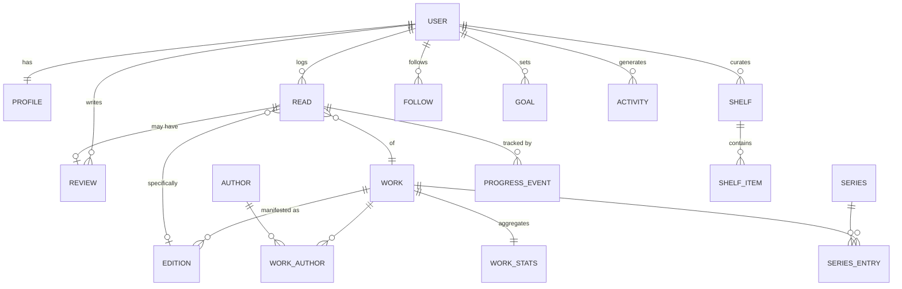

**Eleven entities carry the product:** `users` · `profiles` · `works` · `editions` · `authors` · `reads` · `progress_events` · `reviews` · `shelves` · `follows` · `activity`. `quotes` joins them in Phase 4 (§10.8).

## 51.4 Recommended tech stack

**Locked September 2026.** Full table with rejections and reasons in `architecture.md` §0.

| Layer | Choice |
|---|---|
| Mobile | **Expo SDK 57** (managed) · React Native 0.86 · React 19.2 · TypeScript — one codebase, Android first |
| Navigation | expo-router, typed routes |
| Build / OTA | EAS Build + EAS Update |
| State | TanStack Query (server) + Zustand (client) |
| Offline | `expo-sqlite` + a hand-written mutation queue |
| UI | FlashList · expo-image · Reanimated 4 · gesture-handler · expo-haptics · expo-font |
| **API** | **TypeScript on Node 22 LTS + Fastify 5** — one language across mobile, API and the Phase 10 web app |
| DB access | **Drizzle** — a typed query builder, not an ORM. Raw SQL first-class, so feed and search stay tunable |
| Migrations | drizzle-kit, forward-only |
| Validation | **zod**, shared client↔server via `packages/shared` |
| Jobs | **pg-boss** — Postgres-backed, transactional with the data. No Redis |
| Auth | `@node-rs/argon2` + `jose`; JWT 15m + rotating refresh with family reuse detection |
| Share cards | **satori + resvg-js** — JSX and CSS to SVG to PNG |
| Database | **Postgres 17** with `pg_trgm`; `pgvector` from Phase 7 |
| Search | Postgres `tsvector` + trigram, `simple` dictionary |
| Storage | Cloudflare R2 (MinIO locally) |
| Edge | Caddy — automatic TLS |
| Hosting | Fly.io; managed Postgres on Neon |
| Testing | vitest + testcontainers |
| Observability | Pino JSON, Prometheus `/metrics`, Sentry, UptimeRobot |
| Analytics | First-party, in Postgres — no third-party PII SDK |

**Not in v1:** Redis (trigger: the day a second API instance exists) · a search engine (trigger: relevance, §14.6) · GraphQL · an ORM · microservices · Terraform.

## 51.5 Backend architecture

A **modular monolith**: one Go binary running in either server or worker mode, eleven internal modules with enforced boundaries, one Postgres database. Microservices would be a strict downgrade for a one-developer team at this scale, and the module seams preserve the option to extract later.

## 51.6 Book data providers

| Stage | Provider | Role |
|---|---|---|
| **MVP** | **Open Library (CC0)** | The entire catalog, via monthly bulk dumps, filtered on ingest |
| MVP | Open Library live API | Gap-fill only — 1 identified request per second, results kept permanently |
| MVP | Open Library cover CDN | Covers served by cover ID, zero storage cost |
| MVP | Google Books | Last-resort live fallback. **Never stored** — its terms forbid the caching a catalog requires |
| Scale | ISBNdb (paid) | Optional metadata top-up when correction requests cluster |

## 51.7 Key APIs

`POST /auth/register` · `/login` · `/refresh` — rotating tokens with family reuse detection
`GET /search` · `/works/{id}` · `/works/{id}/editions` · `/works/{id}/reviews`
`POST /reads` · `PATCH /reads/{id}` · `POST /reads/{id}/progress` — idempotent · `POST /reads/{id}/finish` — one call for the whole finish flow
`POST /reviews` · `/reads/{id}/like` · `/reads/{id}/comments`
`POST /users/{id}/follow` · `/block` · `GET /feed?tab=`
`GET/POST /shelves` · `/shelves/{id}/items`
`GET /me` · `/me/stats` · `PUT /me/favourites` · `DELETE /me`
`POST /imports` · `GET /imports/{job_id}` · `POST /exports`

All cursor-paginated. All creating POSTs accept an `Idempotency-Key`.

## 51.8 Key metrics

**North Star:** Weekly Reading Actions per Active User.

Activation: signup → first book logged in 24h **>60%**. Feed health: median follows at day 7 **>5**. Daily hook: progress updates per WAU **>3**. Discovery: recommendation → finish conversion **>15%**. Retention: D7 **>25%**, D30 **>15%**. Growth: share rate per finish **>8%**.

## 51.9 Development phases

| Phase | Duration | Output |
|---|---|---|
| −1 — Walking skeleton | 1 week | One crude end-to-end path, on a real device |
| 0 — Foundation | 7 weeks (3 with the accelerator, §32) | Catalog ingested and searchable; API and auth complete |
| 1 — MVP solo loop | 8 weeks | A tracker good enough to use alone, plus import |
| 2 — Social | 6 weeks | Follows, feed, moderation, public pages |
| 3 — Launch | 5 weeks | Android live on Play Store |
| 4 — Personalisation | 8 weeks | Recommendations that work; iOS launch |
| 5 — AI & monetization | 10 weeks | Plus subscription; AI discovery |
| 6 — Web | 12 weeks | Full web app and SEO |

**Roughly six to seven months to a submittable Android v1.** Cash cost to that point: **$25** for a Play Console account, plus a domain. Everything else — Go, Postgres, Docker, Caddy, River, sqlc, MinIO, FCM, Open Library — is free.

## 51.10 Biggest risks

1. **Cold-start network effects.** Mitigated structurally: the solo tracker must stand alone, and launch seeds one tight community rather than going broad.
2. **Phase 0 swallowing the project.** Mitigated by a hard exit condition — search finds 50 books you own, then move on.
3. **Solo-founder burnout over seven months.** Mitigated by Phase 1 producing something personally useful, Android-only scope, and the five-tab rule as a defence against creep.
4. **Catalog data quality.** Mitigated by ranking on usage, a correction flow, and budgeting for a dedup pass rather than assuming ingest is finished.
5. **Data loss.** Mitigated by 6-hourly off-machine backups and a **monthly restore drill**. This is the only risk on the list that ends the project outright.

## 51.11 Biggest differentiators

1. **Progress as the daily hook.** No competitor's core loop gives a reason to open the app mid-book. This is the retention mechanic and it has no Letterboxd analogue.
2. **An owned CC0 catalog.** No API can be revoked, no vendor can change terms, no per-request cost as the product grows.
3. **Honest abandonment.** First-class DNF with a page and a reason produces negative-preference data that Goodreads and Letterboxd structurally cannot collect — a genuine recommendation advantage.
4. **A profile built to be shared.** Four favourites, taste statistics and server-rendered share cards make the growth loop a designed artefact rather than a screenshot.
5. **Structural civility.** No author replies, no downvotes, no leaderboards, no controversy ranking, no guilt mechanics. In a category with a documented toxicity problem, prevention by design is a product feature.

---

*End of document.*
