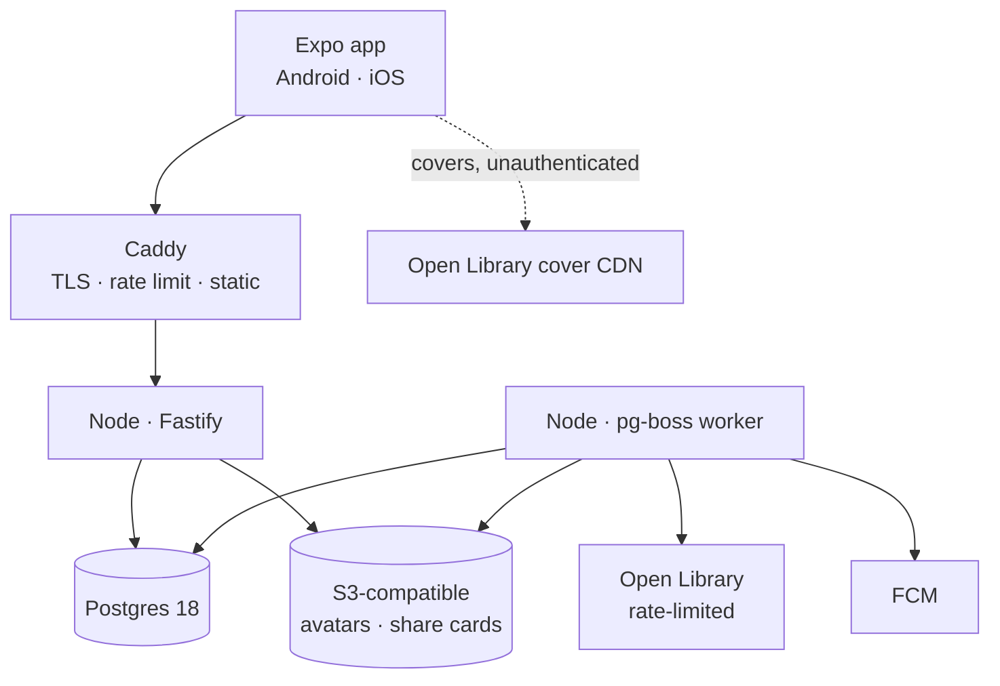
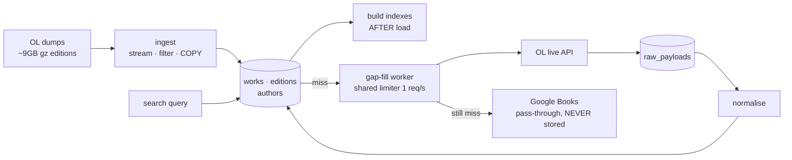
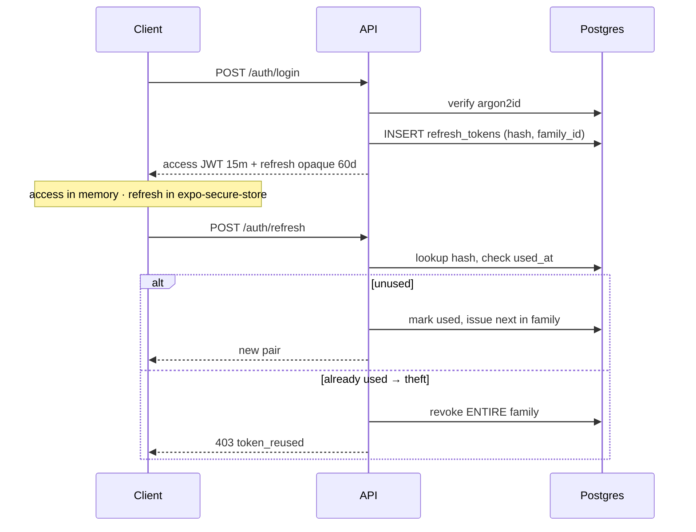
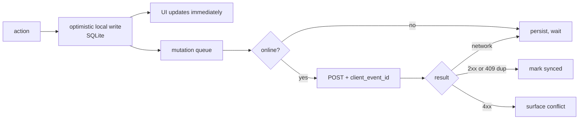

# Flyleaf — Architecture

**Companion to:** `PRD.md` (§ references throughout point there)
**Version:** 1.0
**Status:** Ready to build

> The PRD says *what* and *why*. This document says *how*. Where they disagree, the PRD wins and this document is wrong.

---

## 0. The locked stack

| Layer | Choice | Version at lock (Sept 2026) |
|---|---|---|
| **Mobile** | Expo (managed) · React Native · React · TypeScript | 57.0.19 · 0.86.3 · 19.2 · 7.0 |
| Navigation | expo-router | 57.0.18 |
| Build / OTA | EAS Build + EAS Update · **`expo-dev-client`** | — |
| State | TanStack Query · Zustand | 5.102 · 5.0 |
| Offline | expo-sqlite + a hand-written mutation queue | 57.0.2 |
| UI | FlashList · expo-image · Reanimated · gesture-handler · expo-haptics · expo-font | 2.3 · 57.0.4 · 4.6 · 3.2 · 57.0.2 · 57.0.3 |
| **API** | Node LTS · Fastify · TypeScript | 22 · 5.12 · 7.0 |
| DB access | Drizzle + drizzle-kit | 0.45 · 0.31 |
| Validation | zod, shared client↔server | 4.5 |
| Jobs | pg-boss | 12.30 |
| Auth | `@node-rs/argon2` + `jose` | 2.2 · 6.2 |
| Share cards | satori + resvg-js | — |
| Testing | vitest + testcontainers | 4.1 |
| **Database** | PostgreSQL (`pg_trgm`, `unaccent`; `pgvector` from Phase 7) | 17 |
| Managed Postgres | Neon | — |
| Object storage | Cloudflare R2 (MinIO locally) | — |
| Edge / TLS | Caddy | — |
| Hosting | Fly.io | — |
| Email | Resend, behind an interface | — |
| CI | GitHub Actions | — |
| Errors / uptime | Sentry · UptimeRobot | — |
| Analytics | **First-party, in Postgres** — no third-party PII SDK (PRD §26.5) | — |

### Rejected, with reasons

| Rejected | Why |
|---|---|
| **Go** | Won the monthly ingest job, lost the daily development experience, the type boundary and the share-card pipeline. See §13 |
| **Redis** | Not in v1. Sessions are a JWT plus one hashed row; auth limits are Postgres-backed; the feed is fan-out-on-read; caching is in-process. **Trigger: the day a second API instance exists** — see §4.1 |
| Prisma | Heavy, own query engine, poor raw-SQL story. Feed and search must stay tunable |
| NestJS | Decorator and DI weight a solo developer does not need |
| Fiber | Not applicable once the language changed — and it was fasthttp, not stdlib-compatible |
| GraphQL | One first-party client with known queries |
| Elasticsearch | Postgres full-text plus trigram meets the target. Escalation trigger is **relevance** (PRD §14.6), not latency |
| Cloudinary / Cloudflare Images | Stage 1 stores no covers at all, so there is nothing to transform yet |
| Magic-link auth | Adds email latency to every sign-in |
| WatermelonDB | A sync framework with its own opinions; we write a smaller, more predictable queue |
| Terraform | When there is more than one environment |
| PostHog | Would forfeit the "no third-party PII SDK" claim. Self-host it if funnels become essential |
| Figma | For one person, `design.md` plus building in code beats a parallel design file |

**TypeScript is split across the two apps, deliberately.**

| App | Version | Why |
|---|---|---|
| `apps/api` | **7.0.2** | We own the whole tsconfig. Typechecks clean in strict mode with `noUncheckedIndexedAccess` |
| `apps/mobile` | **6.0.3** | Expo SDK 57 shipped before TypeScript 7, so `expo/tsconfig.base` still sets `baseUrl` — which **TS 7 removed**. Fighting the framework's own base config in Phase −1 buys nothing |

This converges the moment Expo ships a TS7-compatible base. TypeScript is a build-time dependency, so nothing in the shipped product depends on either choice.

**Expo Go is not a supported development target for this project.**

Expo Go supports **exactly one SDK version** — whichever the Play Store ships for a given device. A device on Expo Go 54 cannot open an SDK 57 project, and no dependency pinning changes that. Development happens against a **development build** (`expo-dev-client`) from Phase −1 onward: a normal APK carrying our own native modules, connected to the same Metro server. This was going to be required by Phase 1 regardless — `expo-sqlite`, `expo-camera` and Reanimated worklets all need it.

`eas.json` carries three profiles: `development` (dev client, internal APK), `preview` (internal APK), `production` (app bundle).

**Version alignment for Expo — the rule, learned the hard way.**

> For anything in `apps/mobile`, the authority is **`expo`'s own `bundledNativeModules.json`**, surfaced by `npx expo install --check`. npm's `latest` tag is not just suboptimal here, it is *wrong*.

Expo Go ships a fixed set of compiled native modules. A project whose `package.json` asks for different versions of them is rejected outright with "Project is incompatible with this version of Expo Go" — which reads like a stale app on the phone and is actually a version mismatch in the repo.

Nine of our first pins disagreed with SDK 57, including a **major** gap:

| Package | npm `latest` | SDK 57 wants |
|---|---|---|
| `react-native-gesture-handler` | 3.2.1 | **~2.32.0** |
| `react-native-reanimated` | 4.6.0 | 4.5.1 |
| `react-native-worklets` | 0.12.1 | 0.10.1 |
| `@shopify/flash-list` | 2.3.2 | 2.0.2 |
| `react` / `react-dom` | 19.2.8 | 19.2.3 |
| `react-native-safe-area-context` | 5.9.1 | ~5.7.0 |
| `react-native-screens` | 4.27.0 | ~4.26.0 |
| `react-native-web` | 0.21.2 | ~0.21.0 |

"Latest stable" for the client therefore means **latest stable that the SDK supports** — the two are not the same, and React Native 0.87.1 being newer than SDK 57 handles is the clearest example. The API has no such constraint, which is why it sits on genuinely-latest everything.

---

## 1. Shape of the system

One Node process. One Postgres database. One React Native app. Nothing else is required to run Flyleaf.



| Process | Command | Notes |
|---|---|---|
| API server | `node dist/server.js` | Stateless. Scale horizontally when needed |
| Worker | `node dist/worker.js` | **Same codebase**, pg-boss runner. One artifact means no version skew |
| Migrations | `drizzle-kit migrate` | Run on deploy before the new process starts |
| Ingest | `node dist/ingest.js --dump editions.txt.gz` | Also schedulable as a pg-boss job |
| Admin | Served by the API at `admin.flyleaf.app` | Fastify + server-rendered views, separate auth (§27.5) |

**Everything green in the PRD's §3 diagram is yours and runs anywhere Docker runs.** The only external dependency in the request path is Open Library's cover CDN, and if it vanished tomorrow the ingested catalog keeps working.

---

## 2. Repository layout

```
flyleaf/
├── apps/
│   ├── api/                      Node + TypeScript
│   │   ├── src/server.ts         API process
│   │   ├── src/worker.ts         pg-boss job runner
│   │   ├── src/ingest.ts         Open Library dump ingest
│   │   └── src/
│   │       ├── http.ts           error shape, viewer, conventions
│   │       ├── identity/         users, auth, tokens, profiles
│   │       ├── catalog/          works, editions, authors, search, ingest
│   │       ├── reading/          reads, progress, goals
│   │       ├── content/          reviews, quotes, likes, comments
│   │       ├── shelves/          lists
│   │       ├── social/           follows, blocks, mutes, activity
│   │       ├── feed/             assembly + ranking
│   │       ├── discovery/        browse rows, recommendations
│   │       ├── stats/            aggregations, Year in Review
│   │       ├── dataio/           import, export
│   │       ├── moderation/       reports, filters, admin actions
│   │       ├── notify/           composition, push delivery
│   │       ├── media/            cover proxy, share-card rendering
│   │       ├── admin/            server-rendered admin console
│   │       ├── db/schema.ts      Drizzle schema — source of truth
│   │       └── platform/         db, jobs, config, log, cache, ratelimit, mail
│   └── mobile/                   Expo app
│       ├── app/                  expo-router file routes
│       ├── src/features/         one folder per domain, mirrors API modules
│       ├── src/lib/              api client, db, sync queue, auth
│       └── src/ui/               design system components
├── packages/
│   ├── api-client/               GENERATED from openapi.yaml — do not edit
│   └── shared/                   zod schemas, enums, constants
├── apps/api/drizzle/             generated migrations, forward-only
├── openapi.yaml                  generated from Fastify route schemas (§24.1)
└── docker-compose.yml            postgres + minio
```

### Module rules

1. **No cross-module database access.** `feed` may not query `reviews` tables directly; it calls the `content` package.
2. **No circular imports.** If two modules need each other, the shared concept belongs in a third.
3. **Modules expose classes and functions, not their tables.** These are the seams a service would be extracted along, if that ever becomes justified. It probably will not.
4. **`platform` depends on nothing.** Everything may depend on `platform`.

---

## 3. Database

**Postgres 18** (18.6 is the current stable major as of August 2026; 19 is in beta and stays out until release). Extensions: `pg_trgm`, `unaccent`, `pgcrypto` — the last only if `gen_random_uuid()` ever needs it, which it does not from Postgres 13 onward, where it is built in. `pgvector` from Phase 4.

Extensions and the `flyleaf_unaccent` wrapper (§3.8) are created by `migrate.ts` before the drizzle journal runs. Nothing else applies schema: the Phase −1 arrangement of mounting a `.sql` file into the container's init directory is gone, because it only ever ran on a brand-new volume, which made every schema change a `docker compose down -v`.

### 3.1 Catalog

Ingested from Open Library dumps. Read-only to users; writable by ingest, corrections and admin.

```sql
CREATE TABLE works (
  id                  uuid PRIMARY KEY DEFAULT gen_random_uuid(),
  ol_work_key         text UNIQUE,
  title               text NOT NULL,
  subtitle            text,
  description         text,
  first_publish_year  int,
  original_language   text,
  default_edition_id  uuid,
  maturity            text NOT NULL DEFAULT 'unclassified'
                        CHECK (maturity IN ('general','mature','explicit','unclassified')),
  is_provisional      bool NOT NULL DEFAULT false,
  created_by_user_id  uuid,
  merged_into_id      uuid REFERENCES works(id),
  search_vector       tsvector,
  log_count           int  NOT NULL DEFAULT 0,   -- denormalised, drives search ranking
  created_at          timestamptz NOT NULL DEFAULT now(),
  updated_at          timestamptz NOT NULL DEFAULT now()
);

CREATE TABLE editions (
  id                uuid PRIMARY KEY DEFAULT gen_random_uuid(),
  work_id           uuid NOT NULL REFERENCES works(id) ON DELETE CASCADE,
  ol_edition_key    text UNIQUE,
  isbn_13           text,
  isbn_10           text,
  title             text,
  publisher         text,
  publish_date_raw  text,          -- OL dates are frequently partial
  publish_year      int,
  page_count        int,
  format            text NOT NULL DEFAULT 'unknown'
                      CHECK (format IN ('hardcover','paperback','ebook','audiobook','unknown')),
  language          text NOT NULL DEFAULT 'en',
  audio_seconds     int,
  ol_cover_id       int,           -- INTEGER, never a URL (§40.3)
  is_box_set        bool NOT NULL DEFAULT false
);

CREATE TABLE authors (
  id              uuid PRIMARY KEY DEFAULT gen_random_uuid(),
  ol_author_key   text UNIQUE,
  name            text NOT NULL,
  sort_name       text,
  bio             text,
  ol_photo_id     int,
  birth_year      int,
  death_year      int,
  disambiguation  text
);

CREATE TABLE work_authors (
  work_id    uuid REFERENCES works(id) ON DELETE CASCADE,
  author_id  uuid REFERENCES authors(id) ON DELETE CASCADE,
  role       text NOT NULL DEFAULT 'author'
               CHECK (role IN ('author','co_author','translator','illustrator','narrator','editor')),
  position   int  NOT NULL DEFAULT 0,
  PRIMARY KEY (work_id, author_id, role)
);

CREATE TABLE series (
  id      uuid PRIMARY KEY DEFAULT gen_random_uuid(),
  ol_key  text UNIQUE,
  name    text NOT NULL
);

CREATE TABLE series_entries (
  series_id  uuid REFERENCES series(id) ON DELETE CASCADE,
  work_id    uuid REFERENCES works(id) ON DELETE CASCADE,
  position   numeric(5,2),          -- numeric so 2.5 novellas sort correctly
  PRIMARY KEY (series_id, work_id)
);

CREATE TABLE subjects (
  id    uuid PRIMARY KEY DEFAULT gen_random_uuid(),
  slug  text UNIQUE NOT NULL,
  name  text NOT NULL,
  kind  text NOT NULL CHECK (kind IN ('genre','theme','place','time_period','character','noise'))
);

CREATE TABLE work_subjects (
  work_id     uuid REFERENCES works(id) ON DELETE CASCADE,
  subject_id  uuid REFERENCES subjects(id) ON DELETE CASCADE,
  weight      real NOT NULL DEFAULT 1.0,
  PRIMARY KEY (work_id, subject_id)
);

CREATE TABLE work_stats (
  work_id       uuid PRIMARY KEY REFERENCES works(id) ON DELETE CASCADE,
  rating_sum    numeric(12,1) NOT NULL DEFAULT 0,
  rating_count  bigint NOT NULL DEFAULT 0,
  avg_rating    numeric(3,2),
  weighted_rating numeric(3,2),     -- Bayesian, §9.5
  heart_count   bigint NOT NULL DEFAULT 0,
  read_count    bigint NOT NULL DEFAULT 0,
  dnf_count     bigint NOT NULL DEFAULT 0,
  polarisation  real,               -- stddev of ratings, §9.6
  updated_at    timestamptz NOT NULL DEFAULT now()
);
```

### 3.2 Provenance and raw payloads (§7.9)

```sql
CREATE TABLE external_ids (
  entity_type   text NOT NULL CHECK (entity_type IN ('work','edition','author','series')),
  entity_id     uuid NOT NULL,
  provider      text NOT NULL CHECK (provider IN ('open_library','google_books','isbndb','user')),
  external_id   text NOT NULL,
  first_seen_at timestamptz NOT NULL DEFAULT now(),
  last_seen_at  timestamptz NOT NULL DEFAULT now(),
  PRIMARY KEY (provider, external_id, entity_type)
);
CREATE INDEX external_ids_entity_idx ON external_ids (entity_type, entity_id);

CREATE TABLE field_provenance (
  entity_type text NOT NULL,
  entity_id   uuid NOT NULL,
  field_name  text NOT NULL,
  provider    text NOT NULL CHECK (provider IN ('open_library','isbndb','user')),
  fetched_at  timestamptz NOT NULL DEFAULT now(),
  confidence  smallint NOT NULL DEFAULT 50 CHECK (confidence BETWEEN 0 AND 100),
  is_locked   bool NOT NULL DEFAULT false,   -- true for user corrections
  PRIMARY KEY (entity_type, entity_id, field_name)
);
```

> **The `provider` CHECK on `field_provenance` deliberately omits `google_books`.** That single constraint is what makes the §41 licensing rule structural rather than a promise in a document. Do not add it.

```sql
CREATE TABLE raw_payloads (
  provider      text NOT NULL CHECK (provider = 'open_library'),  -- OL only, CC0
  external_id   text NOT NULL,
  entity_type   text NOT NULL,
  payload       jsonb NOT NULL,
  payload_hash  text NOT NULL,
  fetched_at    timestamptz NOT NULL DEFAULT now(),
  superseded_at timestamptz,
  PRIMARY KEY (provider, external_id, entity_type)
);
```

### 3.3 Identity

```sql
CREATE TABLE users (
  id                uuid PRIMARY KEY DEFAULT gen_random_uuid(),
  email             citext UNIQUE NOT NULL,
  email_verified_at timestamptz,
  password_hash     text NOT NULL,          -- argon2id
  date_of_birth     date NOT NULL,          -- age gate, §26.6
  role              text NOT NULL DEFAULT 'user'
                      CHECK (role IN ('user','moderator','admin')),
  created_at        timestamptz NOT NULL DEFAULT now(),
  deleted_at        timestamptz             -- 30-day grace, §25.4
);

CREATE TABLE refresh_tokens (
  id          uuid PRIMARY KEY DEFAULT gen_random_uuid(),
  user_id     uuid NOT NULL REFERENCES users(id) ON DELETE CASCADE,
  token_hash  text NOT NULL,                -- sha256 of the opaque token; raw never stored
  family_id   uuid NOT NULL,                -- reuse detection, §25.2
  device      text,
  expires_at  timestamptz NOT NULL,
  used_at     timestamptz,
  revoked_at  timestamptz,
  created_at  timestamptz NOT NULL DEFAULT now()
);
CREATE INDEX refresh_tokens_hash_idx   ON refresh_tokens (token_hash);
CREATE INDEX refresh_tokens_family_idx ON refresh_tokens (family_id);

CREATE TABLE profiles (
  user_id            uuid PRIMARY KEY REFERENCES users(id) ON DELETE CASCADE,
  username           citext UNIQUE NOT NULL,
  display_name       text,
  bio                text CHECK (char_length(bio) <= 160),
  avatar_key         text,
  is_private         bool NOT NULL DEFAULT false,
  favourite_work_ids uuid[] DEFAULT '{}'    CHECK (array_length(favourite_work_ids,1) <= 4),
  library_systems    jsonb NOT NULL DEFAULT '[]',   -- "Where to read", §30.3
  show_explicit      bool NOT NULL DEFAULT false,   -- 18+ only, §7.8
  follower_count     int NOT NULL DEFAULT 0,
  following_count    int NOT NULL DEFAULT 0,
  created_at         timestamptz NOT NULL DEFAULT now()
);
```

### 3.4 Reading — the spine

```sql
CREATE TABLE reads (
  id               uuid PRIMARY KEY DEFAULT gen_random_uuid(),
  user_id          uuid NOT NULL REFERENCES users(id) ON DELETE CASCADE,
  work_id          uuid NOT NULL REFERENCES works(id),
  edition_id       uuid REFERENCES editions(id),
  status           text NOT NULL CHECK (status IN ('want','reading','paused','finished','dnf')),
  attempt_no       int  NOT NULL DEFAULT 1,
  started_at       date,
  finished_at      date,
  abandoned_at     date,
  abandoned_page   int,
  dnf_reason       text,
  rating           numeric(2,1) CHECK (rating IS NULL OR (rating BETWEEN 0.5 AND 5.0
                                       AND (rating * 2) = floor(rating * 2))),
  hearted          bool NOT NULL DEFAULT false,     -- §9.4
  format_override  text CHECK (format_override IN ('print','ebook','audiobook')),  -- §7.4
  source           text NOT NULL DEFAULT 'app' CHECK (source IN ('app','import')),
  visibility       text NOT NULL DEFAULT 'public'
                     CHECK (visibility IN ('public','followers','private')),
  like_count       int NOT NULL DEFAULT 0,
  comment_count    int NOT NULL DEFAULT 0,
  created_at       timestamptz NOT NULL DEFAULT now(),
  updated_at       timestamptz NOT NULL DEFAULT now(),
  UNIQUE (user_id, work_id, attempt_no),
  CHECK (finished_at IS NULL OR started_at IS NULL OR finished_at >= started_at)
);
CREATE INDEX reads_user_status_idx ON reads (user_id, status, updated_at DESC);
CREATE INDEX reads_work_finished_idx ON reads (work_id) WHERE status = 'finished';

CREATE TABLE progress_events (
  id              uuid PRIMARY KEY DEFAULT gen_random_uuid(),
  read_id         uuid NOT NULL REFERENCES reads(id) ON DELETE CASCADE,
  at              timestamptz NOT NULL DEFAULT now(),
  page            int,
  percent         numeric(5,2),
  audio_seconds   int,
  minutes         int,                       -- optional session duration, §8.4
  note            text CHECK (char_length(note) <= 280),
  client_event_id uuid UNIQUE NOT NULL       -- offline idempotency
);
CREATE INDEX progress_events_read_idx ON progress_events (read_id, at DESC);
```

> **`progress_events` is append-only.** No UPDATE, no DELETE except by cascade. Current position is always the latest row. This is the single most important schema decision in the tracker (§8.3).

```sql
CREATE TABLE goals (
  user_id       uuid REFERENCES users(id) ON DELETE CASCADE,
  year          int,
  target_books  int,
  target_pages  int,
  PRIMARY KEY (user_id, year)
);
```

### 3.5 Content

```sql
CREATE TABLE reviews (
  id                 uuid PRIMARY KEY DEFAULT gen_random_uuid(),
  read_id            uuid NOT NULL UNIQUE REFERENCES reads(id) ON DELETE CASCADE,
  user_id            uuid NOT NULL REFERENCES users(id) ON DELETE CASCADE,
  work_id            uuid NOT NULL REFERENCES works(id),
  body               text NOT NULL CHECK (char_length(body) <= 10000),
  has_spoilers       bool NOT NULL DEFAULT false,
  spoiler_after_page int,
  visibility         text NOT NULL DEFAULT 'public',
  published_at       timestamptz NOT NULL DEFAULT now(),
  edited_at          timestamptz,
  deleted_at         timestamptz
);
CREATE INDEX reviews_work_idx ON reviews (work_id, published_at DESC);
CREATE INDEX reviews_user_idx ON reviews (user_id, published_at DESC);

CREATE TABLE quotes (                          -- §10.8, P1
  id           uuid PRIMARY KEY DEFAULT gen_random_uuid(),
  read_id      uuid NOT NULL REFERENCES reads(id) ON DELETE CASCADE,
  user_id      uuid NOT NULL REFERENCES users(id) ON DELETE CASCADE,
  work_id      uuid NOT NULL REFERENCES works(id),
  edition_id   uuid REFERENCES editions(id),
  text         text NOT NULL CHECK (char_length(text) <= 500),
  page         int,
  note         text,
  has_spoilers bool NOT NULL DEFAULT false,
  visibility   text NOT NULL DEFAULT 'public',
  created_at   timestamptz NOT NULL DEFAULT now()
);
CREATE INDEX quotes_work_idx ON quotes (work_id, created_at DESC);
CREATE INDEX quotes_user_idx ON quotes (user_id, created_at DESC);

-- Likes and comments target the READ, not the review (§10.3)
CREATE TABLE read_likes (
  read_id    uuid REFERENCES reads(id) ON DELETE CASCADE,
  user_id    uuid REFERENCES users(id) ON DELETE CASCADE,
  created_at timestamptz NOT NULL DEFAULT now(),
  PRIMARY KEY (read_id, user_id)
);

CREATE TABLE read_comments (
  id         uuid PRIMARY KEY DEFAULT gen_random_uuid(),
  read_id    uuid NOT NULL REFERENCES reads(id) ON DELETE CASCADE,
  user_id    uuid NOT NULL REFERENCES users(id) ON DELETE CASCADE,
  body       text NOT NULL CHECK (char_length(body) <= 2000),
  created_at timestamptz NOT NULL DEFAULT now(),
  deleted_at timestamptz
);
CREATE INDEX read_comments_read_idx ON read_comments (read_id, created_at);

CREATE TABLE shelves (
  id             uuid PRIMARY KEY DEFAULT gen_random_uuid(),
  user_id        uuid NOT NULL REFERENCES users(id) ON DELETE CASCADE,
  name           text NOT NULL CHECK (char_length(name) <= 60),
  slug           text NOT NULL,
  description    text,
  is_ranked      bool NOT NULL DEFAULT false,
  privacy        text NOT NULL DEFAULT 'public',
  cover_work_ids uuid[] DEFAULT '{}',
  item_count     int NOT NULL DEFAULT 0,
  save_count     int NOT NULL DEFAULT 0,
  created_at     timestamptz NOT NULL DEFAULT now(),
  deleted_at     timestamptz,
  UNIQUE (user_id, slug)
);

CREATE TABLE shelf_items (
  shelf_id   uuid REFERENCES shelves(id) ON DELETE CASCADE,
  work_id    uuid REFERENCES works(id) ON DELETE CASCADE,
  position   int NOT NULL DEFAULT 0,
  note       text CHECK (char_length(note) <= 280),
  added_at   timestamptz NOT NULL DEFAULT now(),
  added_by   uuid REFERENCES users(id),
  PRIMARY KEY (shelf_id, work_id)
);
CREATE INDEX shelf_items_order_idx ON shelf_items (shelf_id, position);
```

### 3.6 Social

```sql
CREATE TABLE follows (
  follower_id uuid REFERENCES users(id) ON DELETE CASCADE,
  followee_id uuid REFERENCES users(id) ON DELETE CASCADE,
  state       text NOT NULL DEFAULT 'accepted' CHECK (state IN ('pending','accepted')),
  created_at  timestamptz NOT NULL DEFAULT now(),
  PRIMARY KEY (follower_id, followee_id),
  CHECK (follower_id <> followee_id)
);
CREATE INDEX follows_follower_idx ON follows (follower_id, state);
CREATE INDEX follows_followee_idx ON follows (followee_id, state);

CREATE TABLE blocks (
  blocker_id uuid REFERENCES users(id) ON DELETE CASCADE,
  blocked_id uuid REFERENCES users(id) ON DELETE CASCADE,
  created_at timestamptz NOT NULL DEFAULT now(),
  PRIMARY KEY (blocker_id, blocked_id)
);

CREATE TABLE mutes (
  user_id    uuid REFERENCES users(id) ON DELETE CASCADE,
  target_type text NOT NULL CHECK (target_type IN ('user','work')),
  target_id  uuid NOT NULL,
  created_at timestamptz NOT NULL DEFAULT now(),
  PRIMARY KEY (user_id, target_type, target_id)
);

CREATE TABLE activity (
  id          uuid PRIMARY KEY DEFAULT gen_random_uuid(),
  actor_id    uuid NOT NULL REFERENCES users(id) ON DELETE CASCADE,
  verb        text NOT NULL CHECK (verb IN ('started','finished','rated','reviewed',
                                            'dnf','shelved','followed','goal_reached','quoted')),
  work_id     uuid REFERENCES works(id) ON DELETE CASCADE,
  object_type text,
  object_id   uuid,
  visibility  text NOT NULL DEFAULT 'public',
  created_at  timestamptz NOT NULL DEFAULT now()
);
CREATE INDEX activity_actor_idx ON activity (actor_id, created_at DESC);   -- the feed's covering index

CREATE TABLE notifications (
  id          uuid PRIMARY KEY DEFAULT gen_random_uuid(),
  user_id     uuid NOT NULL REFERENCES users(id) ON DELETE CASCADE,
  type        text NOT NULL,
  actor_id    uuid REFERENCES users(id) ON DELETE CASCADE,
  object_type text,
  object_id   uuid,
  read_at     timestamptz,
  created_at  timestamptz NOT NULL DEFAULT now()
);
CREATE INDEX notifications_user_idx ON notifications (user_id, created_at DESC);

CREATE TABLE reports (
  id           uuid PRIMARY KEY DEFAULT gen_random_uuid(),
  reporter_id  uuid NOT NULL REFERENCES users(id),
  subject_type text NOT NULL,
  subject_id   uuid NOT NULL,
  reason       text NOT NULL,
  detail       text,
  state        text NOT NULL DEFAULT 'open' CHECK (state IN ('open','actioned','dismissed')),
  created_at   timestamptz NOT NULL DEFAULT now(),
  resolved_at  timestamptz,
  resolved_by  uuid REFERENCES users(id)
);
```

### 3.7 Operations

```sql
CREATE TABLE imports (
  id         uuid PRIMARY KEY DEFAULT gen_random_uuid(),
  user_id    uuid NOT NULL REFERENCES users(id) ON DELETE CASCADE,
  source     text NOT NULL CHECK (source IN ('goodreads','storygraph','librarything',
                                             'calibre','openlibrary','openreads')),
  state      text NOT NULL DEFAULT 'queued',
  total_rows int, matched int, unmatched int,
  file_key   text,
  created_at timestamptz NOT NULL DEFAULT now(),
  finished_at timestamptz
);

CREATE TABLE import_rows (          -- the unmatched-review list
  import_id  uuid REFERENCES imports(id) ON DELETE CASCADE,
  row_no     int,
  raw        jsonb NOT NULL,
  state      text NOT NULL,         -- matched | unmatched | resolved | skipped
  work_id    uuid REFERENCES works(id),
  PRIMARY KEY (import_id, row_no)
);

CREATE TABLE corrections (
  id             uuid PRIMARY KEY DEFAULT gen_random_uuid(),
  user_id        uuid NOT NULL REFERENCES users(id),
  entity_type    text NOT NULL,
  entity_id      uuid NOT NULL,
  field_name     text NOT NULL,
  proposed_value text,
  state          text NOT NULL DEFAULT 'queued',
  created_at     timestamptz NOT NULL DEFAULT now()
);

CREATE TABLE admin_audit_log (
  id         bigserial PRIMARY KEY,
  actor_id   uuid NOT NULL REFERENCES users(id),
  action     text NOT NULL,
  subject_type text, subject_id uuid,
  reason     text,
  payload    jsonb,
  created_at timestamptz NOT NULL DEFAULT now()
);

CREATE TABLE events (               -- first-party analytics, §28.1
  id         bigserial PRIMARY KEY,
  name       text NOT NULL,
  user_id    uuid,
  session_id uuid,
  platform   text, app_version text,
  properties jsonb NOT NULL DEFAULT '{}',
  at         timestamptz NOT NULL DEFAULT now()
);
CREATE INDEX events_name_at_idx ON events (name, at DESC);
```

pg-boss creates its own schema on first start.

### 3.8 Search index

> **Correction, FN-12.** The DDL below originally called `unaccent()` directly. **That does not run.** `unaccent(text)` is `STABLE`, not `IMMUTABLE` — it resolves its dictionary through `search_path` — and Postgres rejects a non-immutable function in a generated column or an index expression:
>
> ```
> ERROR: generation expression is not immutable
> ```
>
> The two-argument form `unaccent(regdictionary, text)` **is** immutable, because the dictionary is pinned. So a wrapper is required, and every expression that needs an accent-folded value must call the wrapper rather than `unaccent` directly — including at query time, or the query will not match what the index stored.
>
> The wrapper and both extensions are created by `migrate.ts` **before** the drizzle journal runs, because migration 0000 already depends on them. Verified against a real Postgres engine: bare `unaccent()` is rejected, `flyleaf_unaccent()` is accepted.

```sql
CREATE EXTENSION IF NOT EXISTS pg_trgm;
CREATE EXTENSION IF NOT EXISTS unaccent;

CREATE OR REPLACE FUNCTION flyleaf_unaccent(text)
  RETURNS text
  LANGUAGE sql
  IMMUTABLE STRICT PARALLEL SAFE
AS $$ SELECT public.unaccent('public.unaccent'::regdictionary, $1) $$;

ALTER TABLE works ADD COLUMN search_vector tsvector
  GENERATED ALWAYS AS (
    setweight(to_tsvector('simple', flyleaf_unaccent(coalesce(title,''))),    'A') ||
    setweight(to_tsvector('simple', flyleaf_unaccent(coalesce(subtitle,''))), 'B')
  ) STORED;

CREATE INDEX works_search_idx     ON works USING GIN (search_vector);
CREATE INDEX works_title_trgm_idx ON works USING GIN (title gin_trgm_ops);
CREATE INDEX editions_isbn13_idx  ON editions (isbn_13);
CREATE INDEX editions_isbn10_idx  ON editions (isbn_10);
CREATE INDEX editions_work_idx    ON editions (work_id);
CREATE INDEX authors_name_trgm_idx ON authors USING GIN (name gin_trgm_ops);
```

Author names are searched via a join plus the trigram index rather than being denormalised into the vector, so an author rename does not require reindexing every work.

> **Use the `simple` dictionary, not `english`.** Stemming damages proper nouns and non-Latin titles, and book search is overwhelmingly proper nouns (§14.2).

### 3.9 Denormalised counters

| Column | Maintained by | Reconciled |
|---|---|---|
| `work_stats.*` | Trigger on `reads` | Hourly job |
| `reads.like_count`, `comment_count` | Trigger | Nightly |
| `profiles.follower_count`, `following_count` | Trigger on `follows` | Nightly |
| `shelves.item_count`, `save_count` | Trigger | Nightly |
| `works.log_count` | Trigger on `reads` insert | Nightly |

**Every counter has a reconciliation job.** Triggers drift; reconciliation is what makes drift survivable.

---

## 4. Authorization

There is no row-level security doing this for you. Authorization lives in **exactly one place**.

```ts
// Every user-scoped method takes a viewer. There is no overload without it.
class ReadingService {
  get(viewer: string, id: string): Promise<Read | null>
  list(viewer: string, status?: string): Promise<Read[]>
}
```

| Rule | Enforcement |
|---|---|
| Viewer ID is a required argument | Function signature. A query without one cannot be written |
| Ownership checks live in the repository | Never in handlers — scattered checks are how data leaks |
| **404, never 403**, for another user's private resource | A 403 confirms the resource exists |
| One visibility function | `canView(viewer, ownerId, visibility, isPrivate, blocked): boolean` used by every read path |
| Guests | `viewer === null` — the least-privileged viewer (§4.2) |

**The test suite is the actual control.** For every private resource type, assert that a second user receives 404. This suite is non-negotiable and is written in Phase 0.

## 4.1 Rate limiting, caching, and the Redis trigger

Three interfaces exist from day one so that adding Redis is one new implementation plus a config line, rather than a hunt through call sites during an incident.

```ts
export interface RateLimiter {
  allow(bucket: string, limit: number, windowSeconds: number): Promise<boolean>;
}
export interface Cache {
  get<T>(key: string): Promise<T | undefined>;
  set<T>(key: string, value: T, ttlSeconds: number): Promise<void>;
  del(key: string): Promise<void>;
}
```

| Concern | v1 implementation | Why not Redis now |
|---|---|---|
| **Auth rate limits** | **`PgRateLimiter`** — a `rate_limits` table, upsert with a sliding window | Must be exact and correct **across instances**. An in-process counter is per-process, so two API processes would silently double every limit. On auth endpoints that is a security weakening, not a tuning miss |
| General API limits | In-process (`@fastify/rate-limit`) | Low cost of exceeding; volume too high to want a round trip |
| Book-page cache | **`MemoryCache`** — in-process, TTL, LRU eviction | For a single instance this is *strictly faster* than Redis: no network hop. It is not shared and is lost on restart, which is fine for a 60-second TTL |
| Guest book pages | `Cache-Control` at Caddy | Identical for every guest, so it never reaches the app |
| Sessions | JWT + one hashed row in Postgres | A refresh is one indexed lookup per user per 15 minutes. At 10k DAU that is ~11/second |
| Feed | Fan-out-on-read | An architecture decision, not a cache decision (§8) |

> ### The trigger
>
> **Adopt Redis the day a second API instance exists.** Not at a user count — at that architectural change, because that is the moment in-process limits become wrong and an in-process cache stops being shared.

**The constraint that keeps the swap clean:** nothing may assume Redis semantics — no atomic `INCR`, no pub/sub, no sorted sets. If those leak into a call site, the interface has failed its purpose and the swap stops being a config change.

---

## 5. Catalog pipeline



### 5.1 Ingest rules

| Rule | Why |
|---|---|
| **Stream the gzip line by line** | The editions dump is ~45GB uncompressed. Memory stays flat |
| **Filter on ingest**: title AND author AND (ISBN OR cover ID) | Unfiltered needs ~250GB of disk and is mostly noise |
| **`COPY` via `pg-copy-streams`**, batched at 5,000 rows | The difference between an afternoon and a week |
| **Build indexes after the load** | Including the tsvector. Indexing during bulk load is several times slower |
| **Resumable**: checkpoint the byte offset, upsert on the OL key | A 45GB stream will be interrupted |
| **Classify maturity during ingest** | From subjects and imprints. Cannot be bolted on later (§7.8) |
| **Store the raw payload** | So a normaliser fix is a reprocess, not a re-fetch (§7.9) |

### 5.2 Outbound rate limiting

**One global limiter, shared by every outbound caller.** Two independent limiters will exceed the limit together.

```ts
// platform/outbound.ts
export interface OutboundLimiter { wait(): Promise<void> }

// 3 req/s sustained (identified), burst 5, single instance across gap-fill and import.
// Every request carries:
//   User-Agent: Flyleaf/1.0 (+https://flyleaf.app; contact@flyleaf.app)
// Circuit breaker: 5 consecutive failures → open 60s.
```

### 5.3 Covers (§40.3)

| Stage | Behaviour | Trigger to advance |
|---|---|---|
| **1 — MVP** | Client requests `https://covers.openlibrary.org/b/id/{ol_cover_id}-{S,M,L}.jpg` directly. Size matched to surface: S for rows, M for grids, L only for the detail hero | p75 grid cover load > 600ms, or error rate > 2%, on the reference device over 4G |
| 2 | Node proxy (`sharp`): fetch once, convert to WebP, three sizes, own bucket, immutable cache headers. Lazy — only covers users actually view | Bandwidth cost becomes material |
| 3 | CDN in front of the bucket | Traffic |

**Never resolve covers by ISBN** — that endpoint is capped at ~100 req/IP per 5 minutes. Always by cover ID or OLID.

### 5.4 Search ranking

```
score = 0.45 * ts_rank_cd(search_vector, query)
      + 0.25 * ln(1 + works.log_count)
      + 0.15 * (has_cover AND has_author)
      + 0.10 * viewer_library_boost
      + 0.05 * recency
```

`log_count` is the term that solves the duplicate-editions problem without a dedupe pass: the record real users log rises on its own, and improves as the product grows.

**Quality gate:** the 200-query relevance panel (§14.6) runs in CI. Top-3 ≥ 95%, top-1 ≥ 85%. A regression here is a product defect, not a tuning task.

---

## 6. API

REST/JSON over HTTPS. **Fastify route schemas are the contract.** `openapi.yaml` is generated from them, and the typed client from that. The schema *is* the runtime validation, so schema and implementation cannot drift.

| Convention | Value |
|---|---|
| Base | `https://api.flyleaf.app/v1` |
| Auth | `Authorization: Bearer <access_token>` |
| Pagination | **Cursor only.** `?cursor=&limit=` → `{data, next_cursor}` |
| Errors | `{"error":{"code":"snake_case","message":"...","field":"..."}}` |
| Idempotency | `Idempotency-Key` header on every creating POST |
| Rate limits | Headers `X-RateLimit-Limit/-Remaining/-Reset` |

Offset pagination is forbidden: feeds and review lists grow while a client pages through them, and offset silently duplicates and skips.

### Middleware order

```
recover → requestID → logger → CORS → bodyLimit(1MB)
        → rateLimit → auth(optional|required) → validate → handler
```

`auth(optional)` populates a viewer when a token is present and leaves `uuid.Nil` when not — this is what makes guest mode (§4.2) a middleware concern rather than a per-handler one.

### The finish call

One round trip produces the read update, the review, the activity row, the share card job and the milestone check, because they are one transaction plus one enqueued job.

```
POST /v1/reads/{id}/finish
{ "finished_at":"2026-09-01", "rating":4.5, "hearted":true,
  "format_override":"audiobook",
  "review":{"body":"…","has_spoilers":false,"visibility":"public"} }
→ 201 { read, review, share_card_url, milestone }
```

---

## 7. Auth



| Property | Value |
|---|---|
| Hashing | **argon2id** via `@node-rs/argon2`, library defaults. Never bcrypt, never SHA |
| Password policy | ≥ 10 chars, checked against a common-password list. **No composition rules** |
| Access token | JWT HS256, 15 min, carries `sub` and `iat` only |
| Refresh token | 256-bit opaque, stored **hashed**, 60 days, **rotated every use** |
| Reuse detection | `family_id`; a reused token revokes the family and signs out everywhere |
| Client storage | `expo-secure-store` (OS keychain). **Never AsyncStorage** |
| Reset | Revokes all families |

Social sign-in is deferred (§25.1): adding Google on iOS obliges Sign in with Apple, which forces the Apple Developer cost forward.

---

## 8. Feed

**Fan-out on read.** One hand-written SQL query via Drizzle's `sql` template, cursor-paginated.

```sql
SELECT a.* FROM activity a
JOIN follows f ON f.followee_id = a.actor_id
             AND f.follower_id = $1 AND f.state = 'accepted'
WHERE a.created_at < $2
  AND a.visibility = 'public'
  AND NOT EXISTS (SELECT 1 FROM blocks b
                  WHERE (b.blocker_id=$1 AND b.blocked_id=a.actor_id)
                     OR (b.blocker_id=a.actor_id AND b.blocked_id=$1))
  AND NOT EXISTS (SELECT 1 FROM mutes m
                  WHERE m.user_id=$1
                    AND ((m.target_type='user' AND m.target_id=a.actor_id)
                      OR (m.target_type='work' AND m.target_id=a.work_id)))
ORDER BY a.created_at DESC
LIMIT $3;
```

Ranking and diversity are applied **in TypeScript over the fetched page**, not in SQL — weights change often and belong in testable code.

```
rank = activity_weight × exp(-age_hours/36) × affinity × diversity_penalty
```

Hard constraints after ranking: ≤2 consecutive cards per actor, ≤3 per book per page, ≥1 low-frequency actor per 10, ≤1 "started" per 10.

**Never in the feed:** progress updates, likes, imported reads (`source='import'`).

**Migration trigger:** p95 feed query > 200ms. The query sits behind a repository interface so the swap to fan-out-on-write is contained.

---

## 9. Background jobs (pg-boss)

| Job | Schedule | Notes |
|---|---|---|
| `catalog.ingest` | Monthly | Streaming, resumable |
| `catalog.gapfill` | On demand | Behind the shared limiter |
| `catalog.dedupe` | Monthly | Stages 1–2 auto-merge, 3–4 queue |
| `catalog.reprocess` | Manual | Re-normalise from `raw_payloads` |
| `import.process` | On demand | Chunked, progress-reported, resumable |
| `stats.workstats` | Hourly | Incremental |
| `stats.reconcile` | Nightly | Counter drift |
| `feed.prune` | Daily | Activity older than 180 days |
| `notify.send` | On demand | Batched; respects quiet hours and the 5/day cap |
| `media.sharecard` | On demand | **satori → resvg**: JSX and CSS to SVG to PNG |
| `media.yearinreview` | December | Per user |
| `db.backup` | Every 6h | Off-machine |
| `search.rebuild` | Weekly | Catches drift after ingest |

Jobs commit **in the same transaction** as the data that created them — that is the reason pg-boss is in the stack rather than a Redis-backed queue.

---

## 10. Client

| Concern | Choice |
|---|---|
| Framework | Expo SDK 57 (managed), React Native 0.86, React 19.2, TypeScript |
| Navigation | expo-router (typed routes) |
| Build / OTA | EAS Build + EAS Update |
| Server state | TanStack Query 5 |
| Client state | Zustand 5 |
| Local DB | `expo-sqlite` |
| Lists | `@shopify/flash-list` — every long list, no exceptions |
| Images | `expo-image` with blurhash placeholders |
| Animation | Reanimated 4 + `react-native-gesture-handler` (required by the swipe vocabulary in design.md §6) |
| Haptics | `expo-haptics` — every half-star and 5% progress tick |
| Fonts | `expo-font` — Literata + Archivo |
| Camera | `expo-camera` — barcode scanning |
| Push | Expo Notifications → FCM / APNs |
| Secure storage | `expo-secure-store` for the refresh token only |
| Styling | The design system in `design.md`. Tokens, never literals |

**Authoritative version alignment:** run `npx expo install --fix`. For Expo, "latest stable" means what the SDK resolves, not what npm's `latest` tag says — mismatching React Native against the SDK breaks the build.

### Offline sync



| Rule | Detail |
|---|---|
| Progress writes **never** block on the network | People read on planes and in basements |
| Every queued mutation carries a client-generated UUID | Replay is safe |
| Ordering | Per-entity FIFO; independent entities in parallel |
| Conflicts | Progress events cannot conflict (append-only). Scalars: last-write-wins, server arbitrates |
| Retry | Exponential backoff, max 5, then surfaced with a retry action |
| Guest state | Device-local only, never synced; migrates on signup |

**The offline queue is the most defect-prone code in the app and the one place a bug silently destroys user data.** It gets unit tests before it gets features (§33.5).

---

## 11. Deployment

```
git push → CI (vitest, migrate check, npm audit, tsc build)
        → build static binary + Expo OTA where applicable
        → deploy: flyleaf migrate up && systemctl restart flyleaf
        → healthcheck /readyz → rollback on failure
```

| Component | Choice |
|---|---|
| Edge | Caddy — automatic TLS, three-line config |
| Runtime | Single static binary, systemd or Docker |
| Database | Postgres on the same host initially; separate host from ~10k users |
| Object storage | MinIO locally; any S3-compatible in production |
| Config | Environment variables, 12-factor |

### Non-negotiable operational rules

1. **Backups every 6 hours to storage on a different machine and provider.** Retention 30 daily / 12 monthly, encrypted.
2. **Restore drill monthly.** Restore into a scratch database, verify row counts and sample user data. *An untested backup is not a backup.*
3. **Backup failure pages immediately** — higher severity than an outage.
4. **No ad-hoc SQL against production.** If a fix needs raw SQL, that is a missing admin feature (§27.5).
5. **Migrations forward-only.** Never edit a migration that has run.

### Observability

Pino structured JSON with a request ID on every line · Prometheus `/metrics` · `/healthz` and `/readyz` · external uptime pinger every 60s · Sentry for app and API.

**Alerts:** p95 > 1s for 5 min · error rate > 2% · job queue > 1,000 · disk > 70% · **backup failure** · cert expiring within 14 days.

---

## 12. Scaling ladder

Each step is taken in response to a measured signal, never in anticipation.

| Users | Action | Signal |
|---|---|---|
| 0–10k | Single VM: API + worker + Postgres | — |
| 10k–50k | Separate the database host; add a read replica | DB CPU sustained > 60% |
| 50k–200k | Multiple API instances behind Caddy; Redis for hot caches; workers on their own host | p95 > 300ms |
| 200k+ | Partition `progress_events` and `activity` by time; consider extracting feed and search | Table size, query plans |

**Deferred until measured:** Redis · a search engine · a CDN beyond static assets · read replicas · sharding · microservices.

---

## 13. Where the bodies are buried

The five things most likely to hurt, and where they are handled.

| Risk | Mitigation | Section |
|---|---|---|
| A normaliser bug requiring 200k re-fetches at 1 req/s | `raw_payloads` — reprocess instead | §3.2 |
| Google Books data silently persisted | `CHECK` constraint omitting the provider | §3.2 |
| The monthly ingest overwriting user corrections | `field_provenance.is_locked` | §3.2 |
| Offline queue losing or duplicating a user's history | `client_event_id` unique + dedicated test suite | §10 |
| Cross-user data leakage | Repository viewer argument + 404-not-403 + test suite | §4 |
