# Flyleaf — Build Phases

**Companion to:** `PRD.md`, `architecture.md`, `tasks.md`
**Assumption:** one developer, working steadily. Halve for two full-time.
**Total to a submittable Android v1:** ~27 weeks (6–7 months). Cash cost: **$25** plus a domain.

---

## The shape of it

```mermaid
gantt
    dateFormat X
    axisFormat %s
    section Build
    P−1 Skeleton      :a, 0, 1
    P0 Foundation     :b, 1, 4
    P1 Solo loop      :c, 5, 8
    P2 Shelves        :d, 13, 2
    P3 Import/export  :e, 15, 2
    P4 Social         :f, 17, 4
    P5 Stats & YIR    :g, 21, 3
    P6 Launch         :h, 24, 3
```



| # | Phase | Weeks | Cumulative | The one thing it proves |
|---|---|---|---|---|
| **−1** | Walking skeleton | 1 | 1 | The whole stack works end to end |
| **0** | Foundation | 3 (accelerated) or 7 | 4 | Search finds the right book; auth is sound |
| **1** | Solo loop | 8 | 12 | A person with no friends will keep using it |
| **2** | Shelves & lists | 2 | 14 | There is something to share before there is a network |
| **3** | Import & export | 2 | 16 | A Goodreads user can move in an afternoon |
| **4** | Social | 4 | 20 | Finishing a book is a social event |
| **5** | Stats, goal, Year in Review | 3 | 23 | People will share it |
| **6** | Launch readiness | 3 | 26 | It survives contact with strangers |

Add ~1 week of slack. Call it **27 weeks**.

---

## Phase −1 — The walking skeleton

**1 week. Before anything else. Do not skip.**

### Why it exists

Every other phase builds a layer *horizontally*. That is how a solo project spends ten weeks and discovers in week eleven that two layers do not fit. This phase builds one thin path through **every** layer, badly, and makes it work.

### Build

```
sign up (email+password, no verification)
  → search 100 books loaded from a hand-made CSV
  → book detail (title, author, cover)
  → mark reading → update progress → finish → rate
  → see it on a profile
```

Docker Compose with Postgres. A Fastify service with six endpoints. An Expo app with four screens. Design tokens applied, nothing else styled.

### Rules

1. **Ugly on purpose.** No verification emails, no refresh rotation, no ingest pipeline.
2. **Ship it to your own phone via a development build.** Not Expo Go — it supports one SDK version and will refuse the project. A simulator proves nothing about one-handed use on a train.
3. **Throw away the shortcuts, keep the decisions.** The CSV goes; the screen layouts and API shapes stay.
4. **Write down what surprised you.** That list is the real output and it should change the phases below.

### Exit criteria

- [x] The full path above works on a physical Android device — 3 Sep 2026, Android 14, dev build of SDK 57
- [ ] A second person can complete it without instruction — **SK-09, the last open item**
- [x] The surprises list exists and has been acted on — `surprises.md`

### Questions it answers cheaply — answered

| Question | Cost of finding out later | **Answer** |
|---|---|---|
| Does the Expo → Node → Postgres round trip work on a real device? | 6 weeks | **Yes**, over Wi-Fi with no IP editing |
| Is the work/edition split workable in a real UI? | 4 weeks | **Yes.** No edition picker forced into any flow. The risk is *presentation*, not the schema — see `surprises.md` §6 |
| Does an append-only progress stream feel right, or over-engineered? | 3 weeks | **Right, and invisible.** The screen only ever needs the latest row |
| Is the 20-second finish budget achievable? | 8 weeks | **Yes — under 15 seconds**, unstyled and unanimated. Headroom is 5s and Phase 1 will spend it |

Also confirmed on device, and the hardest decision here to reverse: **re-reading creates a second log and leaves the finished one standing**, and read as correct to a first-time user with no explanation.

### What this phase changed in the plan

`surprises.md` is the full account. The one that alters every phase below:

> **Two of the bugs that reached the device passed `tsc` strict, 23 unit tests and 36/36 smoke assertions.** Neither produced a failing check; one produced no runtime error at all. A pass on a physical device is therefore part of every phase's exit criteria from here on, not a nicety at the end.

---

## Phase 0 — Foundation

**3 weeks with the accelerator, 7 without. Nothing user-visible.**

> This is the phase solo projects die in. Set the exit condition, honour it, move on. Relevance improves forever; it does not need to be finished first.

### The accelerator (recommended)

Build the catalog in three layers that come online independently:

| Layer | What | Time |
|---|---|---|
| **1 — Seed** | Ingest only works above a popularity threshold — several editions, a cover, an author. A few hundred thousand works | 2–3 days |
| **2 — Lazy fill** | Search misses fall through to the rate-limited OL API; CC0 results kept permanently, so each gap is fetched once | 2 days |
| **3 — Full ingest** | The complete filtered dump, as a background pg-boss job | 3–4 weeks, **running during Phase 1** |

Layers 1+2 are one week and produce a catalog good enough to build the entire app against. Layer 3 finishes in the background while you are busy elsewhere.

**Why the ordering is better, not just faster:** layer 2 has to exist regardless — no ingest is ever complete — so building it first means it is tested by real use from day one. And its zero-result log tells you exactly what layer 3's filter is getting wrong, instead of you guessing.

**Do not stop at lazy-only.** Every early search would wait on a 1 req/s external API, which is a poor first run and risks an IP block.

### Work

- Docker Compose: Postgres, MinIO, API
- drizzle-kit migrations for the full catalog schema
- Streaming, resumable, `COPY`-based dump ingest with the filter rule
- **Maturity classification at ingest** — cannot be bolted on later
- **Raw payload retention** — keeps normalisation and classification re-runnable
- Full-text + trigram search; the 200-query relevance panel in CI
- Shared outbound rate limiter; OL gap-filler behind it; circuit breaker
- Duplicate detection: stages 1–2 automated, 3–4 queued
- Fastify API skeleton: hook chain, Drizzle wiring, Pino structured logging
- ⚠️ `RateLimiter` / `Cache` interfaces; Postgres-backed auth limits, in-process cache
- **Complete auth**: argon2id, 15-min JWT, rotating refresh with family reuse detection, verification, reset
- Repository layer with mandatory viewer ID + **the cross-user access test suite**
- `openapi.yaml` and generated TypeScript client
- CI: vitest, migrations, `tsc --noEmit`, `npm audit`
- Admin console: merges, maturity override, ingestion status

### Exit criteria

- [ ] Search returns the right book for **50 titles you personally own**
- [ ] The 200-query relevance panel passes at **≥90%** (target 95% by Phase 6)
- [ ] The cross-user access suite passes for every private resource type
- [ ] `drizzle-kit migrate` runs clean on an empty database in CI

### Not built here

Anything with a screen. Resist it.

---

## Phase 1 — The solo loop

**8 weeks. The phase that decides whether the product is any good.**

> Exit condition includes *using it yourself for two weeks*. That is not padding — it is the only way to find out whether the core loop is actually pleasant.

### Work

**Client foundation**
- Expo Router shell, five tabs + FAB, design system components
- Secure token storage, 401-refresh interceptor
- **Guest browse mode** — gate at the action, local Want-to-Read that migrates on signup
- Offline: SQLite, mutation queue, idempotent progress writes

**The loop**
- Search, book detail, cover-forward edition picker, barcode scanner
- Reads + progress events; format override; heart
- Reading tab, log sheet, progress sheet, finish flow, DNF flow
- Ratings (half-star, optional), review composer with spoiler flag and visibility
- Diary — list, grid and calendar views
- Profile with four favourites, the Wall

### Exit criteria

- [ ] **You have tracked two complete books through the app**, on your own phone
- [ ] Finish flow p75 under 20 seconds, measured not asserted
- [ ] Progress update works with the network off, syncs cleanly, creates no duplicates
- [ ] Offline queue test suite passes, including simulated process death
- [ ] A screen-reader pass on log → progress → finish → review

### Not built here

Follows, feed, likes, comments, notifications. **The solo experience must stand alone** — assume the user has no friends here for three months.

---

## Phase 2 — Shelves & lists

**2 weeks.**

Curation, ranked lists, per-entry notes, public shelf pages, save-someone-else's-shelf. Cheap to build, and the thing people share before there is a network to share into.

### Exit criteria
- [ ] A ranked list with notes can be built, reordered and shared
- [ ] Shelf privacy respected on every read path

---

## Phase 3 — Import & export

**2 weeks. Deliberately before social.**

Six sources through one declarative mapping layer: Goodreads, StoryGraph, LibraryThing, Calibre, Open Library, OpenReads. Plus CSV export.

### Why here and not at the end

Importing your own thousand-book library is the **best load test the catalog will ever get**, and it means Phases 4–5 are built against realistic data instead of twelve test rows. It also front-loads the discovery that your search or your schema does not hold up.

### Rules that matter

| Rule | Reason |
|---|---|
| Use the file for **identity and state only**, never metadata | Everything about the book comes from your catalog |
| Ambiguous matches go to an unmatched list, never guessed | Silent bad matches destroy trust with your best users |
| `My Rating = 0` imports as `NULL` | Not 0, not dropped. This is why the column is nullable |
| Imported reads never enter the feed | `source='import'`, excluded from `activity` |
| It is a pg-boss job | 2,000 books × rate-limited lookups is not a request |

### Exit criteria
- [ ] Your own real Goodreads or StoryGraph export imports with ≥85% match
- [ ] Unmatched rows are reviewable and resolvable
- [ ] Export round-trips: export, wipe a test account, re-import, data intact

---

## Phase 4 — Social

**4 weeks.**

- Asymmetric follows, private accounts, follow requests
- Blocks (complete, bidirectional, silent), mutes (user and book)
- Feed: cursor-paginated fan-out-on-read, ranking, aggregation, diversity rules, cold-start fallback
- Likes and comments **on reads** — a finish with no review is fully interactive
- FCM push with per-category controls, quiet hours, 5/day ceiling
- Moderation: automated filters, reports, the admin console's report and user areas
- **Public server-rendered book, profile and list pages**

### Why public pages are in this phase

Without them every share is a dead link for anyone without the app, which breaks the primary growth loop. They are not a Phase 6 nicety.

### Exit criteria
- [ ] 30–50 beta users on sideloaded APKs
- [ ] Median follows at day 7 ≥ 5
- [ ] **Nobody has an empty feed** — verified for every beta user
- [ ] Block is complete: neither party can see the other anywhere
- [ ] A report reaches the admin queue and can be actioned end to end

---

## Phase 5 — Stats, goal, Year in Review

**3 weeks.**

Stats screen with per-card sharing · goal ring on the profile · server-rendered share cards · Year in Review as story-format images.

### Timing matters

**Year in Review must ship by late November.** The wrapped-content window is December; launching in January misses it by a year. If Phase 5 slips past mid-November, ship the stats screen and defer Year in Review by twelve months rather than shipping it late into an empty room.

### Exit criteria
- [ ] Stats correct against hand-computed figures for your own account
- [ ] Incomplete data disclosed, never fabricated ("based on 180 of your 247 books")
- [ ] Share cards render server-side and look identical everywhere

---

## Phase 6 — Launch readiness

**3 weeks. The first $25 is spent here.**

- Onboarding polish, empty states everywhere
- **Account deletion** with 30-day grace — a store requirement
- Privacy labels, data export, terms, privacy policy, community guidelines
- Deploy script, Caddy config, **backups and a tested restore**
- Health checks, uptime monitoring, crash reporting
- Closed beta on sideloaded APKs, then Play Console

### Exit criteria
- [ ] **A backup has been restored into a scratch database and verified**
- [ ] Account deletion completes in-app, end to end
- [ ] Report, block and mute all functional; moderation queue staffed
- [ ] Crash-free sessions ≥ 99.5% across the beta
- [ ] Relevance panel at ≥95% top-3
- [ ] Store listing, screenshots, privacy labels submitted

---

## After launch

| Phase | Focus | Timing |
|---|---|---|
| **7 — Personalisation** | Collaborative filtering, taste correlation, embeddings in pgvector, similar books, **iOS launch** (funded by now) | 8 weeks |
| **8 — Quotes & AI** | Quotes and passages, OCR capture, review summarisation, natural-language search | 8 weeks |
| **9 — Monetization** | Flyleaf Plus, "Where to read" with library links, advanced stats | 6 weeks |
| **10 — Web** | Full responsive app, SEO pages, desktop list curation | 12 weeks |

---

## Rules that hold across every phase

1. **Five tabs. A sixth means removing one.** The structural defence against scope creep.
2. **No phase closes without its exit criteria met.** They are checkboxes, not aspirations.
3. **Every phase ends on a physical Android device**, not a simulator.
4. **The relevance panel and the cross-user auth suite run in CI from Phase 0 onward.** They never go red.
5. **Instrument the interaction budgets from Phase 1.** An unmeasured budget erodes one field at a time.
6. **When a phase runs long, cut scope, not exit criteria.** A shipped Phase 4 with fewer features beats a perfect one that never closes.

---

## The three ways this goes wrong

| Failure | Signal | Response |
|---|---|---|
| **Phase 0 swallows the project** | Week 5 of catalog work, nothing to show | Use the accelerator. Honour the 50-book exit condition. Ship to Phase 1 with imperfect relevance |
| **Solo burnout around month 4** | Dread at opening the editor | Phase −1 and Phase 1 exist so you are a real user by week 12. If it is not fun to use by then, that is data about the product, not about you |
| **Cold-start social failure** | Phase 4 beta feed is empty | The solo loop must already be good enough to retain a lone user. Seed launch with one tight community, not broadly |
